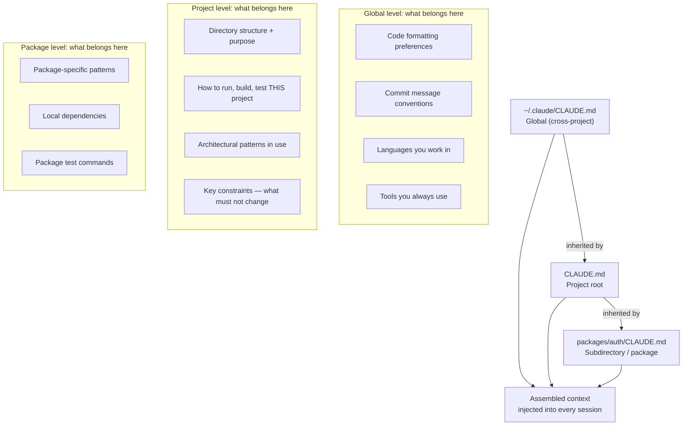

Most engineers treat CLAUDE.md as documentation. That framing sets you up for a mediocre file. CLAUDE.md is not documentation — it is a system prompt that runs before every Claude Code session in your project. The distinction matters because documentation is written for humans reading at leisure; CLAUDE.md is consumed by a model at the start of a task, and everything in it competes for attention with the actual task you just gave it. Write it accordingly.



## The Stacking Model

Claude Code reads CLAUDE.md files at multiple levels and assembles them into a single context block. There are three levels:

**Global** (`~/.claude/CLAUDE.md`): loaded for every project on your machine. Put cross-project conventions here — your preferred languages, commit message format, code style preferences, editor conventions. Think of it as your engineering identity document.

**Project root** (`./CLAUDE.md`): loaded for every session in this project. This is where the bulk of useful context lives. Directory structure, how to run the test suite, architectural decisions, naming conventions the model won't infer from the code.

**Subdirectory** (e.g. `packages/auth/CLAUDE.md`): loaded when Claude Code operates in that directory. In a monorepo with distinct packages, this is where you put package-specific patterns. Keep them short — they add to the project-level context, not replace it.

The model sees all three levels, so avoid repeating yourself across them. Global should set defaults; project overrides; package specializes.

## What to Put In It

**Directory structure with purpose, not just names.** Don't list files — explain what each directory *does*. Claude Code can see the directory tree; it can't infer why `services/gateway/` exists or that `internal/` contains code that must never be imported by external packages.

```markdown
## Directory Structure

- `src/api/` — Public REST API handlers. All endpoints must go through `middleware/auth.go`.
- `src/internal/` — Internal packages, not importable from outside this service. This is enforced by the Go module system.
- `src/infra/` — Infrastructure adapters (database, cache, message queue). Business logic must not import from here directly — go through the interfaces in `src/ports/`.
```

**Actual commands for this project.** Not "run tests." The specific command, including any flags that matter.

```markdown
## Development

```bash
# Run the full test suite (includes integration tests against Docker services)
make test

# Run only unit tests (no Docker required)
go test ./... -tags=unit

# Start local dev server with hot reload
make dev

# Lint + format
make lint
```

Tests require Docker for postgres and redis. If they hang, check `docker ps` — the test harness starts containers and kills them on exit.
```

**Architectural decisions with the WHY.** The model can read that you use dependency injection. It cannot read why you chose not to use a DI framework, or why you have two ORM packages in the codebase (one for the old service, one for the new). The WHY tells the model how to extend correctly.

```markdown
## Architecture

**Database access**: We use `sqlx` for raw SQL, not an ORM. Reason: the data access patterns
in this service are complex enough that ORMs generate inefficient queries. All queries live in
`src/infra/db/queries/`. Don't add ORM imports — they've been deliberately excluded from go.mod.

**Error handling**: All errors are wrapped with `fmt.Errorf("context: %w", err)` at every
boundary crossing. This creates a trace in the error chain. Don't discard errors or return nil
where an error occurred.
```

**Key constraints that must survive refactors.** These are the things where you cannot afford the model to make a well-intentioned mistake.

```markdown
## Constraints

- `CONFIG_ENCRYPTION_KEY` env var must NEVER be logged, written to files, or included in error messages.
- The `/health` and `/ready` endpoints must not require auth — the load balancer hits them.
- Database migrations in `migrations/` are append-only. Never modify an existing migration file; create a new one.
```

## What Not to Put In It

**Generic advice.** "Write clean, readable code." "Add error handling." "Follow SOLID principles." The model knows these. Every word of generic advice dilutes the specific context that actually helps.

**Frequently changing content without a maintenance plan.** Ticket references, version numbers for external dependencies, sprint goals. If you write "we're currently migrating from v1 to v2 of the auth service" and forget to update it in six months, the model will apply stale context to every session.

**Secrets or credentials.** This should be obvious, but CLAUDE.md ends up in version control. Treat it like code — no credentials, no API keys, no internal hostnames that shouldn't be public.

**Everything you could possibly document.** Longer is not better. The model has a finite context window and finite attention. A 10,000-word CLAUDE.md that covers every edge case means the model is attending to ten times as much text before it even reads your task. Keep it to what materially changes how the model would behave. If the model would do it correctly without the instruction, the instruction is not earning its place.

## A Concrete CLAUDE.md Structure

This is what a well-engineered project-level CLAUDE.md looks like in practice:

```markdown
# Project Name — AI Context

## What This Is
One paragraph. What the service does, who uses it, what scale it operates at.
Not marketing language — enough for the model to understand what "correct" looks like.

## Directory Structure
[Annotated list — purpose, not just names]

## Development Commands
[Copy-pasteable commands with notes on prerequisites]

## Architecture
[Key patterns with the WHY. Focus on decisions that aren't obvious from the code.]

## Coding Conventions
[Project-specific conventions the model won't infer. Naming patterns, error handling,
logging format. Skip anything that's just "good practice."]

## Constraints
[Hard limits. What must not change. Security boundaries. CI dependencies.]
```

That structure, kept to 400-600 words, outperforms a 3,000-word document every time. The model reads all of it before your task lands, so every word is competing with the task itself.

## Testing Your CLAUDE.md

The signal that it's working: in session 10, Claude Code still makes correct assumptions about the project without you re-explaining them. It uses the right test command. It puts new code in the right directory. It doesn't add an ORM import after you told it not to.

The signal it's not working: you're re-explaining the same things across sessions. The model asks where tests live. It uses patterns from other projects rather than yours. It makes "correct" changes that violate your constraints.

When that happens, resist the urge to add more content — the problem is usually relevance and clarity, not volume. Rewrite the unclear section rather than appending a clarification. A CLAUDE.md that needs footnotes explaining its own content has failed.

One more test: read your CLAUDE.md fresh, imagining you've never seen the project. Does it tell you everything you'd need to navigate confidently? Is anything in it that you already knew before you opened the file? Cut the latter. Fix the former.

> Treat CLAUDE.md as production code — it goes through code review, it gets updated when architecture changes, and you notice when it drifts.
{: .prompt-tip }
