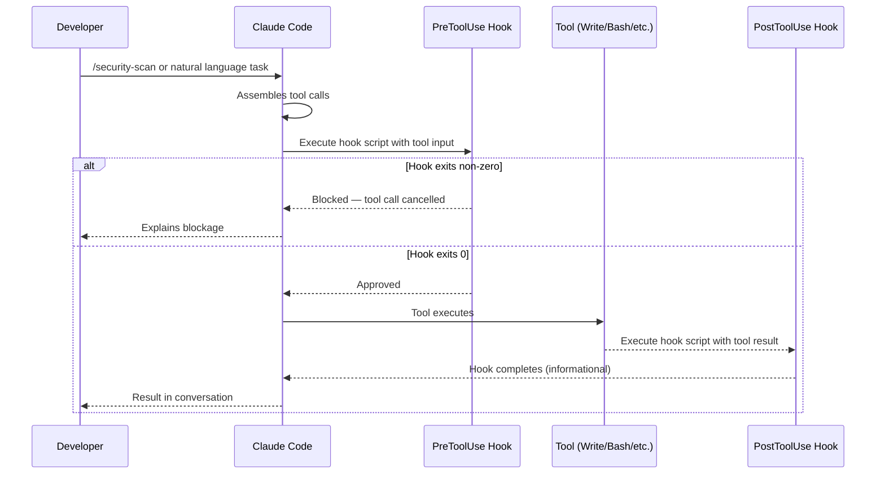

Individual AI productivity is the easy part. The harder problem is making AI assistance consistent across a team — so the output of `/review` today matches what it produces next week, and the model can't accidentally overwrite a `.env` file in any session. Custom slash commands and hooks are the two mechanisms Claude Code provides to solve this. Commands encode workflows as prompts; hooks enforce invariants at the tool-call level. You probably need both.



## Custom Slash Commands

Custom commands live in `.claude/commands/` at project level, or `~/.claude/commands/` for personal cross-project commands. Each file is a Markdown document that becomes the prompt when you invoke the command.

```
.claude/
  commands/
    review.md
    security-scan.md
    update-changelog.md
    ticket.md
```

Claude Code discovers them automatically. Type `/` in any session and your custom commands appear alongside the built-in ones.

The file format is plain Markdown. Whatever you write becomes the prompt:

```markdown
# /review

Review the staged changes (output of `git diff --cached`) for:

1. **Correctness** — logic errors, edge cases not handled, off-by-one errors
2. **Security** — OWASP Top 10 exposure, injection risks, overly broad permissions
3. **Performance** — N+1 queries, unnecessary allocations, missing indexes for new queries
4. **Test coverage** — does the change include tests? Do the tests actually cover the failure cases?

For each finding: describe the issue, explain the risk, and suggest a specific fix. If there are no meaningful findings in a category, say "none" — don't pad.

Focus on things that matter in production. Skip style comments.
```

The `$ARGUMENTS` placeholder lets you pass context at invocation time:

```markdown
# /ticket

Create a ticket description for the following task:

$ARGUMENTS

Output a description in this format:
**Problem**: (what is broken or missing, from the user's perspective)
**Acceptance criteria**: (bullet list of testable conditions that define done)
**Technical notes**: (implementation considerations, gotchas, dependencies)
**Estimate**: (S/M/L — rough complexity)
```

Then invoke it as: `/ticket add rate limiting to the public API endpoints`

### What Makes a Good Command

**One job.** A command that reviews code AND generates a ticket AND updates the changelog is trying to do too much. The model will compromise on each. Write separate commands for each workflow.

**Specific output format.** If the output of a command feeds into another process (posting to a PR, pasting into a ticket system), define the exact format the model should produce. Vague output instructions produce vague output.

**Tested on real sessions.** Run new commands on actual work before sharing them with the team. The prompts that seem obviously clear often have ambiguities that only surface on real code.

## Hooks

Hooks are shell scripts that execute on Claude Code events. They're configured in `.claude/settings.json` and run outside the model — the model doesn't see them, but they can prevent tool calls from happening and log what the model tried to do.

### Hook Types

- **PreToolUse**: runs before a tool call executes. Exit 0 to allow; non-zero to block.
- **PostToolUse**: runs after a tool call completes. Informational — can't undo what already happened.
- **Stop**: runs when Claude Code finishes a task.
- **Notification**: runs when Claude Code emits a notification event.

### Configuration

```json
{
  "hooks": {
    "PreToolUse": [
      {
        "matcher": "Write",
        "hooks": [
          {
            "type": "command",
            "command": "bash /home/user/project/.claude/hooks/pre-write.sh"
          }
        ]
      }
    ],
    "PostToolUse": [
      {
        "matcher": "Write",
        "hooks": [
          {
            "type": "command",
            "command": "bash /home/user/project/.claude/hooks/post-write.sh"
          }
        ]
      }
    ],
    "Stop": [
      {
        "hooks": [
          {
            "type": "command",
            "command": "bash /home/user/project/.claude/hooks/on-stop.sh"
          }
        ]
      }
    ]
  }
}
```

The `matcher` field filters which tool invocations trigger the hook. `"Write"` matches the Write tool; `"Bash"` matches Bash; omitting it matches all tools.

### Practical Hook Examples

**Block writes to sensitive files (PreToolUse):**

```bash
#!/usr/bin/env bash
# .claude/hooks/pre-write.sh
# Blocks writes to .env and secrets files

# Claude Code passes tool input as JSON on stdin
INPUT=$(cat)
FILE_PATH=$(echo "$INPUT" | python3 -c "import sys,json; d=json.load(sys.stdin); print(d.get('file_path',''))" 2>/dev/null)

if [[ "$FILE_PATH" =~ \.(env|pem|key|p12|pfx)$ ]] || [[ "$FILE_PATH" =~ secrets\. ]]; then
  echo "BLOCKED: writes to $FILE_PATH are not permitted in Claude Code sessions" >&2
  exit 1
fi

exit 0
```

**Auto-format after edits (PostToolUse):**

```bash
#!/usr/bin/env bash
# .claude/hooks/post-write.sh
# Runs gofmt after any .go file write

INPUT=$(cat)
FILE_PATH=$(echo "$INPUT" | python3 -c "import sys,json; d=json.load(sys.stdin); print(d.get('file_path',''))" 2>/dev/null)

if [[ "$FILE_PATH" =~ \.go$ ]]; then
  gofmt -w "$FILE_PATH"
fi

exit 0
```

**Check for uncommitted changes on stop:**

```bash
#!/usr/bin/env bash
# .claude/hooks/on-stop.sh
# Warns if Claude left uncommitted changes

CHANGED=$(git diff --name-only 2>/dev/null | wc -l)
STAGED=$(git diff --cached --name-only 2>/dev/null | wc -l)

if [ "$CHANGED" -gt 0 ] || [ "$STAGED" -gt 0 ]; then
  echo "Session ended with $CHANGED modified and $STAGED staged files — review before pushing" >&2
fi

exit 0
```

Hook scripts must be executable (`chmod +x`). They receive tool input as JSON on stdin. For PreToolUse, exit non-zero to block; for all others, the exit code is logged but doesn't affect session behavior.

## What Hooks Can't Do

Hooks run in your local shell. They can read files, call APIs, write logs, and block tool calls. They cannot:
- Modify Claude's context or inject text into the conversation
- See the full conversation history, only the current tool call
- Run asynchronously — they block the tool call until they complete, so keep them fast

A slow hook (waiting on a remote API, running a full test suite) adds latency to every tool call the matcher matches. Keep hooks fast — seconds, not minutes.

## Distributing Commands and Hooks to a Team

Project-level commands (`.claude/commands/`) and hook scripts (`.claude/hooks/`) are checked into version control and automatically available to everyone who clones the repo. The settings file (`.claude/settings.json`) can also be committed, though members may have personal overrides in `.claude/settings.local.json`.

This is the right model for team consistency: the commands and hooks are part of the repository, get code-reviewed like everything else, and evolve alongside the codebase. A new engineer who joins the project gets the team's Claude Code workflow on their first `git clone`.

> Treat your `.claude/commands/` directory like a shared prompt library — review new additions the same way you'd review a shared utility function.
{: .prompt-tip }
