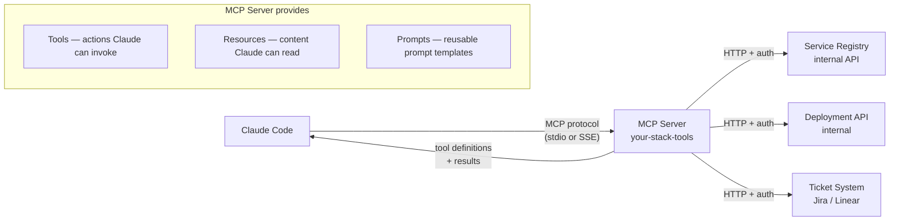

Out of the box, Claude Code knows how to read files, run shell commands, and search the web. That covers a lot, but it doesn't cover your internal service registry, your company's deployment API, or your ticketing system. You can describe these to the model in CLAUDE.md and hope it uses curl correctly — or you can build an MCP server that gives Claude Code a first-class typed interface to your internal stack. The difference in reliability and convenience is significant.



## What MCP Provides to Claude Code

An MCP server exposes three things:

**Tools**: functions Claude Code can call. These are the most useful — `get_service_owner`, `trigger_deployment`, `create_ticket`, `check_build_status`. Each tool has a typed schema (name, description, parameters), and Claude Code decides when to call them based on the conversation context.

**Resources**: content Claude Code can read. Think of these as dynamic files — an always-current version of your internal API documentation, the current on-call schedule, the latest deployment manifest. Claude Code can read them the same way it reads local files.

**Prompts**: reusable prompt templates exposed through the MCP server. Less commonly used, but useful for standardizing complex multi-step prompts across a team.

## Building an MCP Server in Python

The `mcp` SDK handles the protocol — you define tools as Python functions.

```bash
pip install mcp httpx
```

```python
# tools/internal_stack_mcp.py
import asyncio
import httpx
from mcp.server import Server
from mcp.server.stdio import stdio_server
from mcp import types

app = Server("internal-stack")
REGISTRY_URL = "https://registry.internal.example.com"
DEPLOY_URL = "https://deploy.internal.example.com"

@app.list_tools()
async def list_tools() -> list[types.Tool]:
    return [
        types.Tool(
            name="get_service_owner",
            description=(
                "Look up the owning team and on-call engineer for a named service. "
                "Use this when you need to know who to contact about a service, "
                "or before making changes to a service you don't own."
            ),
            inputSchema={
                "type": "object",
                "properties": {
                    "service_name": {
                        "type": "string",
                        "description": "The service name as it appears in the registry (e.g. 'auth-service', 'billing-api')"
                    }
                },
                "required": ["service_name"]
            }
        ),
        types.Tool(
            name="check_build_status",
            description=(
                "Check the current CI build status for a service and branch. "
                "Use before suggesting a deployment to confirm the build is green."
            ),
            inputSchema={
                "type": "object",
                "properties": {
                    "service_name": {"type": "string"},
                    "branch": {"type": "string", "description": "Branch name, defaults to 'main'"}
                },
                "required": ["service_name"]
            }
        ),
    ]

@app.call_tool()
async def call_tool(name: str, arguments: dict) -> list[types.TextContent]:
    async with httpx.AsyncClient() as client:
        if name == "get_service_owner":
            r = await client.get(
                f"{REGISTRY_URL}/services/{arguments['service_name']}/owner",
                headers={"Authorization": f"Bearer {_get_token()}"},
                timeout=10
            )
            r.raise_for_status()
            data = r.json()
            return [types.TextContent(
                type="text",
                text=f"Service: {data['service']}\nTeam: {data['team']}\nOn-call: {data['oncall_name']} ({data['oncall_slack']})"
            )]

        elif name == "check_build_status":
            branch = arguments.get("branch", "main")
            r = await client.get(
                f"{DEPLOY_URL}/builds/{arguments['service_name']}/{branch}/latest",
                headers={"Authorization": f"Bearer {_get_token()}"},
                timeout=10
            )
            r.raise_for_status()
            data = r.json()
            return [types.TextContent(
                type="text",
                text=f"Build #{data['build_id']}: {data['status']} ({data['duration_s']}s)\nCommit: {data['commit_sha'][:8]} — {data['commit_message']}"
            )]

        raise ValueError(f"Unknown tool: {name}")

def _get_token() -> str:
    import os
    token = os.environ.get("INTERNAL_API_TOKEN")
    if not token:
        raise RuntimeError("INTERNAL_API_TOKEN environment variable not set")
    return token

async def main():
    async with stdio_server() as (read_stream, write_stream):
        await app.run(read_stream, write_stream, app.create_initialization_options())

if __name__ == "__main__":
    asyncio.run(main())
```

## The Same Server in TypeScript

For Node.js teams:

```typescript
// src/internal-stack-mcp.ts
import { Server } from "@modelcontextprotocol/sdk/server/index.js";
import { StdioServerTransport } from "@modelcontextprotocol/sdk/server/stdio.js";
import { CallToolRequestSchema, ListToolsRequestSchema } from "@modelcontextprotocol/sdk/types.js";

const server = new Server(
  { name: "internal-stack", version: "1.0.0" },
  { capabilities: { tools: {} } }
);

server.setRequestHandler(ListToolsRequestSchema, async () => ({
  tools: [
    {
      name: "get_service_owner",
      description:
        "Look up the owning team and on-call engineer for a named service. " +
        "Use when you need to know who owns a service before making changes.",
      inputSchema: {
        type: "object",
        properties: {
          service_name: { type: "string", description: "Service name as in the registry" }
        },
        required: ["service_name"]
      }
    }
  ]
}));

server.setRequestHandler(CallToolRequestSchema, async (request) => {
  const { name, arguments: args } = request.params;

  if (name === "get_service_owner") {
    const res = await fetch(
      `${process.env.REGISTRY_URL}/services/${args?.service_name}/owner`,
      { headers: { Authorization: `Bearer ${process.env.INTERNAL_API_TOKEN}` } }
    );
    const data = await res.json() as Record<string, string>;
    return {
      content: [{
        type: "text",
        text: `Team: ${data.team}\nOn-call: ${data.oncall_name} (${data.oncall_slack})`
      }]
    };
  }

  throw new Error(`Unknown tool: ${name}`);
});

const transport = new StdioServerTransport();
await server.connect(transport);
```

## Connecting to Claude Code

Add the server to `.claude/settings.json`:

```json
{
  "mcpServers": {
    "internal-stack": {
      "type": "stdio",
      "command": "python3",
      "args": ["/home/user/project/tools/internal_stack_mcp.py"],
      "env": {
        "INTERNAL_API_TOKEN": "${INTERNAL_API_TOKEN}"
      }
    }
  }
}
```

For a Node.js server built with `tsc`:

```json
{
  "mcpServers": {
    "internal-stack": {
      "type": "stdio",
      "command": "node",
      "args": ["/home/user/project/dist/internal-stack-mcp.js"]
    }
  }
}
```

The `${INTERNAL_API_TOKEN}` syntax reads from your shell environment — credentials stay out of the config file.

## Tool Descriptions Are the Most Underinvested Part

The quality of tool descriptions directly determines whether Claude Code uses your tools correctly. This is the part teams consistently underinvest in.

**Bad description:**

```json
{
  "name": "get_service_owner",
  "description": "Gets service owner information"
}
```

The model doesn't know when to call this, what "service owner" means in your context, or what it returns.

**Good description:**

```json
{
  "name": "get_service_owner",
  "description": "Look up the owning team and on-call engineer for a named internal service. Use this BEFORE making any changes to a service you don't own, and when the user asks who to contact about a service. Returns team name, Slack handle, and current on-call engineer. Service names match what appears in Kubernetes namespaces (e.g. 'auth-service', 'billing-api', not 'auth' or 'billing')."
}
```

The good version tells the model when to call the tool, what the parameter format is, and what it will return. That is the minimum bar for reliable tool use.

## Debugging MCP

When a tool isn't being called or is returning errors:

```bash
# List all tools Claude Code can see (including MCP tools)
claude tools list

# Run Claude Code with MCP debug output
claude --mcp-debug

# Test the server directly without Claude Code
echo '{"jsonrpc":"2.0","method":"tools/list","id":1}' | python3 tools/internal_stack_mcp.py
```

If `claude tools list` doesn't show your tool, the server isn't starting correctly — check the server's stderr output. If the tool shows up but isn't being called, the description needs work.

> Security note: the MCP server runs as your local user process. It authenticates to internal APIs using credentials from your environment. Claude Code never sees those credentials — the server handles auth internally and only returns results.
{: .prompt-info }
