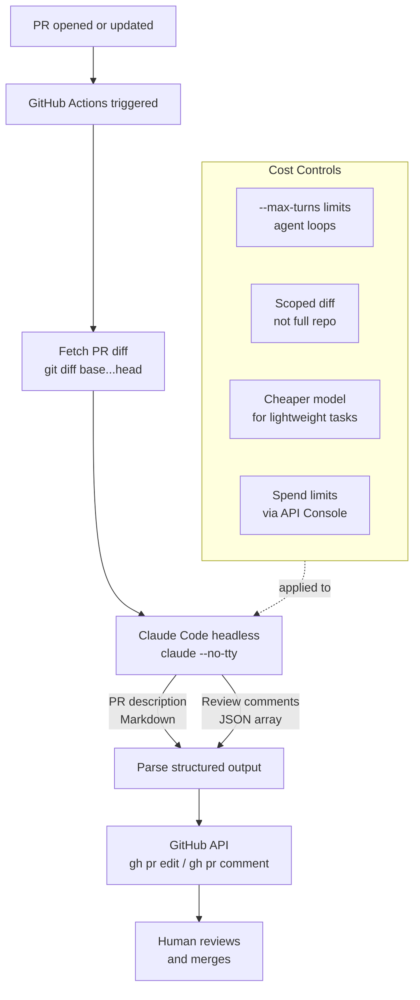

Running Claude Code in CI is genuinely useful for a narrow set of tasks — and genuinely problematic if you treat it as a general-purpose AI step you can drop anywhere in a pipeline. The tasks that work well are bounded, output-structured, and tolerant of occasional imprecision. The tasks that fail are open-ended, context-heavy, or gates on critical paths where a hallucination breaks production. Knowing the difference before you commit to the integration saves a lot of pain.



## Running Claude Code Headlessly

In CI, Claude Code runs without a TTY and without interactive prompts. The key flags:

```bash
# Basic headless run
claude --no-tty --print "Generate a PR description for this diff: $(git diff origin/main...HEAD)"

# With explicit model selection
claude --no-tty --model claude-haiku-4-5 --print "$(cat prompt.txt)"

# Limit agent loop iterations (prevents runaway costs in agentic mode)
claude --no-tty --max-turns 3 --print "$(cat prompt.txt)"

# Read-only mode — disables all write and execute tools
claude --no-tty --allowedTools "Read,Glob,Grep" --print "$(cat prompt.txt)"
```

The `ANTHROPIC_API_KEY` environment variable is required. In GitHub Actions, store it as a repository secret and reference it in the workflow env.

## A Complete PR Description Workflow

This workflow runs on every PR open and update, generates a structured description from the diff, and updates the PR body using the GitHub CLI.

```yaml
# .github/workflows/pr-description.yml
name: Generate PR Description

on:
  pull_request:
    types: [opened, synchronize]

jobs:
  describe:
    runs-on: ubuntu-latest
    permissions:
      pull-requests: write
      contents: read

    steps:
      - uses: actions/checkout@v4
        with:
          fetch-depth: 0

      - name: Install Claude Code
        run: npm install -g @anthropic-ai/claude-code

      - name: Generate diff
        id: diff
        run: |
          git diff origin/${{ github.base_ref }}...HEAD \
            -- '*.py' '*.go' '*.ts' '*.tsx' '*.js' '*.yaml' '*.yml' \
            | head -c 40000 > /tmp/pr_diff.txt
          echo "diff_size=$(wc -c < /tmp/pr_diff.txt)" >> $GITHUB_OUTPUT

      - name: Generate PR description
        env:
          ANTHROPIC_API_KEY: ${{ secrets.ANTHROPIC_API_KEY }}
        run: |
          cat > /tmp/prompt.txt << 'PROMPT'
          You are reviewing a pull request diff. Generate a PR description in this exact format:

          ## Summary
          (2-3 sentences: what changed and why)

          ## Changes
          - (bullet list of specific changes)

          ## Testing
          (what tests were added or updated)

          ## Notes
          (anything reviewers should pay particular attention to, or "None")

          Diff to analyze:
          PROMPT

          cat /tmp/pr_diff.txt >> /tmp/prompt.txt

          claude --no-tty \
            --model claude-haiku-4-5 \
            --max-turns 1 \
            --print "$(cat /tmp/prompt.txt)" > /tmp/pr_description.txt

      - name: Update PR description
        env:
          GH_TOKEN: ${{ github.token }}
        run: |
          gh pr edit ${{ github.event.pull_request.number }} \
            --body "$(cat /tmp/pr_description.txt)"
```

Key decisions in that workflow:

**Scoped diff** — only code files, capped at 40,000 characters. This covers the vast majority of PRs while preventing context overflow on large diffs. Passing the entire repo would be expensive and counterproductive.

**claude-haiku-4-5** — PR description generation doesn't need Sonnet-level reasoning. Haiku is fast and cheap for this task. Use the cheapest model that produces acceptable output.

**`--max-turns 1`** — this is not an agentic task. One prompt, one output. Prevent the model from spinning up a multi-turn agent loop.

## What Works Well in CI

**PR description generation.** The diff is bounded and the output format is clear. Even imperfect descriptions are useful — they give reviewers context they'd otherwise have to reconstruct manually.

**Changelog entry generation.** Feed it conventional commit messages for the release, get a changelog entry. The model is summarizing structured input into structured output.

**Security anti-pattern scanning.** Prompt Claude to look for specific patterns (hardcoded credentials, SQL injection risks, missing input validation) in the diff. This catches obvious issues faster than a human reading a large diff.

**Test generation for new functions.** Pass a new function and its signature, ask for test cases. The output needs review, but it's a time saver for boilerplate test structure.

## Cost Control

Left unmanaged, CI AI costs will surprise you. Three controls you should have in place before going live:

**Per-run token budgeting.** Use `--max-turns` to limit agent loops. For non-agentic tasks (single prompt → single output), `--max-turns 1` prevents any looping. For agentic tasks, set a ceiling that matches your expected complexity.

**Diff scoping.** Don't pass the entire repository. Don't pass binary files or generated files. Cap input size explicitly:

```bash
# Only include files changed in the PR, only certain extensions, only up to 40K chars
git diff origin/${{ github.base_ref }}...HEAD \
  -- '*.py' '*.go' '*.ts' \
  | head -c 40000
```

**Spend limits in the Anthropic Console.** Set per-API-key monthly spend limits. These are a circuit breaker — they don't replace prompt-level controls, but they prevent a runaway workflow from generating a surprise bill.

**Model selection by task complexity:**
- Haiku: PR descriptions, changelog entries, simple summarization
- Sonnet: security review, test generation, code review with reasoning
- Avoid Opus in CI: the cost per run is hard to justify for automated tasks

## What Doesn't Work in CI

**Open-ended exploration.** "Find all the bugs in this PR" produces inconsistent results and costs significantly more than targeted prompts. Scope the task precisely.

**Full-codebase understanding.** If the task requires understanding files not in the diff — global patterns, implicit dependencies, architecture decisions — the headless runner won't read those files reliably. Either provide them explicitly in the prompt or accept that the output will be shallow.

**Hard gates on critical paths.** Using Claude Code as a required merge gate is a risk. The model can produce false positives (blocking a valid PR) and false negatives (passing a problematic one). Use it as an advisory signal, not a binary block.

**Tasks requiring iteration.** If the right output depends on asking follow-up questions or exploring the codebase, CI is the wrong environment. Those tasks belong in an interactive session.

> Always run your CI AI steps with `--no-tty` and test them locally with `ANTHROPIC_API_KEY=your-key claude --no-tty --print "$(cat test_prompt.txt)"` before committing to a workflow. The failure modes in headless mode differ from interactive mode.
{: .prompt-warning }
