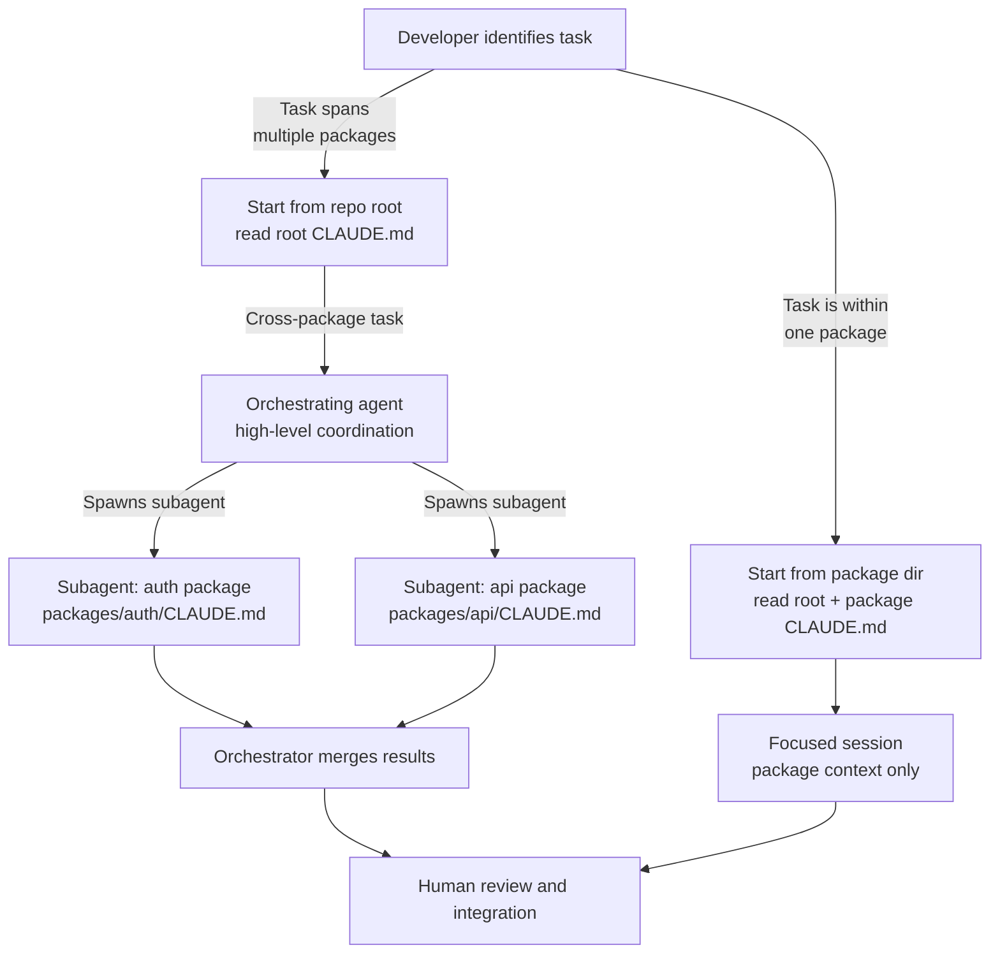

The demos always show a ten-file project. Your monorepo has 600 packages, 2 million lines, and a build graph that takes 4 minutes to compute. Claude Code can be genuinely useful in that environment, but not the same way it's useful in a small project. The naive approach — open Claude Code at the repo root, ask a big question — produces shallow answers that don't respect the implicit structure of your codebase. With some deliberate session management and CLAUDE.md work, you get something much better.



## CLAUDE.md for Monorepos: The Stacking Strategy

A monorepo CLAUDE.md lives at two levels. Get both right.

**Root `CLAUDE.md`**: repo-wide conventions. What the monorepo does, top-level structure (what lives in `packages/`, `apps/`, `libs/`, `tools/`), shared tooling (build system, test runner, linting), shared coding conventions, cross-cutting constraints.

Keep it factual and short. A 2-million-line repo doesn't need a 3,000-word root CLAUDE.md — it needs a precise map of what's where and how the build works.

```markdown
# internal-platform — AI Context

## Repo Structure
- `packages/` — shared libraries, importable by apps and other packages
- `apps/` — deployable services (each has its own Dockerfile and deployment config)
- `tools/` — build tooling, code generators, CI scripts
- `libs/` — vendored and internal forks (do not modify without engineering review)

## Build System
This repo uses Turborepo. Always build with `turbo` commands, not direct `npm/yarn` calls.

```bash
turbo build                        # Build all affected packages
turbo test --filter=./packages/auth  # Test a single package
turbo lint --affected              # Lint only changed files
```

## Cross-Package Conventions
- Package names follow `@company/package-name` in package.json
- Internal imports use workspace protocol: `"@company/auth": "workspace:*"`
- Breaking changes to shared packages require a changeset: `npx changeset`
- Never import from `apps/` into `packages/` — packages must be app-agnostic
```

**Package-level `CLAUDE.md`** (`packages/auth/CLAUDE.md`): specializes for that package. What the package does (in detail), package-specific patterns, local test commands, dependencies, known rough edges. Don't repeat root-level conventions — the model already has them.

```markdown
# packages/auth — AI Context

## What This Package Does
JWT issuance, validation, and refresh for all internal services. Consumers should use
`createAuthMiddleware()` for express apps — don't implement JWT logic independently.

## Package Structure
- `src/middleware/` — Express middleware (the main consumer interface)
- `src/tokens/` — JWT creation and validation logic
- `src/providers/` — OIDC provider integrations (Google, Okta)
- `src/__tests__/` — Unit tests. Integration tests live in `e2e/` at the repo root.

## Local Dev
```bash
cd packages/auth
npm test              # Unit tests only, fast
npm run test:watch    # Watch mode during development
```

## Constraints
- Token expiry values are in `src/config/defaults.ts`. Do not hardcode expiry values in other files.
- The `verify()` function must remain synchronous — callers depend on it.
- PKCE flow is not yet implemented. Don't add it without consulting the auth team.
```

## Scoping Sessions Deliberately

Where you start Claude Code determines what context it assembles first. For package-specific work, start from the package directory:

```bash
# Work on auth package — Claude reads packages/auth/CLAUDE.md before root
cd packages/auth
claude

# Cross-package work — Claude reads root CLAUDE.md first
cd /path/to/monorepo
claude
```

This matters more than it seems. A session started at the package level has the package's context immediately prominent. A session started at the root sees the repo-level view first and may need explicit guidance to focus on the right package.

The practical habit: before starting a Claude Code session, ask "what is the smallest directory boundary that contains everything relevant to this task?" Start there.

## Explicit File References

When Claude Code needs to understand code it hasn't read, reference the files explicitly in your prompt:

```
# Weak prompt — Claude may not have read the relevant files
"Update the auth middleware to support the new token format"

# Strong prompt — Claude knows exactly what to read
"Read packages/auth/src/middleware/auth.ts and packages/shared/src/types/token.ts,
then update the middleware to support the new TokenV2 format defined in the types file"
```

Explicit references are especially important for cross-package changes where the model hasn't seen both sides of the dependency. The `#file:` shorthand works in some contexts:

```
Look at #file:packages/auth/src/tokens/verify.ts and explain what the PKCE validation
flow would need to add to the `verify()` function.
```

## Subagent Composition for Cross-Package Work

For tasks that genuinely span package boundaries, Claude Code can orchestrate subagents. Each subagent gets a focused task and the relevant context for its package.

The pattern works when:
- The packages have clear interfaces between them (you can describe the contract)
- The work can be parallelized (auth changes and API changes are independent once the interface is defined)
- Each sub-task is concrete enough to assign to a subagent without ongoing coordination

It doesn't work when:
- The changes are deeply interleaved and require continuous back-and-forth
- The interface between packages isn't well-defined (the subagents will make incompatible assumptions)
- The task requires understanding the whole to do the parts correctly

A rough guide: if you can write a clear spec for each subagent's task that another engineer could implement independently, subagents will probably work. If you can't write that spec, neither can the orchestrator.

## What Claude Code Still Struggles With at Scale

**Global refactors.** Renaming a type that's used in 800 files is not a good Claude Code task. The model can't hold all 800 files in context simultaneously. It will miss some, produce inconsistent changes, or make assumptions about files it hasn't read. Use LSP-based rename tooling for this.

**Implicit dependencies.** A dynamic language codebase where the call graph is only known at runtime is hard for any tool, including Claude Code. If a function is called via reflection, string-keyed dispatch, or monkey-patching, the model won't trace it. Be explicit about these relationships in CLAUDE.md or in your prompts.

**Consistency with unread code.** Claude Code is consistent with what it has read. It is only guessing about what it hasn't. After any large Claude-driven change, check: did the model actually read the files it claims to have updated? Ask it directly:

```
Before I review this, tell me which files you read to understand the current auth middleware behavior.
```

If it lists files you know are critical but didn't mention, it may have guessed about them. Verify the change against those files manually.

> In a large codebase, your job as the developer is to be the context manager. Claude Code writes code well; you decide what it reads before it does.
{: .prompt-tip }
