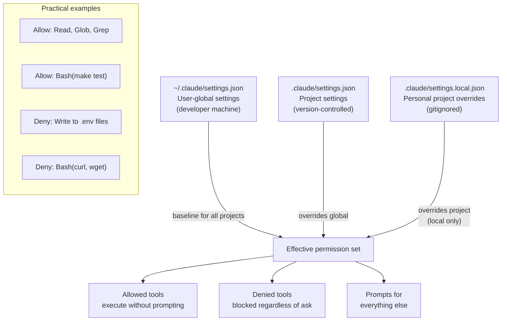

The default Claude Code configuration is permissive. It will ask before doing dangerous things, but "ask" is not the same as "can't." In an enterprise environment with secrets in the codebase, external API credentials in env vars, and regulatory requirements around data access, you need more than "the model will ask first." You need a configuration that constrains what's possible — enforced by the harness, not by trusting the model's judgment.



## The Settings File Hierarchy

Three settings files control Claude Code's behavior, each at a different scope:

**`~/.claude/settings.json`** (user-global): your personal defaults across all projects. Good place for your preferred tool allowances — tools you trust in every project.

**`.claude/settings.json`** (project-level, checked into git): team-wide project constraints. Everyone who clones the repo gets these settings. This is where you enforce security invariants.

**`.claude/settings.local.json`** (project-level, gitignored): personal overrides for this project. For individual developer preferences that shouldn't apply to the whole team.

Later files in the hierarchy override earlier ones. The project settings override global; local overrides project.

## Key Permission Settings

The core configuration lives under `permissions` in the settings JSON:

```json
{
  "permissions": {
    "allow": [
      "Read",
      "Glob",
      "Grep",
      "Bash(make test)",
      "Bash(make build)",
      "Bash(make lint)",
      "Bash(go test ./...)",
      "Write(src/**)"
    ],
    "deny": [
      "Bash(curl *)",
      "Bash(wget *)",
      "Bash(ssh *)",
      "Bash(scp *)",
      "Write(**/.env)",
      "Write(**/.env.*)",
      "Write(**/secrets.*)",
      "Write(**/*.pem)",
      "Write(**/*.key)",
      "Write(**/credentials*)"
    ]
  }
}
```

**`allow`** lists tool invocations that execute without prompting the user. Use specific Bash patterns (not `Bash(*)`) — you want Claude Code to run the test suite without asking, not to run arbitrary shell commands without asking.

**`deny`** lists tool invocations that are blocked regardless of what the user or model tries. These are hard constraints. Denying writes to `.env` files means even if a user types "update the .env file," the Write tool call is blocked before execution.

## An Enterprise Lockdown Configuration

For a project with regulatory constraints or a sensitive codebase:

```json
{
  "permissions": {
    "allow": [
      "Read",
      "Glob",
      "Grep",
      "Write(src/**)",
      "Write(tests/**)",
      "Write(docs/**)",
      "Bash(make test)",
      "Bash(make build)",
      "Bash(make lint)",
      "Bash(git diff*)",
      "Bash(git log*)",
      "Bash(git status)"
    ],
    "deny": [
      "Bash(curl *)",
      "Bash(wget *)",
      "Bash(nc *)",
      "Bash(nmap *)",
      "Bash(ssh *)",
      "Bash(scp *)",
      "Bash(rsync *)",
      "Bash(pip install *)",
      "Bash(npm install *)",
      "Bash(apt *)",
      "Bash(brew *)",
      "Write(**/.env)",
      "Write(**/.env.*)",
      "Write(**/secrets.*)",
      "Write(**/*.pem)",
      "Write(**/*.key)",
      "Write(**/*.p12)",
      "Write(**/*.pfx)",
      "Write(**/credentials*)",
      "Write(**/config/production*)",
      "Write(.github/workflows/**)"
    ]
  }
}
```

This allows read access everywhere, write access within source and test directories, and a specific set of build/test commands — while blocking network egress, package installation, and writes to sensitive paths. GitHub Actions workflows are write-denied to prevent the model from modifying CI configuration.

## What Claude Code Can See: The Honest List

Beyond tool permissions, understand what the model has access to by default:

**Environment variables**: Claude Code runs in your shell context. If you have `AWS_ACCESS_KEY_ID` or `DATABASE_URL` in your shell env, a model with Bash access can read them via `env` or `printenv`. Mitigation: use a wrapper script that strips sensitive env vars before launching Claude Code:

```bash
#!/usr/bin/env bash
# claude-clean — launch Claude Code without credential env vars
env -u AWS_ACCESS_KEY_ID \
    -u AWS_SECRET_ACCESS_KEY \
    -u DATABASE_URL \
    -u STRIPE_SECRET_KEY \
    -u GITHUB_TOKEN \
    claude "$@"
```

**File system**: any file readable by your user account. The `deny` list for Write doesn't apply to Read — Claude Code can read `.env` files even if it can't write them. For sensitive files that shouldn't be readable:

Create `.claudeignore` at the project root (analogous to `.gitignore`):

```
# .claudeignore
.env
.env.*
secrets/
*.pem
*.key
config/production.yml
internal/credentials/
```

**Git history**: Claude Code can run `git log`, `git show`, and `git diff` if you allow it Bash access to git commands. If your repository has had credentials committed in the past (even if since rotated), they are in the git history and the model can read them with `git show`. Audit your history with `git log --all -S "password\|token\|secret"` before running Claude Code with git access.

## Credential Hygiene Checklist

Before running Claude Code in a sensitive project:

- [ ] No live credentials in `.env` files in the project directory (use a secrets manager; `.env` should reference variable names, not values)
- [ ] Shell session stripped of credential env vars, or wrapper script in use
- [ ] `.claudeignore` created and covers secrets paths
- [ ] Git history audited for committed credentials
- [ ] Project settings deny writes to known-sensitive paths
- [ ] Bash allow-list uses specific commands, not `Bash(*)`

## Enterprise Distribution

The project-level `.claude/settings.json` goes in version control and is applied automatically when anyone clones the repo. This is the right model for team-wide constraints — the security configuration is part of the project, reviewed with the code, and updated when requirements change.

For org-wide standards that should apply across all projects, use a dotfiles repository or MDM to distribute a base `~/.claude/settings.json` to developer machines. Project settings then layer on top of that baseline.

```bash
# In a dotfiles bootstrap script
mkdir -p ~/.claude
cat > ~/.claude/settings.json << 'EOF'
{
  "permissions": {
    "deny": [
      "Bash(curl *)",
      "Bash(wget *)",
      "Bash(ssh *)"
    ]
  }
}
EOF
```

## Audit Logging

Claude Code writes tool call logs locally. The log location is system-dependent but typically lives in `~/.claude/logs/`. These logs capture what tools were invoked, with what arguments, and whether they succeeded — useful for incident investigation and compliance auditing.

For centralized audit logging in an enterprise environment, the PostToolUse hook is the right integration point: every tool call triggers the hook with the tool name and arguments in JSON, which you can forward to your logging infrastructure.

```bash
#!/usr/bin/env bash
# .claude/hooks/audit-log.sh — PostToolUse hook for centralized audit logging
INPUT=$(cat)
TIMESTAMP=$(date -u +"%Y-%m-%dT%H:%M:%SZ")
echo "{\"timestamp\":\"$TIMESTAMP\",\"user\":\"$USER\",\"project\":\"$(basename $(pwd))\",\"tool_call\":$INPUT}" \
  >> /var/log/claude-audit/tool-calls.jsonl
exit 0
```

> The permission system constrains what is possible; the model's judgment determines what it attempts. Both matter. Good permissions prevent catastrophic mistakes; good judgment prevents mediocre ones.
{: .prompt-info }
