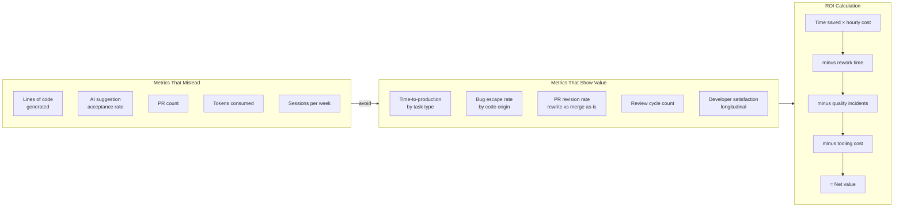

Every engineering leader wants to know if Claude Code is worth it. Most of them are reaching for the wrong ruler. Lines of code generated, PR count, AI acceptance rate, tokens consumed — these numbers will go up when you introduce Claude Code and tell you almost nothing about whether you're producing better software faster. The problem is that these are supply-side metrics: they measure the tool's activity, not its value. Value only shows up on the output side: shipping speed, defect rate, engineering capacity, and developer experience.



## Why Velocity Metrics Fail

**Lines of code** inflate with AI assistance. Claude Code generates verbose code — it often writes 30% more than a skilled engineer would write by hand, because it hedges with extra null checks, extra logging, and comments explaining what it just wrote. If your metric rewards line count, you are accidentally rewarding bloat.

**PR count** goes up when engineers work in shorter cycles. AI tools do encourage more frequent, smaller commits — which is generally good engineering practice. But more PRs is not the same as more value delivered. A team opening 40 small PRs a week may be shipping less than one opening 10 well-scoped ones.

**AI acceptance rate** (Copilot's main vanity metric) is even worse. An engineer who accepts 10% of suggestions and picks exactly the right 10% is producing better outcomes than one who accepts 80% indiscriminately and then spends time cleaning up the mess. High acceptance rate is neutral at best, problematic at worst.

## What to Measure Instead

### Bug Escape Rate by Code Origin

Tag PRs and issues with their origin: AI-assisted, human-written, or AI-reviewed. Over 3-6 months, track the defect rate in production by origin.

This is the most important metric and the most work to collect. But it's the only metric that directly answers the question: "Is AI-assisted code as reliable as human-written code?" If AI-assisted code produces proportionally more production bugs, the review process is broken — engineers are not reviewing AI output with appropriate skepticism. If it produces fewer bugs, you're getting real quality benefit.

The collection method: a voluntary `ai-assisted` label on PRs. Engineers self-report when they used Claude Code substantially. When a production bug is triaged, the incident tags the PR that introduced it. Match the PR label to the incident. Aggregate quarterly.

### Time to Production by Task Type

Not just overall velocity — broken down by task type. AI tools don't uniformly accelerate all work.

Where Claude Code genuinely speeds things up: greenfield feature development, boilerplate generation (API endpoints, CRUD handlers, test scaffolding), documentation, refactoring within a single file. Expect 20-40% reduction in time-to-production for these.

Where it doesn't: bug investigations (the model doesn't know what the bug is until you do), cross-cutting architectural changes (context limits), code in weakly-typed dynamic languages with extensive implicit dependencies.

Measure both. Report both. An honest measurement shows where the tool helps and where it doesn't — that's more valuable than an average that obscures both.

### PR Revision Rate

How often does a reviewer substantially rewrite AI-generated code before merging? Track this by asking reviewers to note when they've rewritten more than 30% of a PR — another voluntary signal.

High revision rate means one of three things: the prompt quality is poor, the task was too complex for current AI tools, or the engineer submitted AI output without reviewing it first. All three are actionable. Low revision rate means the AI output is landing well and reviewer time is being spent on real problems rather than fixing AI mistakes.

### Review Cycle Count

AI-assisted PRs should require fewer review rounds, not more. If engineers are opening PRs that require 3-4 rounds before merge, the AI is generating the wrong thing or generating it for the wrong task. Review cycle count is easy to pull from GitHub: the number of review rounds per PR before merge.

Compare cycle counts for ai-assisted vs non-assisted PRs. If they're equal, you're getting speed benefits without quality tradeoff. If ai-assisted PRs need more rounds, the time saved writing code is being lost in review.

## Building Measurement Without Surveillance

The measurement approach matters as much as the metrics. Individual-level tracking destroys trust and changes behavior in exactly the wrong direction — engineers game metrics, or stop using AI tools to avoid being measured on them.

The rules:
- **Aggregate at team level, never individual.** You want to know if the team is shipping better. Individual attribution is noise.
- **Voluntary signals only.** The `ai-assisted` label is self-reported. No mandatory tracking, no session logging, no keystroke analysis.
- **Share results with the engineers, not just leadership.** If the data shows AI-assisted code has a higher bug rate, the engineers need to know that more than the CTO does — they're the ones who can fix it.
- **Longitudinal tracking over at least two quarters.** Two weeks of data tells you nothing. AI tooling takes time to learn and time for practices to stabilize. Measure quarterly minimum.

## Leading Indicators

While lagging indicators (bug rates, production incidents) take months to accumulate, these leading indicators give you signal in weeks:

**Spec quality before Claude is invoked.** Teams that write clear problem statements and acceptance criteria before asking Claude Code to implement them consistently get better output. Teams that skip specification and prompt the model with vague intent consistently get more rework. Track whether engineers are writing specs — not to surveil them, but as a signal of process maturity.

**Review depth on AI-assisted PRs.** Are reviewers reading AI output with appropriate skepticism? A good review of an AI-assisted PR should take roughly as long as reviewing human-written code of the same size. If reviews are shorter on AI-assisted PRs, engineers may be treating AI output as trusted by default.

**Session start patterns.** Are engineers starting Claude Code sessions with context-heavy, well-framed prompts, or with vague one-liners? Session-start prompt quality is a leading indicator of output quality. You can observe this in team channel discussions without tracking sessions.

## The ROI Calculation

Be honest about both sides:

```
Net value = (Time saved × engineer hourly cost)
          − (Rework time × engineer hourly cost)
          − (Quality incidents: investigation + fix + customer cost)
          − (Tooling cost: API credits + Claude Code licenses)
```

"Time saved" requires a baseline. Establish it before rolling out Claude Code to a team, or use a control group. Without a baseline, every time-saved estimate is a guess.

"Rework time" is consistently underestimated. Include: time spent reviewing AI output, time spent fixing AI-generated bugs, time spent explaining AI decisions to reviewers, time spent undoing changes that went in the wrong direction.

"Quality incidents" attributable to AI-generated code are the highest-variance term. One serious production incident from AI-generated code can wipe out months of productivity gains. This is why the bug escape rate metric is so important — catch it early.

For a realistic enterprise scenario: a team of 8 engineers, each saving 1.5 hours per day on implementation work, at $120/hour blended rate — that's $180K/year in raw time savings. Against that: $5K/year in API costs, and — critically — whatever rework and quality costs emerge from the measurement system. If rework runs 30% of time saved and there are no quality incidents, ROI is strong. If rework runs 60% and there are two production incidents per quarter, it's borderline.

What good looks like after six months: 20-30% reduction in time-to-production for greenfield features; bug escape rates at parity with human-written code; engineers reporting they spend more time on architecture, design, and hard problems, and less on boilerplate. Those three together, with honest measurement, make a durable business case.

> Don't present a ROI calculation without including rework time and quality incident costs. A number that omits those isn't ROI — it's a feature comparison dressed as a financial analysis.
{: .prompt-warning }
