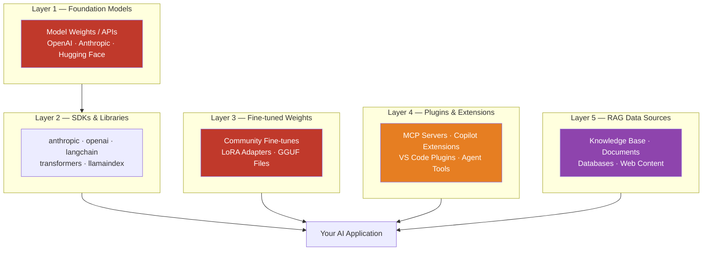

Software supply chain security is well-understood after Log4Shell and the SolarWinds compromise. The response — SBOM requirements, dependency pinning, private package registries, code signing — is now standard practice at mature engineering orgs.

AI systems have a supply chain too. It's larger, less well-understood, and only partially covered by the controls you've already built for traditional software. This post maps the layers and the risks at each one.



## Layer 1: Foundation Model Risks

When you use a hosted API — Anthropic, OpenAI, Google — you're trusting that provider's infrastructure, security practices, and model integrity. For enterprise use, this means:

- **Get the MSA/DPA right.** Data processing agreements matter. Understand what data is retained, for how long, and under what conditions. Enterprise tiers from major providers offer better contractual protections.
- **Model version pinning.** Hosted APIs sometimes update model versions without explicit notice. If your application behavior depends on specific model behavior, pin to a specific model version (`claude-3-5-sonnet-20241022`, not `claude-sonnet-latest`).
- **API key hygiene.** Not a model-level concern, but the obvious one: rotate keys, scope to minimum permissions, use secrets management, don't put keys in environment variables that get logged.

The bigger supply chain risk at this layer is **self-hosted open-source model weights**.

### Compromised Model Weights

Community fine-tunes from Hugging Face Hub are not vetted. Research has demonstrated models with "sleeper" backdoors — the model behaves normally except when a specific trigger phrase appears in the input, at which point it produces attacker-controlled output, bypasses safety filters, or exfiltrates context.

These attacks are not theoretical. They've been reproduced in academic settings and the tooling to create them is public.

**Practical controls:**
- Only use model weights from organizations you trust, with provenance you can verify.
- Verify the SHA-256 hash of weight files against the model card before deployment.
- Prefer `safetensors` format. `pickle`-based formats (`.pt`, `.bin` in some loaders) can execute arbitrary code at load time. This is not a theoretical concern.

```python
import hashlib

def verify_model_weights(path: str, expected_sha256: str) -> bool:
    """Verify model weight file integrity before loading."""
    sha256 = hashlib.sha256()
    with open(path, "rb") as f:
        for chunk in iter(lambda: f.read(8192), b""):
            sha256.update(chunk)
    actual = sha256.hexdigest()
    if actual != expected_sha256:
        raise ValueError(
            f"Model weight integrity check failed.\n"
            f"Expected: {expected_sha256}\n"
            f"Got:      {actual}"
        )
    return True
```

Never load community model weights in production without hash verification.

## Layer 2: SDK and Library Risks

The AI SDK ecosystem is moving fast, which means high churn in the dependency graph and frequent new releases from maintainers under pressure to ship features.

### Typosquatting

Attackers publish malicious packages with names one character different from popular AI libraries:

| Legitimate | Typosquats to watch for |
|---|---|
| `anthropic` | `antropic`, `anthrpic`, `anthroplc` |
| `openai` | `openaai`, `openai-api` (unofficial) |
| `langchain` | `langchan`, `lang-chain` |
| `transformers` | `transformer` (context-dependent) |

The attack vector: a developer copies a pip install command with a typo, or an automated dependency update pulls a similarly-named package.

**Controls:**
- Use a private package registry (Artifactory, AWS CodeArtifact) that proxies PyPI/npm but blocks packages not in an approved list.
- Lock all dependencies in `requirements.txt` or `pyproject.toml` with hashes, not just version pins.
- Run `pip-audit` or `safety` in CI to catch known vulnerabilities in the dependency tree.

```bash
# Generate hashed requirements (tamper-evident lock file)
pip install pip-tools
pip-compile --generate-hashes requirements.in -o requirements.txt

# Audit for known vulnerabilities
pip install pip-audit
pip-audit -r requirements.txt
```

### Dependency Depth

`langchain` in a recent audit had 127 transitive dependencies. Each one is an attack surface. You're not just trusting langchain; you're trusting every library langchain depends on. This is true of any complex AI framework.

Mitigation: dependency scanning in CI (Dependabot, Snyk, or similar), private registry with an approved-list policy, and a process for reviewing new transitive dependencies when they're introduced.

## Layer 3: Fine-tuned and Locally-Served Weights

If your team fine-tunes models or serves local model weights via Ollama, llama.cpp, or vLLM, add:

- **Training data provenance**: what data did the fine-tune see? If the training pipeline ingests untrusted data, you're training on potentially poisoned examples.
- **Evaluation before deployment**: run your eval suite against the fine-tuned model before deploying, including adversarial inputs, to catch behavior changes introduced by the fine-tune.
- **Weight storage security**: treat fine-tuned weight files like credentials. Access-controlled storage, audit logs on who downloaded them, version tracking.

## Layer 4: MCP Servers and Plugins

This is the highest-risk layer for most teams in 2026, and the one receiving the least scrutiny.

MCP (Model Context Protocol) servers give agents tools: the ability to read files, query databases, send messages, browse the web, call APIs. A malicious or compromised MCP server has full visibility into everything passed to its tools, and full control over what it returns.

**The attack surface:**
- **Data exfiltration via tool calls**: every tool invocation sends data to the MCP server process. A malicious server logs everything.
- **Result manipulation**: a compromised server returns manipulated results that trigger indirect prompt injection in the agent's next reasoning step.
- **Tool result injection**: the server returns a tool result containing adversarial instructions (covered in yesterday's post).

**Practical controls:**

Before connecting any MCP server:
- Review the server's source code. This is non-negotiable for servers handling sensitive data.
- Run MCP servers in network-isolated environments where possible. A server for local file access doesn't need internet egress.
- Use a separate process with the minimum OS permissions needed. Don't run MCP servers as root.
- Maintain an approved-list of MCP servers for your team. Treat unapproved servers the same as unapproved npm packages.

```yaml
# Example: MCP server config with explicit scope limiting
mcp_servers:
  - name: filesystem
    command: npx @modelcontextprotocol/server-filesystem
    args: ["/workspace/project"]  # Explicitly scoped to project directory only
    # NOT: args: ["/"]  — this gives file system access to root
    env:
      NODE_ENV: production
    network_access: none  # If your MCP runtime supports network isolation
```

## Layer 5: RAG Data Sources

The knowledge base is trusted by design. That trust is the attack surface.

**Document ingestion pipeline:** treat every document as potentially hostile. Run content policy checks on ingested documents. Scan for embedded instructions in text layers of PDFs, in hidden text, in metadata fields.

**Access control at retrieval time:** if a user can't read Document X directly, they shouldn't be able to ask the agent to summarize Document X and get an answer. RAG retrieval must enforce the same ACLs as direct document access. This is consistently under-implemented in enterprise RAG deployments.

```python
def retrieve_with_acl(query: str, user_id: str, db) -> list[Document]:
    """RAG retrieval that enforces document-level ACLs."""
    # Get documents user has permission to access
    accessible_doc_ids = get_accessible_documents(user_id)
    
    # Filter vector search to only accessible documents
    results = db.similarity_search(
        query,
        filter={"doc_id": {"$in": accessible_doc_ids}},
        k=5
    )
    return results
```

**Stale or tampered knowledge base:** if your knowledge base can be modified by users, track changes and flag anomalies. A document that suddenly changes content after months of stability warrants review.

## The Controls Checklist

| Layer | Control | Priority |
|---|---|---|
| Foundation model | Pin model versions, verify API contract | High |
| Open-source weights | Hash verification, safetensors format | Critical |
| SDKs | Pinned versions with hashes, private registry | High |
| Dependencies | Automated vulnerability scanning in CI | High |
| MCP servers | Source review, network isolation, approved-list | Critical |
| RAG documents | Ingestion policy checks, ACL enforcement | High |
| Fine-tunes | Training data provenance, eval before deploy | Medium |

The AI supply chain is wider and less mature than the traditional software supply chain. The tools exist — apply the same discipline you've built for software dependencies and extend it to every AI-specific component your system depends on.

> If you're using MCP servers you haven't read the source code of, and those servers have access to sensitive data: that is an unreviewed supply chain dependency with elevated risk. Treat it the same way you'd treat an unreviewed npm package running in production.
{: .prompt-warning }
