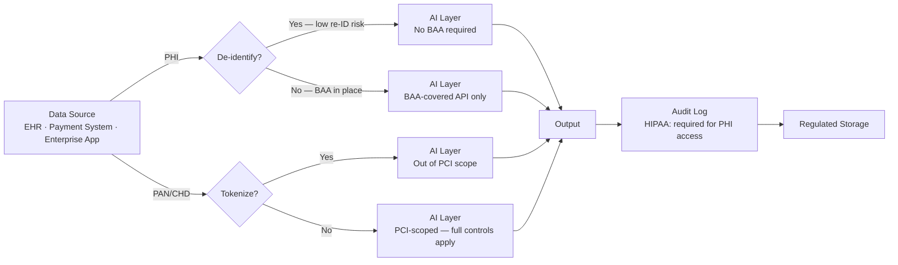

The core tension with regulated data and AI is straightforward: LLMs are trained and served by third parties, and regulated data has strict rules about where it can go and who can see it. When regulated data ends up in a prompt, you've extended your compliance boundary to include the AI provider's infrastructure — and that has consequences.

This post covers what actually changes, regulation by regulation, and the engineering controls that satisfy auditors without killing the use case.



## HIPAA and AI

### The BAA Requirement

If Protected Health Information (PHI) appears in a prompt, the AI provider processing that prompt is a Business Associate under HIPAA — which means you need a Business Associate Agreement (BAA) in place before data flows.

The major providers offer BAAs for enterprise tiers:
- **Anthropic**: BAA available for enterprise API customers
- **OpenAI**: BAA available for enterprise API customers; **not** the consumer ChatGPT interface
- **AWS Bedrock**: covered under AWS's BAA framework
- **Azure OpenAI**: covered under Microsoft's HIPAA BAA
- **Google Vertex AI**: covered under Google Cloud's BAA

Critical distinction: BAAs typically cover the **API**, not the **consumer web UI**. Your developers using Claude.ai or ChatGPT's web interface to process PHI is not covered by the enterprise API BAA. This is a common gap.

Get the BAA signed before any PHI enters prompts. Not after, not "we'll do it soon."

### Minimum Necessary

HIPAA's minimum necessary principle requires limiting PHI access to what's actually needed for the purpose. Applied to AI: don't send a complete medical record when a summary or a few specific fields will do the job.

This matters both for compliance (a narrower BAA scope is easier to negotiate and audit) and security (less PHI in prompts means less exposure if there's a data breach or indirect injection attack).

```python
def build_clinical_prompt(patient_record: dict, query: str) -> str:
    """Extract only necessary PHI fields rather than passing full record."""
    
    # Only include fields relevant to the clinical query
    minimal_context = {
        "age": patient_record.get("age"),
        "relevant_diagnoses": patient_record.get("active_diagnoses", []),
        "current_medications": patient_record.get("medications", []),
        # Explicitly exclude: SSN, full name, address, insurance IDs
    }
    
    return f"""
Clinical context: {minimal_context}
Question: {query}
"""
```

### De-identification as a Mitigation

HIPAA's Safe Harbor method defines 18 specific identifiers that, when removed, produce de-identified data not subject to HIPAA. If you can de-identify before sending to the AI layer, you may not need a BAA at all — depending on re-identification risk in your context.

This is the preferred engineering path when feasible: de-identify at the boundary, send de-identified data, avoid the BAA requirement entirely. It's not always possible (some AI use cases require the actual PHI), but for analytics, summarization, and research use cases it often is.

### Audit Log Requirements

HIPAA requires audit trails for access to PHI. If PHI flows through your AI system, your prompt logs are part of the audit trail. This means:
- Prompt logs containing PHI must be retained per your HIPAA retention policy
- Those logs must be access-controlled (not "write logs to CloudWatch and forget about the permissions")
- They must be auditable — you need to be able to answer "who sent PHI to the AI, when, and what was the response?"

This is frequently missed in the rush to build the AI feature. Logging is an afterthought until it becomes the center of an audit.

## PCI DSS and AI

### Scope: When AI Gets Pulled In

PCI DSS scope is defined by the environment that touches cardholder data (CHD): PANs, CVVs, expiration dates in combination with PANs. If CHD appears in a prompt, the AI provider processing that prompt is in scope for PCI DSS. That means all the controls — access logging, penetration testing, security monitoring, vendor assessments — now apply to your AI infrastructure.

This is almost certainly not what you want.

### Tokenization Before the AI Boundary

The engineering answer: tokenize PANs before they reach the AI layer. Vault the actual card number, pass a token to the AI system. The AI sees `tok_4xkR2m9qP7`, not `4111111111111111`. The AI never processes CHD, so it never enters PCI scope.

```python
def get_customer_context_for_ai(customer_id: str, payment_vault) -> dict:
    """Build customer context for AI using tokens, not raw card data."""
    customer = db.get_customer(customer_id)
    
    return {
        "customer_name": customer.name,
        "account_status": customer.status,
        # Use payment token, never the actual PAN
        "payment_method": payment_vault.get_token(customer.default_card_id),
        "last_four": customer.last_four,  # Safe: last four is not a PAN
        # Do NOT include: full PAN, CVV, expiry + PAN combination
    }
```

This is the right architecture. The AI feature stays out of PCI scope, and your compliance team stays happy.

### PCI DSS 4.0 and AI

PCI DSS 4.0 (required compliance from March 2025) explicitly addresses AI/ML for the first time. Key additions:
- AI systems that handle CHD must meet the same security controls as other in-scope systems
- Anomaly detection and behavioral monitoring requirements now have explicit guidance for AI-driven security tools
- Increased emphasis on customized controls — you need to demonstrate that your specific AI implementation meets the intent of the standard

If you're building AI features in a PCI-scoped product, your QSA will be asking about AI specifically during your next assessment. Have answers ready.

## SOC 2 and AI Products

### What Auditors Are Looking At in 2026

SOC 2 auditors have caught up to the AI product era. The questions being asked in Type II audits now include:

**Model access controls**: who can invoke the AI capabilities, with what permissions, and is that access logged? Is there a process for revoking access?

**Data retention**: what data does your AI provider retain, for how long, and under what conditions? Can you demonstrate this aligns with your stated privacy commitments?

**Monitoring for anomalous model use**: elevated query volumes from a single user, unusual data access patterns, token usage spikes — are these monitored and do they trigger alerts?

**Change management for system prompts**: this is the one that surprises teams most. If your system prompt is effectively the policy configuration for your AI, changes to it should go through the same change management process as code changes: review, approval, test, deployment log. Some auditors are now explicitly asking for this.

**Incident response for AI failures**: when the AI does something wrong, what's the process? Does it include detection, containment, investigation, and disclosure? (More on this in the final post in this series.)

### The AI Addendum

Some audit firms are now issuing separate opinions on AI trust services criteria, distinct from the traditional SOC 2 trust services categories. This is still evolving, but the direction is clear: AI-specific controls are becoming a distinct audit area. If your product is AI-native, expect increasing scrutiny.

## Controls Checklist by Regulation

| Control | HIPAA | PCI DSS | SOC 2 |
|---|---|---|---|
| BAA / DPA with AI provider | Required | — | Best practice |
| Tokenize / de-identify before AI | Best practice | Required if CHD | Best practice |
| Audit log all AI interactions with regulated data | Required | Required for CHD | Required |
| ACL on prompt logs | Required | Required | Required |
| System prompt change management | — | — | Required |
| Anomaly monitoring on AI usage | — | Required for CHD | Required |
| Vendor security assessment of AI provider | Required | Required | Required |
| Incident response plan covering AI | Required | Required | Required |

## The Practical Path Forward

For most enterprise teams, the sequence is:

1. **Classify your data**: does your AI system touch PHI, CHD, or other regulated data? Be specific about which fields.
2. **Design for minimum exposure**: de-identify or tokenize at the boundary wherever the use case allows.
3. **Get the BAA/DPA before data flows**: not after the feature is built.
4. **Build audit logging into the architecture**, not as an afterthought.
5. **Brief your legal and compliance teams** on the AI supply chain: they need to know that your AI provider's infrastructure is in scope for regulated data questions.

The compliance work is not optional, and it's not as complicated as it sounds. Most major AI providers have done the hard work of getting compliant infrastructure in place. The engineering team's job is to use it correctly.

> Before putting any regulated data into an AI prompt, get explicit written confirmation from your legal and compliance team that the data handling meets your regulatory obligations. "I assumed we had a BAA" is not a defensible position in an audit.
{: .prompt-danger }
