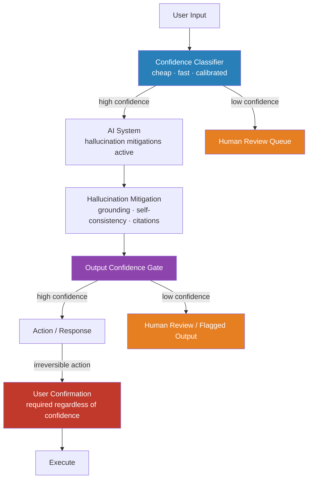

Safety and reliability are different properties. A system is safe if it doesn't cause harm. A system is reliable if it does what it should, consistently, under all conditions. Your AI system needs to be both, and passing a safety review doesn't tell you much about operational reliability.

The industry has put a lot of energy into safety tooling — guardrails, content filters, RLHF fine-tuning, red teaming. Far less energy has gone into the operational reliability question: how do you build an AI system that performs predictably across the long tail of production inputs, degrades gracefully when it fails, and gives you the observability to know when something's wrong?

This post covers that.



## Hallucination in Production

Hallucination gets discussed in the abstract. In production, it's a measurement problem and a task-specific engineering problem.

### Measuring Hallucination Rate

"Our model hallucinates 5% of the time" is not a useful number. Hallucination rate varies significantly by:
- **Topic**: models are better calibrated on common knowledge than on niche domains, recent events, or proprietary information
- **Context length**: longer contexts increase hallucination probability as attention becomes diluted
- **Question type**: open-ended generation hallucinates more than classification or extraction
- **Prompt structure**: chain-of-thought prompting reduces hallucination for reasoning tasks

Measure hallucination per task type in your application, not as a single global metric. A support bot answering product questions has different hallucination characteristics than an agent summarizing meeting notes.

### Mitigation Hierarchy

Apply these in order based on your latency and cost tolerance:

**Grounding via RAG**: for factual queries, retrieval-augmented generation reduces hallucination significantly by anchoring the model to specific source documents. It doesn't eliminate hallucination — models can still confabulate facts that aren't in the retrieved content — but it reduces it meaningfully.

**Self-consistency sampling**: generate multiple responses (k=3–5) and take the majority answer. Works best for questions with definite correct answers. Increases cost k-fold, so use selectively for high-stakes outputs.

```python
import anthropic
from collections import Counter

def self_consistent_answer(
    prompt: str,
    client: anthropic.Anthropic,
    k: int = 3
) -> str:
    """Sample k responses and return the most common answer."""
    responses = []
    for _ in range(k):
        msg = client.messages.create(
            model="claude-opus-4-5",
            max_tokens=512,
            messages=[{"role": "user", "content": prompt}]
        )
        responses.append(msg.content[0].text.strip())
    
    # For short answers, exact match; for long answers, use embedding similarity
    counts = Counter(responses)
    return counts.most_common(1)[0][0]
```

**Citation enforcement**: require the model to cite specific sources for factual claims. Makes hallucination visible (the model either cites a real source or fabricates one — the latter is detectable). Add a citation verification step that checks whether the cited source exists and contains the claim.

```python
CITATION_PROMPT = """
Answer the question using only information from the provided documents.
For every factual claim, include a citation in the format [DOC_ID:paragraph_number].
If you cannot find information to answer the question in the documents, say so explicitly.
Do not make up facts not present in the documents.
"""
```

### Defining Acceptable Thresholds

This is the conversation no one wants to have but every production AI system requires. What is an acceptable hallucination rate for this use case?

- A customer-facing FAQ bot that hallucinates a product spec: low-severity, correctable, 1-2% might be acceptable with user correction feedback loops
- A clinical documentation assistant that hallucinates a medication: unacceptable at any rate; requires citation enforcement and human review for all clinical claims
- A code generation agent that hallucinates an API signature: medium-severity, caught at runtime; 5-10% might be acceptable with test coverage

Define the threshold before you build, not after you ship.

## Consistency Under Distribution Shift

Traditional software fails with error messages. AI systems fail silently with wrong outputs. And unlike traditional software, they degrade when production inputs drift away from the distribution they perform well on — without signaling that this is happening.

### Detecting Distribution Shift

**Embedding-based input monitoring**: embed each production input using a fast embedding model, compare to the centroid of your test/evaluation distribution, flag inputs beyond a distance threshold for human review.

```python
import numpy as np

class InputDriftMonitor:
    def __init__(self, reference_embeddings: np.ndarray, threshold: float = 0.85):
        self.centroid = reference_embeddings.mean(axis=0)
        self.threshold = threshold  # cosine similarity threshold
    
    def is_in_distribution(self, query_embedding: np.ndarray) -> bool:
        similarity = np.dot(self.centroid, query_embedding) / (
            np.linalg.norm(self.centroid) * np.linalg.norm(query_embedding)
        )
        return float(similarity) >= self.threshold
    
    def flag_if_ood(self, query: str, embedding: np.ndarray) -> dict:
        in_dist = self.is_in_distribution(embedding)
        return {
            "in_distribution": in_dist,
            "requires_review": not in_dist,
            "query_preview": query[:100]
        }
```

**Canary inputs**: synthetic test cases with known correct answers, run periodically against the production system. If canary accuracy drops, something has changed — new model version, prompt change, knowledge base update. This is your early-warning system for model drift.

**Output quality monitoring**: LLM-as-judge running on sampled production outputs, evaluating whether responses meet your quality criteria. Run on 5-10% of traffic for cost efficiency.

## Human-in-the-Loop Patterns

The goal is not to put humans in the loop everywhere — that negates the value of AI. The goal is to put humans in the loop where the cost of an AI error exceeds the cost of the delay.

### Classification-First Routing

Before sending an input to your expensive, capable AI system, run it through a fast, cheap classifier that estimates:
- Is this query within the system's intended scope?
- How confident am I that the full AI system will handle this well?

Route low-confidence inputs to human review before they reach the AI system. This is cheaper than reviewing AI outputs after the fact.

### Output Confidence Gating

For outputs that drive actions or decisions, measure confidence before acting:
- **Sampling variance**: generate the same output 3x with temperature > 0; if the outputs diverge significantly, confidence is low
- **Explicit calibration**: some model APIs return token-level log probabilities; high variance in the final answer tokens indicates low confidence
- **Contradiction detection**: if follow-up self-questioning produces a different answer, flag for review

### Irreversibility Threshold

The most important rule: any AI-driven action that's difficult or impossible to reverse requires a human confirmation step, regardless of the model's apparent confidence. This is a hard architectural rule, not a soft recommendation.

Irreversible actions: send email, charge payment, delete data, post publicly, trigger financial transaction, notify a patient. For all of these: AI drafts, human confirms, system executes.

## Graceful Degradation

When your AI system is unavailable, slow, or producing unusably poor outputs, your application should still work. Most teams don't plan this explicitly. They should.

### Fallback Patterns

**Rule-based fallback**: for critical user flows, maintain a non-AI path. It might be slower, less capable, or require more user effort — but it works when the AI doesn't.

**Circuit breaker for AI services**: track AI service error rate and latency. When either exceeds threshold, open the circuit: stop sending requests to the AI layer, serve the fallback immediately, start a health check loop to detect recovery.

```python
class AICircuitBreaker:
    def __init__(self, failure_threshold: float = 0.5, recovery_timeout: int = 60):
        self.failure_threshold = failure_threshold  # 50% error rate opens circuit
        self.recovery_timeout = recovery_timeout    # seconds before re-testing
        self._state = "closed"  # closed = AI active; open = fallback active
        self._failure_count = 0
        self._total_count = 0
        self._open_since: float | None = None
    
    def call(self, ai_fn, fallback_fn, *args, **kwargs):
        import time
        if self._state == "open":
            if time.time() - self._open_since > self.recovery_timeout:
                self._state = "half-open"
            else:
                return fallback_fn(*args, **kwargs)
        
        try:
            result = ai_fn(*args, **kwargs)
            self._on_success()
            return result
        except Exception as e:
            self._on_failure()
            return fallback_fn(*args, **kwargs)
    
    def _on_success(self):
        self._state = "closed"
        self._failure_count = 0
        self._total_count = 0
    
    def _on_failure(self):
        self._failure_count += 1
        self._total_count += 1
        if self._total_count > 10 and self._failure_count / self._total_count > self.failure_threshold:
            self._state = "open"
            import time
            self._open_since = time.time()
```

**Cached response**: for query types that are repeated frequently, cache successful AI responses. Serve cached responses when the AI is unavailable. Stale beats empty for most informational use cases.

## The Measurement Problem

You can't improve what you don't measure. Reliability requires:

- **Online evaluation**: LLM-as-judge on sampled production traffic, running continuously
- **Canary monitoring**: known-answer tests running on a schedule
- **Drift detection**: input distribution monitoring with alerting
- **Latency and error rate**: standard observability, applied to the AI layer
- **Hallucination rate by task type**: not a single number — per-category tracking

Build this instrumentation before your system is in production. Retrofitting observability after the fact is far more expensive than building it in.

> Reliability is not a feature you add at the end. It's a set of architectural decisions — fallbacks, confidence gating, circuit breakers, monitoring — that need to be planned for during system design.
{: .prompt-info }
