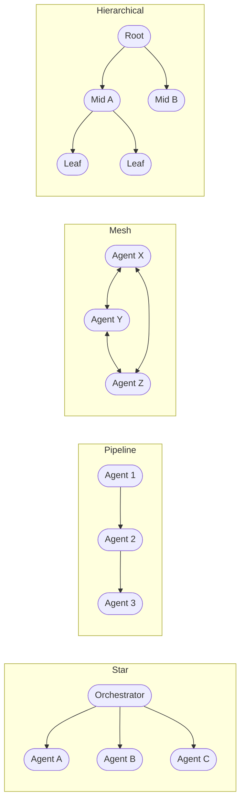

The topology decision is the most consequential architectural choice you make when building a multi-agent system. It determines how your agents communicate, how failures propagate, how much you can parallelize, and — critically — how easy the system is to debug at 2am when something goes wrong in production. Get this wrong and you spend months fighting your architecture instead of shipping features.

There are four core topologies. Most real systems end up as hybrids of two or three. But you need to understand each one clearly before you can reason about combinations.

## The Four Topologies

### Star (Orchestrator + Specialists)

A central orchestrator receives every request, decides which specialists to call (possibly several in parallel), aggregates their results, and produces a final response. The orchestrator does not do domain work itself — it routes, coordinates, and assembles.

**Best for:** diverse tasks where domain concerns can be cleanly partitioned. A customer support orchestrator routing to a billing agent, a shipping agent, a technical support agent. The orchestrator understands intent; the specialists understand domain.

**What it costs you:**

The orchestrator is both a bottleneck and a single point of failure. All traffic flows through it. If it goes down, the system goes down. If its context grows too large (because it's accumulating results from specialists), quality degrades. Specialists cannot communicate directly — if Agent A needs to iterate with Agent B, the orchestrator must relay every message, which is expensive and slow.

The other hidden cost: as you add specialists, the orchestrator's routing logic grows. Either the orchestrator uses LLM reasoning to decide who to call (non-deterministic, expensive) or it uses rule-based routing (deterministic, but brittle as the specialist space grows).

### Pipeline (Sequential Handoffs)

Agent A produces output. That output becomes the input to Agent B. Agent B's output goes to Agent C. Each agent adds to or transforms what it received.

**Best for:** structured multi-step workflows where the output of one step is genuinely the input to the next. Code review pipeline: extract → analyze → suggest → format. Document processing: parse → extract entities → enrich → store. The pipeline structure is self-documenting — you can read the workflow by reading the agent sequence.

**What it costs you:**

One slow agent pauses everything downstream. One failing agent blocks the pipeline — unless you build explicit bypass or partial-result logic at each step. Errors amplify: if Agent A produces a bad extraction, Agent B's analysis is wrong, Agent C's suggestions are wrong, and the error is buried three levels deep when a human reviews the output. Debugging requires replaying the full pipeline to find which step introduced the problem.

### Mesh (Peer-to-Peer)

Agents communicate directly with each other, with no central coordinator. An agent that needs information from another agent calls it directly. Results flow laterally.

**Best for:** high-throughput parallel work where agents are processing independent items and occasionally need to coordinate. Event-driven scenarios where different agents react to the same stream of events and may need to share signals. Research swarms where multiple agents explore independently and compare findings.

**What it costs you:**

Almost everything else. Debugging is genuinely hard — there is no single trace root; you have to correlate across N agents to reconstruct what happened. Testing is hard because the interaction surface is O(N²). Emergent behavior is real: the system can produce outcomes that no individual agent was designed to produce, and those outcomes are not always good. Cost is hard to predict because you don't know in advance how many inter-agent calls a given task will generate.

Use mesh patterns only when you have the observability infrastructure to support them (distributed tracing, correlation IDs, centralized log aggregation) and only when the throughput requirements genuinely justify the complexity.

### Hierarchical (Agents Spawning Agents)

A root agent decomposes a task into subtasks and spawns child agents to handle them. Child agents can spawn their own children. Results bubble up the tree.

**Best for:** tasks with unknown structure at the start. Open-ended research where you don't know upfront how many sub-questions you'll need to answer. Complex code generation where you don't know how many modules the solution will require. The hierarchy emerges from the problem structure rather than being pre-defined.

**What it costs you:**

Unbounded recursion and cost. Without explicit depth limits and budget caps, a hierarchical agent can spawn arbitrarily many children and run up a token bill that will make your finance team very unhappy. Testing is difficult because the tree structure is dynamic. Setting human-in-the-loop checkpoints is awkward because you don't know where in the tree significant decisions are being made.

Always implement hard limits: maximum depth, maximum total agents, maximum total tokens. These are not optional.

## Decision Framework

| Consideration | Star | Pipeline | Mesh | Hierarchical |
|---|---|---|---|---|
| Workflow predictability | High → fits | High → fits | Low → avoid | Unknown → fits |
| Parallelism need | Moderate | Low | High | Variable |
| Debuggability priority | Good | Good | Poor | Moderate |
| Cost predictability | Good | Good | Poor | Poor |
| Specialists need to talk | No | No | Yes | Sometimes |

## Framework Support

**LangGraph** supports all four via its graph model. Define nodes (agents) and edges (connections). A star is a supervisor node with edges to specialist nodes. A pipeline is a linear chain. A mesh is a graph with bidirectional edges. Hierarchical is implemented via subgraphs.

**Copilot Studio connected agents** uses the A2A (Agent-to-Agent) protocol, which implements the star pattern natively. One copilot acts as the orchestrator; it discovers and calls other copilots as specialists.

**AWS Strands** is built around an orchestrator pattern (star). Native support for spawning subagents gives you hierarchical. Pipeline and mesh require more custom wiring.

**Semantic Kernel's `AgentGroupChat`** supports both star (with a `KernelFunctionSelectionStrategy`) and pipeline (with `SequentialSelectionStrategy`).

## Hybrid Patterns

Most production systems at scale use a hybrid: star for top-level routing (the orchestrator decides which domain to send the request to), pipeline within each specialist domain (the billing specialist runs extract → validate → calculate → format internally), and potentially hierarchical within a specialist when the task complexity is unknown.

The key rule: choose the simplest topology that meets your requirements. A pipeline is simpler than a star. A star is simpler than a mesh. Simpler means cheaper to operate, easier to debug, and faster to change. Add complexity when the simpler topology demonstrably cannot solve your problem — not before.
