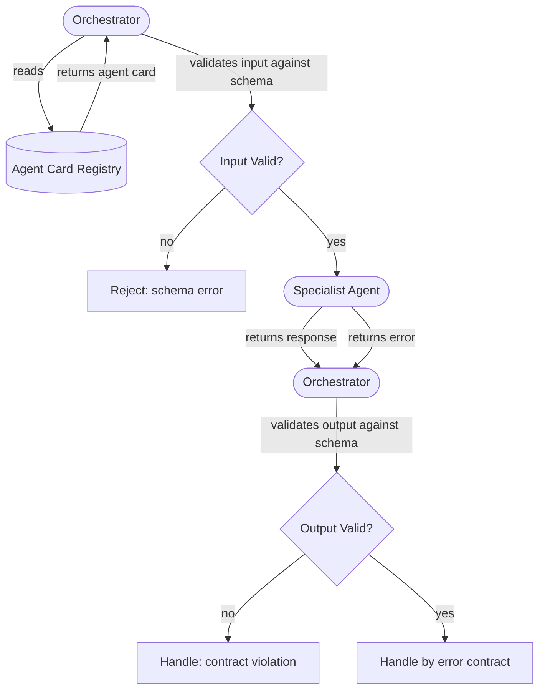

The first multi-agent system you build is fine without contracts. You have one orchestrator, two or three specialists, and you know how each one works because you wrote them. Then the team grows. Six months later you have fifteen agents, three orchestrators, and nobody remembers what the invoice processor expects as input. Someone changes the output format of the shipping agent to add a new field, and the orchestrator that wasn't using that field silently breaks because its JSON parsing now fails. A contract would have caught this at deploy time.

Agent contracts are not a nice-to-have for large systems. They are the mechanism that makes agents independently deployable and independently testable. Without them, every change to any agent is a system-wide regression risk.



## What a Contract Contains

An agent contract has six components. Implement all six or your contract is incomplete.

**Input schema.** What the agent accepts. Required fields, their types, their constraints. A Pydantic model or JSON Schema. The orchestrator validates against this before calling the agent. If the input doesn't conform, fail fast with a schema error — do not let a bad input reach the agent and produce a confusing downstream error.

**Output schema.** What the agent returns. Every field that a consumer might rely on must be listed here. If your agent returns a structured response, the output schema forces you to commit to that structure. Agents without output schemas gradually drift — fields get renamed, types change, and nothing breaks loudly until someone's production orchestrator falls over.

**Capability declaration.** What tools and permissions the agent has. This is metadata for the orchestrator — it should know, before routing, whether a specialist can send emails, write to a database, or call external APIs. The orchestrator should never route an email task to a specialist that has no email tool access. Put this in the contract.

**Error contract.** How the agent signals failure. Not exceptions — specific, typed error codes with documented meanings. `TOOL_UNAVAILABLE`, `INSUFFICIENT_PERMISSIONS`, `INPUT_VALIDATION_FAILED`, `UPSTREAM_TIMEOUT`. The orchestrator handles `TOOL_UNAVAILABLE` differently from `INSUFFICIENT_PERMISSIONS`. If your agent just raises generic exceptions, the orchestrator cannot make intelligent recovery decisions.

**Timeout contract.** Expected latency (P50, P95) and maximum latency before the agent gives up. The orchestrator uses this to set its own timeout values. If the specialist's P95 is 8 seconds and the orchestrator timeout is 5 seconds, you have a problem that your contract makes visible.

**Idempotency and retry policy.** Can the orchestrator safely retry this agent on failure? If the agent sends an email, no. If it reads from a database, yes. Document this explicitly. Also document whether partial state can occur — if the agent fails halfway through a multi-step operation, is the state consistent?

## The Agent Card

An agent card is the machine-readable manifest that packages all of the above. It lives in the agent's repository and is registered in your agent registry at deploy time. The A2A protocol formalizes exactly this pattern.

```yaml
agent_id: com.yourcompany.finance.invoice-processor
name: Invoice Processor
description: >
  Extracts line items, validates totals, and routes invoices for approval.
  Handles PDF and structured JSON invoice formats.
version: 2.1.0
status: production
owner: finance-platform-team
deployment_url: https://agents.internal.yourcompany.com/finance/invoice-processor
sla:
  p95_latency_ms: 4000
  max_latency_ms: 10000
  availability: 99.5
idempotent: true
retry_policy:
  max_retries: 3
  backoff: exponential
capabilities:
  - read_invoices
  - query_erp
  - generate_pdf
  - write_approval_queue
tags:
  - finance
  - invoice
  - approval-workflow
input_schema:
  $ref: schemas/invoice-processor-input.json
output_schema:
  $ref: schemas/invoice-processor-output.json
error_codes:
  INVALID_INVOICE_FORMAT: "Input does not match expected invoice schema"
  ERP_UNAVAILABLE: "ERP system unreachable; retry after backoff"
  DUPLICATE_INVOICE: "Invoice ID already processed; idempotent — safe to ignore"
  APPROVAL_QUEUE_FULL: "Queue at capacity; retry in 60 seconds"
```

## Enforcing Contracts in Python

The input and output schemas become Pydantic models. Validation happens at the boundary — before calling the agent and after receiving its response.

```python
from pydantic import BaseModel, Field
from typing import Literal
from decimal import Decimal


class InvoiceItem(BaseModel):
    description: str
    quantity: int = Field(gt=0)
    unit_price: Decimal = Field(ge=0)


class InvoiceProcessorInput(BaseModel):
    invoice_id: str = Field(pattern=r"^INV-\d{6}$")
    vendor_id: str
    currency: Literal["USD", "EUR", "GBP", "INR"]
    items: list[InvoiceItem] = Field(min_length=1)
    submitted_by: str


class InvoiceProcessorOutput(BaseModel):
    invoice_id: str
    status: Literal["approved", "rejected", "pending_review"]
    total: Decimal
    approval_queue_id: str | None = None
    rejection_reason: str | None = None


class AgentError(BaseModel):
    error_code: str
    message: str
    retryable: bool
```

The orchestrator wraps every specialist call:

```python
import httpx
from pydantic import ValidationError


async def call_specialist(
    url: str,
    input_model: InvoiceProcessorInput,
    output_type: type,
) -> InvoiceProcessorOutput | AgentError:
    # Validate input before sending — fail fast
    payload = input_model.model_dump()

    async with httpx.AsyncClient(timeout=10.0) as client:
        response = await client.post(url, json=payload)

    if response.status_code != 200:
        return AgentError(**response.json())

    # Validate output — contract violation is a hard error
    try:
        return output_type.model_validate(response.json())
    except ValidationError as e:
        # Specialist returned something that doesn't match its contract
        raise ContractViolationError(f"Specialist at {url} violated output contract: {e}")
```

## Contract Testing

Contract tests run the agent against its own schema, in isolation, without an orchestrator. They are fast, cheap, and catch most regressions before integration.

```python
import pytest
from pydantic import ValidationError


def test_invoice_processor_rejects_zero_quantity():
    """Contract: quantity must be > 0."""
    with pytest.raises(ValidationError):
        InvoiceProcessorInput(
            invoice_id="INV-000001",
            vendor_id="V-999",
            currency="USD",
            items=[{"description": "Widget", "quantity": 0, "unit_price": "10.00"}],
            submitted_by="akash@example.com",
        )


def test_invoice_processor_output_always_includes_status():
    """Contract: output must always have a status field."""
    output = call_invoice_processor_live(valid_invoice_input())
    assert output.status in ("approved", "rejected", "pending_review")
```

Run these in CI on every commit to the specialist's repository, before any integration tests run. They execute in milliseconds with no LLM API calls.

## Contract Versioning

Agent contracts change. The versioning rule is straightforward: treat it like a library API.

- **Major version** (2.0.0 → 3.0.0): breaking change. Removed a required field. Changed a field's type. Renamed an error code. The orchestrator MUST be updated before or simultaneously with the specialist deploy.
- **Minor version** (2.0.0 → 2.1.0): additive change. New optional output field. New capability. New non-breaking error code. Safe to deploy the specialist first; orchestrators that don't use the new field continue working.
- **Patch version** (2.0.0 → 2.0.1): internal change with no interface impact. Bug fix in business logic. Performance improvement. Orchestrators need no changes.

Include the major version in the deployment URL: `/finance/invoice-processor/v2/`. This lets you run v2 and v3 simultaneously during migration, route traffic gradually, and roll back without downtime.

## Where to Store Contracts

The schema files (JSON Schema or Pydantic models) live in the specialist agent's repository — they are owned by the specialist team, not the orchestrator team. The agent card lives alongside them. At deploy time, CI pushes the card to a central registry.

This ownership model matters. If the orchestrator team owns the contracts, specialists end up shaped around what orchestrators want rather than what specialists can naturally provide. That inversion creates coupling that grows worse over time.

The registry is the integration point. What's in the registry is the truth about what's deployed and what's callable. We'll cover registries in detail in the next post.
