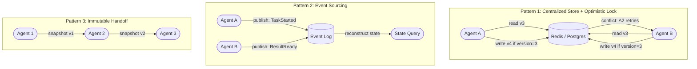

If you have built distributed systems before, you already know that shared mutable state between concurrent processes is where things go wrong. Multi-agent systems inherit all of those problems and add a new one: the agents reading and writing the state are themselves non-deterministic. Two agents can read identical state and produce different interpretations of it. One agent can write state that is syntactically valid but semantically corrupts another agent's reasoning. The usual database concurrency controls help, but they only solve half the problem.

This post covers what goes wrong with shared state in agent systems and four patterns that address different parts of the problem. No single pattern solves everything — which one you use depends on what your agents are actually doing with the state.



## Why Agent State Is Harder Than Database State

In a standard distributed system, two threads updating the same database row race for a lock. The database ensures atomicity. The threads themselves are deterministic — given the same input, they produce the same output.

Agents are not deterministic. Agent A and Agent B can read the exact same task state and reach different conclusions about what to do next, especially if they're using different models or different system prompts. This means even if you solve the concurrency problem, you still have a semantic consistency problem: the state after two agents have both written to it may be internally contradictory.

The second problem is LLM output as state mutation. When an agent writes to shared state, it often writes natural language or structured data that was generated by an LLM. That content can carry implicit assumptions, context, or framing that affects how the next agent reasons about the state — in ways that are invisible in the state structure itself. This is context contamination, and it's distinct from the data integrity issues a database handles.

## Pattern 1: Centralized State Store with Optimistic Locking

The orchestrator and all specialists share a state store (Redis for hot state, Postgres for durable state). Each state record has a version number. Agents read the current state and version, compute their update, then write with a conditional: "only apply this write if the version is still N."

```python
import redis
import json
from dataclasses import dataclass


r = redis.Redis(host="localhost", port=6379, decode_responses=True)


@dataclass
class TaskState:
    task_id: str
    status: str
    results: dict
    version: int


def read_task_state(task_id: str) -> TaskState:
    key = f"task:{task_id}"
    data = r.hgetall(key)
    return TaskState(
        task_id=task_id,
        status=data["status"],
        results=json.loads(data["results"]),
        version=int(data["version"]),
    )


def update_task_state(state: TaskState, new_status: str, new_results: dict) -> bool:
    """
    Returns True if write succeeded, False on version conflict (caller should retry).
    Uses a Lua script for atomic compare-and-set.
    """
    lua_script = """
    local key = KEYS[1]
    local expected_version = tonumber(ARGV[1])
    local current_version = tonumber(redis.call('hget', key, 'version'))

    if current_version ~= expected_version then
        return 0  -- conflict
    end

    redis.call('hset', key,
        'status', ARGV[2],
        'results', ARGV[3],
        'version', expected_version + 1
    )
    return 1  -- success
    """
    result = r.eval(
        lua_script,
        1,
        f"task:{state.task_id}",
        state.version,
        new_status,
        json.dumps(new_results),
    )
    return bool(result)


def update_with_retry(task_id: str, new_status: str, new_results: dict, max_retries: int = 3):
    for attempt in range(max_retries):
        state = read_task_state(task_id)
        if update_task_state(state, new_status, new_results):
            return
        if attempt == max_retries - 1:
            raise RuntimeError(f"Failed to update task {task_id} after {max_retries} retries")
```

Use this pattern for: task progress tracking, coordination signals between agents, rate limit counters. Do not use it for anything where the agents need to read a long natural-language context and then write their interpretation back — the optimistic lock solves the write conflict but doesn't prevent semantic contamination.

## Pattern 2: Event Sourcing for Agent State

Instead of shared mutable state, agents publish events. The current state is a function of all events in the log. No agent ever writes directly to a "current state" object — they only append events.

```python
from datetime import datetime, timezone
from dataclasses import dataclass, asdict
from enum import Enum
import json


class EventType(str, Enum):
    TASK_STARTED = "TaskStarted"
    AGENT_ASSIGNED = "AgentAssigned"
    TOOL_CALLED = "ToolCalled"
    RESULT_PRODUCED = "ResultProduced"
    TASK_COMPLETED = "TaskCompleted"
    TASK_FAILED = "TaskFailed"


@dataclass
class AgentEvent:
    event_type: EventType
    task_id: str
    agent_id: str
    payload: dict
    timestamp: str = None
    sequence: int = None

    def __post_init__(self):
        if self.timestamp is None:
            self.timestamp = datetime.now(timezone.utc).isoformat()


def publish_event(event: AgentEvent, event_store):
    """Append-only write to the event log."""
    event_store.append(asdict(event))


def reconstruct_task_state(task_id: str, event_store) -> dict:
    """Rebuild current state by replaying all events for this task."""
    events = [e for e in event_store if e["task_id"] == task_id]
    events.sort(key=lambda e: e["sequence"])

    state = {"task_id": task_id, "status": "not_started", "results": {}, "agents": []}
    for event in events:
        if event["event_type"] == EventType.TASK_STARTED:
            state["status"] = "in_progress"
        elif event["event_type"] == EventType.RESULT_PRODUCED:
            state["results"][event["agent_id"]] = event["payload"]["result"]
        elif event["event_type"] == EventType.TASK_COMPLETED:
            state["status"] = "completed"
        elif event["event_type"] == EventType.TASK_FAILED:
            state["status"] = "failed"
            state["failure_reason"] = event["payload"].get("reason")
    return state
```

The advantages are real: complete audit trail, ability to replay any task to understand what happened, temporal queries ("what did the state look like 10 minutes into processing?"). The disadvantage is latency — if you have 500 events for a task and need to reconstruct state on every agent call, that's expensive. Use snapshots: periodically store a materialized snapshot plus the sequence number it was built from. On reconstruction, start from the latest snapshot and replay only events after it.

## Pattern 3: Immutable Context Handoff

Each agent receives a complete, read-only snapshot of the current state. It computes a new state. It passes the new state to the next agent. There are no concurrent writes because each agent in the sequence is the only one writing at a given time.

This is the natural state model for pipeline topologies. It is also the safest model for LLM-based agents because each agent gets a clean, unambiguous view of the current situation — not a state object that multiple other agents have been asynchronously writing to.

```python
from dataclasses import dataclass, replace
from typing import Any


@dataclass(frozen=True)
class PipelineState:
    """Immutable. Each pipeline stage returns a new instance."""
    task_id: str
    original_input: dict
    extracted_data: dict | None = None
    analysis_result: dict | None = None
    final_output: dict | None = None
    errors: tuple = ()


async def run_pipeline(initial_input: dict) -> PipelineState:
    state = PipelineState(
        task_id=generate_id(),
        original_input=initial_input,
    )

    # Each stage returns a new state — the previous state is immutable
    state = await extraction_agent(state)
    state = await analysis_agent(state)
    state = await formatting_agent(state)

    return state


async def extraction_agent(state: PipelineState) -> PipelineState:
    result = await call_llm_for_extraction(state.original_input)
    # Returns a new state, never mutates the input
    return replace(state, extracted_data=result)
```

The limitation is concurrency: you cannot parallelize stages because each stage must wait for the previous one's output. If your workflow requires multiple agents working simultaneously on the same state, use the optimistic lock pattern instead.

## Pattern 4: Per-Agent Private Memory with Explicit Handoff

Each agent has its own private memory namespace. It does not read from or write to any other agent's memory. Sharing happens only through structured messages with explicit schemas. This is the approach that prevents context contamination most effectively.

```python
class AgentMemory:
    def __init__(self, agent_id: str, memory_backend):
        self.namespace = f"agent:{agent_id}:memory"
        self.backend = memory_backend

    def write(self, key: str, value: Any):
        self.backend.set(f"{self.namespace}:{key}", value)

    def read(self, key: str) -> Any:
        return self.backend.get(f"{self.namespace}:{key}")


# Sharing between agents happens via typed messages, not memory access
@dataclass
class HandoffMessage:
    from_agent: str
    to_agent: str
    task_id: str
    payload: dict  # Must conform to the receiving agent's input contract
    trace_id: str
```

## What to Avoid

**Shared prompt context between agents.** Passing Agent A's full conversation history to Agent B is not state sharing — it is context contamination. Agent B will begin to reason based on Agent A's conversational context, including its assumptions, framing, and errors. Pass structured data. Let each agent build its own conversational context from that data.

**Global mutable memory stores without namespacing.** A shared Redis hash that all agents read and write freely is a recipe for subtle bugs where one agent's cached inference affects another agent's behavior in a session it was not part of.

**State that grows without bounds.** Every time an orchestrator accumulates results from specialists into a shared context object, that object grows. Set explicit size limits. Summarize or prune old results rather than appending indefinitely.

The right pattern depends on your concurrency model and how much of your state is structured data versus LLM-generated content. For structured data, optimistic locking is pragmatic. For audit trails and replay, event sourcing is worth the complexity. For LLM-generated content flowing between agents, immutable handoff is the safest choice.
