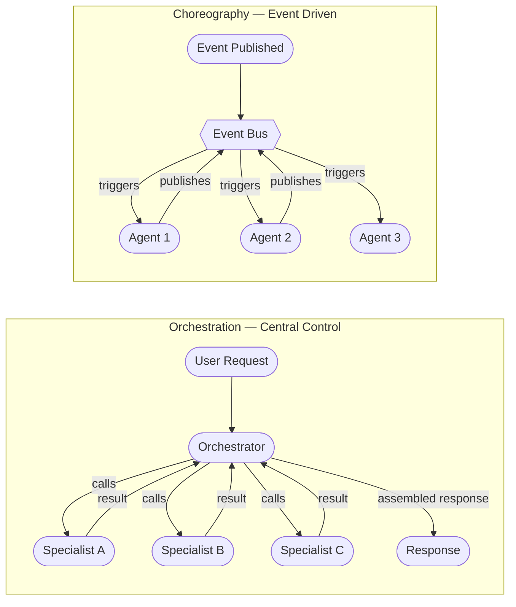

This distinction comes from microservices architecture, and it maps cleanly onto multi-agent systems. Orchestration and choreography are not competing philosophies — they are tools with different strengths, and most production systems end up using both, for different parts of the same workflow. The mistake is applying one universally because it's what your framework makes easy.



## Orchestration

An orchestrator is an agent whose job is coordination, not domain work. It receives a task, decides which specialists to call, calls them (sequentially or in parallel), and assembles the results into a final response. The orchestrator has explicit control over the workflow at every step.

**In LangGraph**, the orchestrator is typically a supervisor node with a `KernelFunctionSelectionStrategy` that routes to specialist nodes based on the current state. The graph is defined upfront — the possible paths are known.

**In Copilot Studio**, connected agents implement orchestration via the A2A protocol. The primary copilot discovers specialist copilots via their agent cards and routes tasks to them. The orchestration logic lives in the primary copilot's instructions.

**In AWS Strands**, the orchestrator agent uses subagents as tools. The orchestrator's tool list includes the specialist agents.

**In Semantic Kernel's `AgentGroupChat`**, a `TerminationStrategy` and `SelectionStrategy` control who speaks next and when the conversation ends — orchestration through selection logic.

```python
from semantic_kernel.agents import AgentGroupChat, ChatCompletionAgent
from semantic_kernel.agents.strategies import KernelFunctionSelectionStrategy
from semantic_kernel.kernel import Kernel


kernel = Kernel()

orchestrator = ChatCompletionAgent(
    kernel=kernel,
    name="Orchestrator",
    instructions="""
    You coordinate specialist agents. Based on the user request:
    - Route to BillingAgent for payment and invoice questions
    - Route to ShippingAgent for delivery and tracking questions
    - Route to TechSupportAgent for product issues
    Only call one specialist per turn. Assemble the final response yourself.
    """,
)

billing_agent = ChatCompletionAgent(kernel=kernel, name="BillingAgent", instructions="...")
shipping_agent = ChatCompletionAgent(kernel=kernel, name="ShippingAgent", instructions="...")

chat = AgentGroupChat(
    agents=[orchestrator, billing_agent, shipping_agent],
    selection_strategy=KernelFunctionSelectionStrategy(...),
)
```

**Advantages you get:**

A single trace root. Every orchestration session has one parent span — the orchestrator. All specialist calls are child spans. Debugging means finding the orchestrator trace and following it. This is invaluable in production.

Human-in-the-loop integration is natural. You pause the orchestrator between steps. The orchestrator resumes when the human provides input. No need to coordinate across multiple event streams.

Workflow logic is co-located. The orchestrator's system prompt or code contains the complete coordination logic. When something behaves unexpectedly, you read one file.

**What you pay:**

The orchestrator's context grows as it accumulates specialist results. For long workflows with verbose specialist outputs, this becomes expensive and degrades quality. Mitigate with selective retention — extract only the fields you need from each specialist result before adding them to context.

The orchestrator is a bottleneck. Every request flows through it. Every specialist call blocks on the orchestrator's scheduling. For genuinely parallel workloads (process 10,000 documents independently), this serialization is a real throughput constraint.

If the orchestrator goes down, all in-flight requests fail. High availability requires redundant orchestrator instances with shared state, which adds complexity.

## Choreography

In a choreographed system, agents react to events. There is no central coordinator. Agent A completes its work and publishes an event. Agent B is subscribed to that event type and begins work. Agent B's output triggers Agent C. The workflow emerges from the subscription configuration, not from an orchestrator's instructions.

```python
import boto3
import json
from typing import Callable


sqs = boto3.client("sqs", region_name="us-east-1")

QUEUES = {
    "extraction_complete": "https://sqs.us-east-1.amazonaws.com/123456789/extraction-complete",
    "analysis_complete": "https://sqs.us-east-1.amazonaws.com/123456789/analysis-complete",
    "summarization_complete": "https://sqs.us-east-1.amazonaws.com/123456789/summarization-complete",
}


def publish_event(queue_name: str, event_type: str, payload: dict):
    sqs.send_message(
        QueueUrl=QUEUES[queue_name],
        MessageBody=json.dumps({
            "event_type": event_type,
            "payload": payload,
            "correlation_id": payload.get("document_id"),
        }),
    )


def extraction_agent_handler(message: dict):
    document_id = message["payload"]["document_id"]
    # ... perform extraction ...
    extracted = run_extraction(document_id)

    # Publish completion event — no knowledge of what comes next
    publish_event("extraction_complete", "DocumentExtracted", {
        "document_id": document_id,
        "extracted_data": extracted,
    })


def analysis_agent_handler(message: dict):
    # Triggered by extraction_complete queue
    # No knowledge of who triggered it or what comes before or after
    extracted_data = message["payload"]["extracted_data"]
    analysis = run_analysis(extracted_data)

    publish_event("analysis_complete", "DocumentAnalyzed", {
        "document_id": message["payload"]["document_id"],
        "analysis": analysis,
    })
```

**Advantages you get:**

No single point of failure. If the analysis agent goes down, the extraction agent keeps running and publishing events. Messages accumulate in the queue. When analysis comes back up, it drains the queue. The system degrades gracefully.

True independent deployability. You can deploy a new version of the analysis agent without touching extraction or summarization. Each agent is its own service with its own deployment lifecycle.

Horizontal scaling is trivial. If your extraction queue is backing up, add more extraction agent instances. They all consume from the same queue. No orchestrator changes required.

**What you pay:**

Workflow logic is distributed. The complete picture of "what happens to a document after it enters the system" exists nowhere — it's spread across each agent's subscription configuration and the event type definitions. New engineers spend real time reconstructing the mental model.

Debugging requires correlating events across agents using a correlation ID (document ID in the example above). You need centralized logging or distributed tracing set up before you can troubleshoot effectively. This is not optional — it's a prerequisite for running choreographed agents in production.

End-to-end testing is harder. There is no single entry point to call with a test input and a result to assert against. You need to observe the event stream and wait for a terminal event.

## When Orchestration Wins

- Predictable, structured workflows (the path through the system is known upfront)
- Human-in-the-loop checkpoints at specific, known decision points
- Compliance requirements for a decision audit trail
- Small to medium throughput (< a few hundred concurrent workflows)
- The team is small and debugging simplicity matters more than scale

## When Choreography Wins

- High-throughput parallel processing (thousands of documents, events, or items)
- Agents that should evolve and deploy independently across teams
- Fan-out scenarios where the number of agents responding varies dynamically
- Resilience is the top requirement — partial failures must not cascade
- You have the observability infrastructure to support distributed debugging

## The Hybrid

The most common production pattern: orchestrated backbone, choreographed sub-tasks.

The top-level workflow has an orchestrator. It handles routing, human-in-the-loop, and final assembly. Within a specialist domain — say, document analysis — the specialist internally uses a queue-based choreography model to parallelize analysis across 50 documents simultaneously. The orchestrator sees one specialist; the specialist internally coordinates a swarm.

This gives you debuggability at the system level (the orchestrator trace) and scale at the specialist level (choreography within each domain). It also respects team boundaries: the orchestrator team owns the coordination contract; each specialist team owns their internal implementation.

The decision rule is simple: start with orchestration. Add choreography within specialist domains when throughput requirements make the orchestration bottleneck demonstrably visible. Do not add choreography speculatively.
