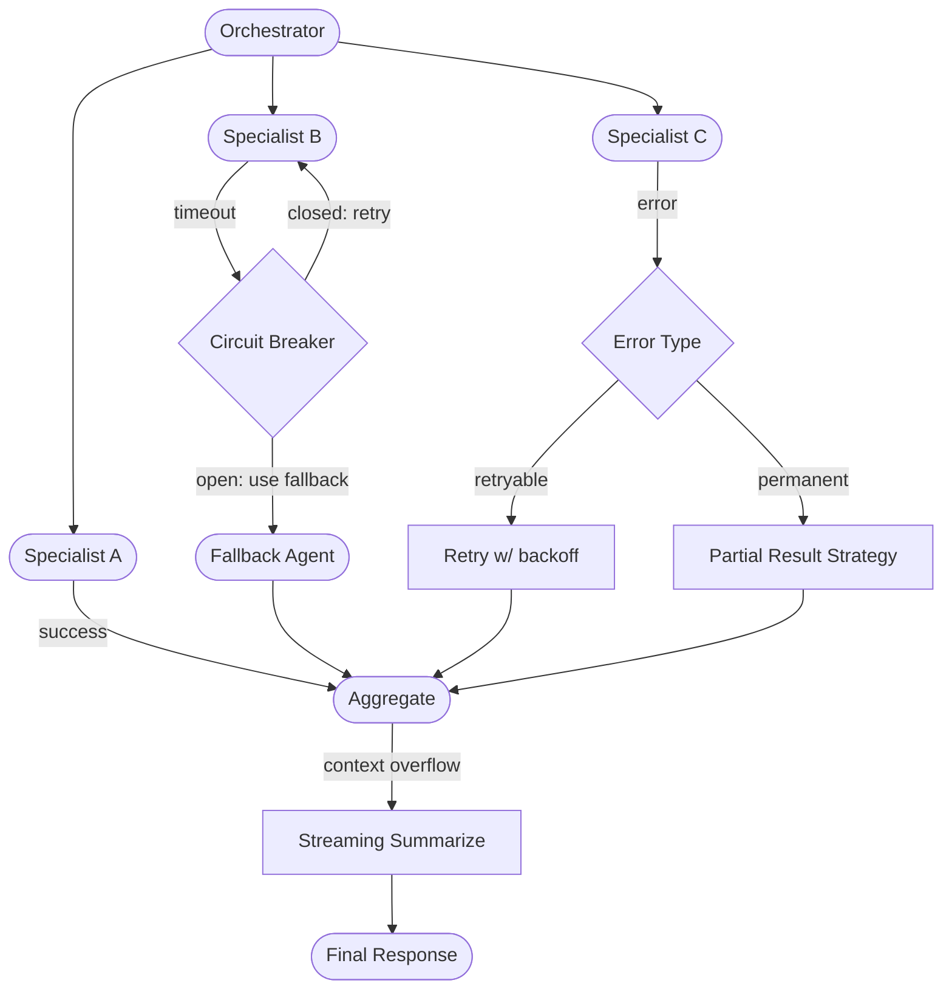

A single-agent system has one failure mode that matters: the agent fails. A multi-agent system has at least six distinct failure modes, and they compose with each other. An agent timeout can cause a partial result, which can cause a downstream agent to hallucinate when asked to analyze incomplete data, which produces a wrong final answer that looks like a success. Understanding the failure taxonomy is the prerequisite for building resilience.



## The Failure Taxonomy

**Agent timeout.** The specialist doesn't respond within its declared SLA. The orchestrator is now blocked on a call that may never return. Without an explicit timeout, the orchestrator hangs indefinitely and the user session times out.

**Agent error.** The specialist returns an error response. The critical question: is this transient (retry may succeed) or permanent (retry will not help)? `UPSTREAM_TIMEOUT` is transient. `INSUFFICIENT_PERMISSIONS` is permanent. Your error contract, covered in the contracts post, defines these categories. If your specialists return generic HTTP 500s instead of typed error codes, you cannot make this distinction.

**Partial results.** Four of five specialists succeeded. One timed out. The orchestrator must now decide: use the partial results and note the gap, retry the failed specialist asynchronously, abort and retry the whole workflow, or escalate to a human. The right choice depends on whether the missing specialist's output is load-bearing for the final answer.

**Cascading failure.** Specialist A's bad output becomes Specialist B's bad input. B's downstream errors look like B's fault when the root cause is A. In pipeline topologies this propagation is especially dangerous because each stage amplifies the error rather than catching it.

**Context overflow.** The orchestrator accumulates results from specialists and its context grows too large. Quality degrades. In GPT-4-class models, the last few results in a very long context receive less attention than earlier results. The orchestrator may "forget" that Specialist A said X by the time it assembles the final response.

**Model degradation.** The specialist is running but producing lower-quality outputs — maybe because the model is under load, or because the input is subtly out-of-distribution. This is the hardest failure mode to detect because there is no error signal. The only way to catch it is LLM-as-judge evaluation on a sample of specialist outputs, or human review on a sample.

## Circuit Breaker for Agent Calls

The circuit breaker pattern prevents your orchestrator from repeatedly calling a failing specialist, wasting tokens and time on calls that won't succeed.

```python
import time
from dataclasses import dataclass, field
from enum import Enum
from typing import Callable, Any


class CircuitState(Enum):
    CLOSED = "closed"      # Normal operation
    OPEN = "open"          # Failing — reject calls immediately
    HALF_OPEN = "half_open"  # Probing — allow one call through


@dataclass
class CircuitBreaker:
    agent_id: str
    failure_threshold: int = 5        # Open after N consecutive failures
    recovery_timeout: int = 60        # Seconds before trying again (half-open)
    state: CircuitState = CircuitState.CLOSED
    failure_count: int = 0
    last_failure_time: float = field(default_factory=lambda: 0.0)

    def call(self, fn: Callable, *args, **kwargs) -> Any:
        if self.state == CircuitState.OPEN:
            if time.time() - self.last_failure_time >= self.recovery_timeout:
                self.state = CircuitState.HALF_OPEN
            else:
                raise CircuitOpenError(
                    f"Circuit open for {self.agent_id}. "
                    f"Retry in {int(self.recovery_timeout - (time.time() - self.last_failure_time))}s"
                )

        try:
            result = fn(*args, **kwargs)
            self._on_success()
            return result
        except Exception as e:
            self._on_failure()
            raise

    def _on_success(self):
        self.failure_count = 0
        self.state = CircuitState.CLOSED

    def _on_failure(self):
        self.failure_count += 1
        self.last_failure_time = time.time()
        if self.failure_count >= self.failure_threshold or self.state == CircuitState.HALF_OPEN:
            self.state = CircuitState.OPEN


class CircuitOpenError(Exception):
    pass


# Usage in orchestrator
circuit_breakers: dict[str, CircuitBreaker] = {}


def get_circuit_breaker(agent_id: str) -> CircuitBreaker:
    if agent_id not in circuit_breakers:
        circuit_breakers[agent_id] = CircuitBreaker(agent_id=agent_id)
    return circuit_breakers[agent_id]


async def call_specialist_with_circuit_breaker(agent_id: str, payload: dict) -> dict:
    breaker = get_circuit_breaker(agent_id)
    try:
        return await breaker.call(call_specialist_api, agent_id, payload)
    except CircuitOpenError:
        return await call_fallback_agent(agent_id, payload)
```

Keep circuit breakers in shared storage (Redis) if you run multiple orchestrator instances. A circuit that's open on one instance should be open on all of them.

## Retry with Backoff — And Its Limits

Retry is safe only for idempotent operations. Read-only tool calls are idempotent. Analysis tasks are idempotent. Sending an email is not. Creating a record is not. Charging a payment card is not.

Before adding retry to any specialist call, check the idempotency field in that agent's contract. If `idempotent: false`, do not retry. Duplicate actions at the specialist level are worse than a visible failure at the orchestrator level.

```python
import asyncio
import random


async def retry_with_backoff(
    fn: Callable,
    args: tuple = (),
    kwargs: dict = None,
    max_retries: int = 3,
    base_delay: float = 1.0,
    max_delay: float = 30.0,
    retryable_errors: tuple = (TimeoutError, TransientAgentError),
) -> Any:
    kwargs = kwargs or {}
    last_exception = None

    for attempt in range(max_retries + 1):
        try:
            return await fn(*args, **kwargs)
        except retryable_errors as e:
            last_exception = e
            if attempt == max_retries:
                break
            # Exponential backoff with jitter to prevent thundering herd
            delay = min(base_delay * (2 ** attempt) + random.uniform(0, 1), max_delay)
            await asyncio.sleep(delay)
        except Exception:
            raise  # Non-retryable errors propagate immediately

    raise last_exception
```

Cap retries at 3 for agent calls. More than 3 retries on a specialist call means the orchestrator is waiting 30+ seconds while burning tokens on failed requests. It's better to surface the failure cleanly and let the orchestrator use its fallback or partial-result strategy.

## Fallback Agents

When the primary specialist fails, route to a fallback. The fallback is typically simpler — fewer tools, lower capability, but higher reliability.

```python
SPECIALIST_FALLBACKS = {
    "com.yourco.finance.invoice-processor-v2": "com.yourco.finance.invoice-processor-basic",
    "com.yourco.research.deep-analyst": "com.yourco.research.surface-analyst",
}


async def call_with_fallback(agent_id: str, payload: dict) -> dict:
    try:
        return await call_specialist_with_circuit_breaker(agent_id, payload)
    except (CircuitOpenError, MaxRetriesExceeded) as e:
        fallback_id = SPECIALIST_FALLBACKS.get(agent_id)
        if fallback_id is None:
            raise

        result = await call_specialist_api(fallback_id, payload)
        result["_fallback_used"] = True
        result["_fallback_reason"] = str(e)
        return result
```

Always tag fallback results so the orchestrator knows it's assembling a response with degraded specialist coverage. The final response to the user should acknowledge the limitation explicitly — "I was unable to access the full invoice analysis; the summary below is based on available information." Hiding fallback usage from the user is a transparency problem.

## Partial Result Strategies

When some specialists succeed and others don't, you have four options. Which one is correct depends on whether the missing result is essential or supplementary.

| Missing specialist role | Recommended strategy |
|---|---|
| Essential (output gates the final answer) | Abort, return error, don't partially assemble |
| Supplementary (output enriches but isn't required) | Use partial results, note the gap in the response |
| Can be retried asynchronously | Use partial results now, enqueue retry, update response later |
| Human judgment required | Escalate to human review queue |

Document which specialists are essential versus supplementary in your orchestrator's routing configuration, not in ad-hoc code. This makes the dependency visible.

## Context Overflow Mitigation

As an orchestrator accumulates specialist results, it should compress older results rather than appending indefinitely.

```python
async def assemble_with_compression(specialist_results: list[dict], max_tokens: int = 4000) -> str:
    assembled = []
    total_tokens = 0

    for result in specialist_results:
        result_text = format_specialist_result(result)
        result_tokens = count_tokens(result_text)

        if total_tokens + result_tokens > max_tokens:
            # Summarize what we have so far before adding more
            summary = await summarize_context(assembled)
            assembled = [summary]
            total_tokens = count_tokens(summary)

        assembled.append(result_text)
        total_tokens += result_tokens

    return "\n\n".join(assembled)
```

The simpler alternative: extract only the fields you need from each specialist result. If the invoice processor returns 40 fields but the orchestrator only needs `status`, `total`, and `approval_queue_id`, extract those three and discard the rest before adding to context.

## Chaos Engineering for Agent Systems

Resilience patterns that haven't been tested under real failure conditions are hypotheses, not guarantees. In staging, deliberately inject failures.

```python
import random


class ChaosSpecialistProxy:
    """Wraps a specialist call with configurable failure injection."""

    def __init__(self, specialist_fn, failure_rate: float = 0.2, chaos_enabled: bool = False):
        self.specialist_fn = specialist_fn
        self.failure_rate = failure_rate
        self.chaos_enabled = chaos_enabled

    async def call(self, payload: dict) -> dict:
        if self.chaos_enabled and random.random() < self.failure_rate:
            failure_type = random.choice(["timeout", "error", "malformed_response"])
            if failure_type == "timeout":
                raise TimeoutError("Chaos: injected timeout")
            elif failure_type == "error":
                raise TransientAgentError("Chaos: injected transient error")
            else:
                return {"_chaos": "malformed", "unexpected_field": True}  # Contract violation

        return await self.specialist_fn(payload)
```

Run chaos injection on every deploy to staging, not just when you make changes to the orchestrator. A specialist team's deployment that changes latency characteristics can silently break the orchestrator's timeout assumptions — you want to catch that before it reaches production.
