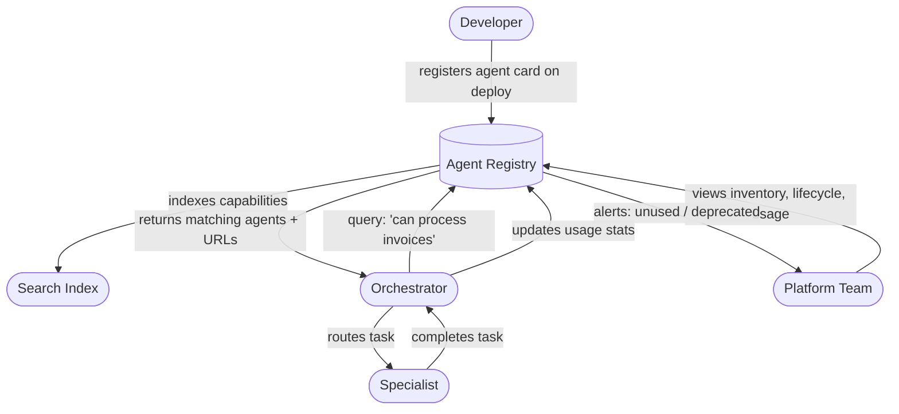

The problem compounds quietly. At five agents, everyone knows what exists because the team that built them is small. At fifteen, you start getting Slack messages asking "does anyone have an agent that can do X?" At thirty, people start building agents that duplicate existing ones because discovery is too hard. Orchestrators accumulate hardcoded specialist URLs that nobody updates when deployments change. Governance is impossible because nobody has a complete inventory. A registry does not solve all of these problems, but without one, none of them get solved.



## What a Registry Actually Provides

**Discoverability.** A searchable catalog of available agents, their capabilities, and how to call them. Engineers query the registry before building a new agent. Orchestrators query it at runtime instead of relying on hardcoded configuration.

**Reuse.** The registry makes the "does this already exist?" question answerable in under a minute. That's the threshold between actually checking and skipping the check because it's faster to just build another one.

**Governance.** Owner accountability: every agent has a named owner (team or individual). Lifecycle tracking: experimental, production, deprecated. Usage metrics: which agents are being called, at what frequency, by which orchestrators. You cannot deprecate an agent safely if you don't know who is using it.

**Runtime discovery.** Orchestrators that query the registry at startup or on each task can adapt to the available specialist pool without code changes. Add a new specialist that's better at a task — the orchestrator discovers it and starts using it automatically.

## The Registry Schema

Each entry in the registry corresponds to one deployed agent version. This is what each entry contains:

```yaml
# Example registry entry: invoice processing specialist
agent_id: com.yourcompany.finance.invoice-processor
name: Invoice Processor
description: >
  Extracts line items, validates totals, and routes invoices for approval.
  Handles PDF and structured JSON invoice formats up to 500 line items.
  Returns approval queue placement or rejection with reason codes.
version: "2.1.0"
status: production  # experimental | production | deprecated
owner:
  team: finance-platform
  contact: finance-platform@yourcompany.com
  oncall: https://pagerduty.yourcompany.com/finance-platform
deployment_url: https://agents.internal.yourcompany.com/finance/invoice-processor/v2
sla:
  p95_latency_ms: 4000
  max_latency_ms: 10000
  availability_target: 99.5
idempotent: true
retry_policy:
  max_retries: 3
  backoff: exponential
  base_delay_ms: 500
capabilities:
  - read_invoices
  - query_erp
  - generate_pdf
  - write_approval_queue
tags:
  - finance
  - invoice
  - approval-workflow
  - pdf-processing
input_schema_url: https://schemas.internal.yourcompany.com/agents/invoice-processor/v2/input.json
output_schema_url: https://schemas.internal.yourcompany.com/agents/invoice-processor/v2/output.json
error_codes:
  - code: INVALID_INVOICE_FORMAT
    message: Input does not match expected invoice schema
    retryable: false
  - code: ERP_UNAVAILABLE
    message: ERP system unreachable
    retryable: true
  - code: DUPLICATE_INVOICE
    message: Invoice ID already processed; idempotent — safe to ignore
    retryable: false
  - code: APPROVAL_QUEUE_FULL
    message: Queue at capacity; retry in 60 seconds
    retryable: true
registered_at: "2026-07-15T10:30:00Z"
last_deployed_at: "2026-09-10T14:22:00Z"
usage:
  calls_last_30d: 18400
  calling_orchestrators:
    - com.yourcompany.finance.ap-orchestrator
    - com.yourcompany.procurement.po-processor
```

The `description` field is particularly important for runtime discovery. When an orchestrator uses embeddings to match tasks to agents, it embeds this description and compares it to the task embedding. Write it to describe what the agent does in terms of what a user or orchestrator would ask for — not in terms of how it's implemented.

## Implementation Spectrum

The right implementation depends on how many agents you have and what you need from the registry.

**Lightweight (≤10 agents): Git repository.**

A YAML file per agent in a dedicated `agent-registry` repository. Changes go through pull request. CI validates the schema. No API, no runtime discovery — just human-readable documentation with version history. This is the right starting point. Do not over-engineer a registry for a system with five agents.

**Structured (10–30 agents): API-backed with a database.**

```python
from fastapi import FastAPI, HTTPException
from pydantic import BaseModel
from typing import Literal
import psycopg2


app = FastAPI(title="Agent Registry")


class AgentEntry(BaseModel):
    agent_id: str
    name: str
    description: str
    version: str
    status: Literal["experimental", "production", "deprecated"]
    owner_team: str
    deployment_url: str
    capabilities: list[str]
    tags: list[str]
    idempotent: bool
    p95_latency_ms: int


@app.get("/agents")
async def list_agents(status: str = "production", tag: str = None):
    query = "SELECT * FROM agents WHERE status = %s"
    params = [status]
    if tag:
        query += " AND %s = ANY(tags)"
        params.append(tag)
    return execute_query(query, params)


@app.get("/agents/search")
async def search_agents(q: str, limit: int = 10):
    """Semantic search using pre-computed description embeddings."""
    query_embedding = embed(q)
    return vector_search(query_embedding, limit=limit)


@app.post("/agents/{agent_id}/usage")
async def record_usage(agent_id: str, orchestrator_id: str):
    """Called by orchestrators to update usage metrics."""
    execute_query(
        "INSERT INTO agent_usage (agent_id, orchestrator_id, called_at) VALUES (%s, %s, NOW())",
        [agent_id, orchestrator_id],
    )
```

**At scale (30+ agents): Platform integration.**

Integrate the registry with your CI/CD pipeline so agents self-register at deploy time. The registry becomes part of the deployment artifact, not a manual step.

```yaml
# .github/workflows/deploy-agent.yml
- name: Register agent in registry
  run: |
    curl -X POST https://registry.internal.yourcompany.com/agents \
      -H "Authorization: Bearer $REGISTRY_TOKEN" \
      -H "Content-Type: application/json" \
      -d @agent-card.yaml
  env:
    REGISTRY_TOKEN: ${{ secrets.AGENT_REGISTRY_TOKEN }}
```

## Runtime Discovery

An orchestrator that queries the registry at runtime does not need to be updated when new specialists become available.

```python
import httpx
from functools import lru_cache
import time


class RegistryClient:
    def __init__(self, registry_url: str, cache_ttl_seconds: int = 300):
        self.registry_url = registry_url
        self.cache_ttl = cache_ttl_seconds
        self._cache: dict = {}
        self._cache_time: dict = {}

    async def find_agents_for_task(self, task_description: str) -> list[dict]:
        """Find agents whose capabilities match the task description."""
        cache_key = f"task:{task_description}"
        if self._is_cached(cache_key):
            return self._cache[cache_key]

        async with httpx.AsyncClient() as client:
            response = await client.get(
                f"{self.registry_url}/agents/search",
                params={"q": task_description, "status": "production", "limit": 5},
            )
            results = response.json()

        self._set_cache(cache_key, results)
        return results

    async def get_agent(self, agent_id: str) -> dict:
        """Get the full agent card for a known agent ID."""
        cache_key = f"agent:{agent_id}"
        if self._is_cached(cache_key):
            return self._cache[cache_key]

        async with httpx.AsyncClient() as client:
            response = await client.get(f"{self.registry_url}/agents/{agent_id}")
            if response.status_code == 404:
                raise AgentNotFoundError(agent_id)
            agent = response.json()

        self._set_cache(cache_key, agent)
        return agent

    def _is_cached(self, key: str) -> bool:
        return key in self._cache and (time.time() - self._cache_time.get(key, 0)) < self.cache_ttl

    def _set_cache(self, key: str, value):
        self._cache[key] = value
        self._cache_time[key] = time.time()
```

Cache registry responses locally — registry lookups should not be on the hot path of every agent call. A 5-minute cache TTL is reasonable for production deployments. Invalidate on deployment events.

## Integration with A2A and Copilot Studio

**A2A protocol.** The A2A agent card IS a registry entry. If you're building A2A-compatible agents, your registry is a hosted collection of agent cards served at `/.well-known/agent.json` per agent. The registry's search API becomes a directory service.

**Copilot Studio.** Microsoft's equivalent of a registry for Copilot Studio agents is the agent inventory in the Power Platform Admin Center, queryable via Azure Resource Graph:

```kusto
resources
| where type == "microsoft.copilotstudio/agents"
| project name, location, properties.status, properties.ownerTeam
| order by name asc
```

If you're managing a large Copilot Studio deployment, this query gives you the equivalent of a registry listing. Pipe it into your governance dashboard alongside your custom agent registry for a unified view.

## Governance Workflows

A registry enables governance workflows that are otherwise impossible.

**Deprecation.** When a team wants to retire an agent, they set `status: deprecated` in the registry. The registry notifies all orchestrators registered as consumers. Orchestrators have a deadline to migrate. The registry tracks whether they have.

**Ownership transfer.** Agent changes hands between teams. The registry has the authority record. The `owner.oncall` field ensures someone gets paged when the agent has an incident.

**Audit trail.** Every change to the registry — new agent registered, status changed, URL updated — is logged. When something breaks, you can see exactly when the agent's configuration changed and who changed it.

**Cost attribution.** Registry usage metrics (calls per orchestrator per agent) feed cost attribution. If the finance team's orchestrator makes 50,000 calls per month to an agent the platform team operates, the platform team has the data to justify the infrastructure cost and the finance team has the data to understand where their AI spend goes.

Start with the Git repository approach. Add the API when you have more than 10 agents or when you need runtime discovery. Add governance workflows when you have more than 20 agents or when the first deprecation conversation becomes painful.
