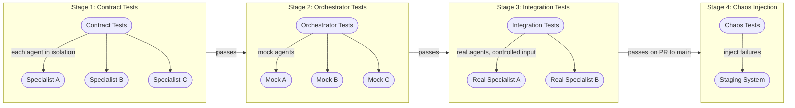

Testing a single agent is hard enough: you have non-deterministic outputs, no reliable assert-equal for LLM responses, and every test call costs real tokens. Testing a system of agents compounds these problems. You have more failure points, interdependencies between agents that unit tests cannot catch, emergent behavior that only appears when agents interact, and a cost structure that makes comprehensive test coverage expensive enough to skip. The engineers who skip it regret it in production.

This post covers four strategies that together give you useful coverage without bankrupting you on token costs, and a CI pipeline structure that runs them at the right stage.



## Why This Is Hard

**More failure points.** A five-specialist system has at least five independent failure modes plus their pairwise and higher-order compositions. Unit tests per agent catch individual failures. They do not catch the orchestrator routing to the wrong specialist, or the output of Specialist A being technically valid but semantically wrong in a way that corrupts Specialist B's analysis.

**Non-determinism.** The same input can produce different agent routing on different runs. The same specialist can return different outputs. Assertion-based testing (`assert output == expected`) mostly fails. You need either deterministic test conditions (temperature=0, fixed seeds where possible) or probabilistic evaluation (LLM-as-judge scoring above a threshold).

**Emergent behavior.** Some failure modes only appear when agents interact at runtime. An agent that works perfectly in isolation can behave unexpectedly when it receives output from another agent rather than a clean, human-crafted test input. You need integration tests that exercise the real interaction paths.

**Cost.** Running integration tests for a five-specialist system means 5+ LLM calls per test case. At 10 test cases you're at 50+ calls per CI run. At daily deploys across 5 teams, that adds up. The strategy below front-loads cheap tests and reserves expensive integration tests for the right CI stage.

## Strategy 1: Contract Tests

Contract tests run each specialist against its own schema, in complete isolation. No orchestrator. No other agents. No real workflow. The test validates that the agent's inputs and outputs conform to its declared contract.

```python
import pytest
from pydantic import ValidationError
from unittest.mock import patch, AsyncMock


# Test the input contract: specialist rejects invalid inputs
class TestInvoiceProcessorInputContract:
    def test_rejects_invalid_invoice_id_format(self):
        with pytest.raises(ValidationError):
            InvoiceProcessorInput(
                invoice_id="INVALID",  # Must match INV-\d{6}
                vendor_id="V-001",
                currency="USD",
                items=[{"description": "Widget", "quantity": 1, "unit_price": "10.00"}],
                submitted_by="akash@example.com",
            )

    def test_rejects_empty_items_list(self):
        with pytest.raises(ValidationError):
            InvoiceProcessorInput(
                invoice_id="INV-000001",
                vendor_id="V-001",
                currency="USD",
                items=[],  # min_length=1
                submitted_by="akash@example.com",
            )

    def test_rejects_negative_quantity(self):
        with pytest.raises(ValidationError):
            InvoiceProcessorInput(
                invoice_id="INV-000001",
                vendor_id="V-001",
                currency="USD",
                items=[{"description": "Widget", "quantity": -1, "unit_price": "10.00"}],
                submitted_by="akash@example.com",
            )


# Test the output contract: specialist always returns required fields
class TestInvoiceProcessorOutputContract:
    @pytest.mark.asyncio
    async def test_output_always_includes_status(self, valid_invoice_input):
        result = await call_invoice_processor(valid_invoice_input)
        assert result.status in ("approved", "rejected", "pending_review")

    @pytest.mark.asyncio
    async def test_approved_output_has_queue_id(self, approvable_invoice_input):
        result = await call_invoice_processor(approvable_invoice_input)
        if result.status == "approved":
            assert result.approval_queue_id is not None

    @pytest.mark.asyncio
    async def test_rejected_output_has_reason(self, rejectable_invoice_input):
        result = await call_invoice_processor(rejectable_invoice_input)
        if result.status == "rejected":
            assert result.rejection_reason is not None and len(result.rejection_reason) > 0
```

Contract tests make no LLM calls for the input validation tests (pure Pydantic) and minimal calls for output tests. Run on every commit to the specialist's repository. Fast, cheap, and they catch the most common regression: a developer changing an output field name without updating consuming orchestrators.

## Strategy 2: Mock Agents in Orchestrator Tests

Replace all specialists with deterministic mocks. Test only the orchestrator's logic: routing decisions, aggregation, error handling, partial result strategies, circuit breaker behavior.

```python
from unittest.mock import AsyncMock, patch
import pytest


class MockSpecialist:
    def __init__(self, agent_id: str, response: dict | Exception):
        self.agent_id = agent_id
        self.response = response
        self.call_count = 0
        self.received_payloads = []

    async def __call__(self, payload: dict) -> dict:
        self.call_count += 1
        self.received_payloads.append(payload)
        if isinstance(self.response, Exception):
            raise self.response
        return self.response


@pytest.fixture
def billing_mock():
    return MockSpecialist(
        agent_id="com.yourco.finance.billing",
        response={"status": "found", "amount_due": 150.00, "currency": "USD"},
    )


@pytest.fixture
def billing_timeout_mock():
    return MockSpecialist(
        agent_id="com.yourco.finance.billing",
        response=TimeoutError("Simulated billing timeout"),
    )


class TestOrchestratorRouting:
    @pytest.mark.asyncio
    async def test_routes_billing_query_to_billing_agent(self, billing_mock, orchestrator):
        with patch("orchestrator.specialists.billing", billing_mock):
            result = await orchestrator.handle("What is my current balance?")

        assert billing_mock.call_count == 1
        assert "150.00" in result.response

    @pytest.mark.asyncio
    async def test_uses_partial_results_on_timeout(self, billing_timeout_mock, orchestrator):
        with patch("orchestrator.specialists.billing", billing_timeout_mock):
            result = await orchestrator.handle("What is my current balance?")

        # Orchestrator should return partial result, not raise
        assert result is not None
        assert result.has_gaps is True
        assert "billing information unavailable" in result.response.lower()

    @pytest.mark.asyncio
    async def test_circuit_breaker_opens_after_threshold(self, orchestrator):
        failing_mock = MockSpecialist("billing", TimeoutError("timeout"))
        with patch("orchestrator.specialists.billing", failing_mock):
            for _ in range(5):
                await orchestrator.handle("billing query")

            # 6th call should use fallback immediately (circuit open)
            result = await orchestrator.handle("billing query")
            assert failing_mock.call_count == 5  # Not 6 — circuit opened
            assert result.fallback_used is True
```

These tests are cheap (no real LLM calls if you mock the LLM layer too) and run in seconds. They test the orchestrator's coordination logic exhaustively. What they don't test: whether the real specialists produce outputs the orchestrator can actually use.

## Strategy 3: Trace-Based Regression Testing

Record a golden trace from a manually verified run. On each deploy, replay the same input and compare the agent call sequence to the golden trace. This catches routing changes, format changes, and specialist behavior changes that don't show up in isolated tests.

```python
import json
from pathlib import Path
from dataclasses import dataclass, asdict


@dataclass
class AgentCallRecord:
    agent_id: str
    input_hash: str   # Hash of the input, not the full input (deterministic comparison)
    output_fields: list[str]  # Fields present in the output (not values — too non-deterministic)
    duration_ms: int
    status: str  # success | timeout | error


class TraceRecorder:
    def __init__(self):
        self.calls: list[AgentCallRecord] = []

    def record(self, agent_id: str, input_data: dict, output: dict, duration_ms: int):
        self.calls.append(AgentCallRecord(
            agent_id=agent_id,
            input_hash=hash_dict(input_data),
            output_fields=sorted(output.keys()) if isinstance(output, dict) else [],
            duration_ms=duration_ms,
            status="success",
        ))

    def save_golden(self, path: str):
        Path(path).write_text(json.dumps([asdict(c) for c in self.calls], indent=2))

    @staticmethod
    def load_golden(path: str) -> list[AgentCallRecord]:
        return [AgentCallRecord(**c) for c in json.loads(Path(path).read_text())]


def compare_traces(golden: list[AgentCallRecord], actual: list[AgentCallRecord]) -> list[str]:
    failures = []
    if len(golden) != len(actual):
        failures.append(f"Call count mismatch: expected {len(golden)}, got {len(actual)}")
        return failures

    for i, (g, a) in enumerate(zip(golden, actual)):
        if g.agent_id != a.agent_id:
            failures.append(f"Call {i}: expected agent {g.agent_id}, got {a.agent_id}")
        if g.input_hash != a.input_hash:
            failures.append(f"Call {i} to {a.agent_id}: input changed")
        if set(g.output_fields) != set(a.output_fields):
            missing = set(g.output_fields) - set(a.output_fields)
            added = set(a.output_fields) - set(g.output_fields)
            if missing:
                failures.append(f"Call {i} to {a.agent_id}: output missing fields: {missing}")

    return failures
```

Use temperature=0 when recording golden traces. Compare call sequence and output structure, not output values — LLM outputs are not deterministically reproducible even at temperature=0 across model updates.

## Strategy 4: Chaos Injection in Staging

Deliberately inject failures into your staging environment to verify that resilience patterns work as designed. Run this on every deploy to staging — not just when you change the orchestrator.

```yaml
# .github/workflows/chaos-test.yml
name: Chaos Injection Tests
on:
  workflow_run:
    workflows: [Deploy to Staging]
    types: [completed]

jobs:
  chaos:
    if: ${{ github.event.workflow_run.conclusion == 'success' }}
    runs-on: ubuntu-latest
    steps:
      - uses: actions/checkout@v4

      - name: Run chaos test suite
        run: python tests/chaos/run_chaos_suite.py
        env:
          STAGING_URL: ${{ secrets.STAGING_ORCHESTRATOR_URL }}
          CHAOS_SCENARIOS: "specialist_timeout,specialist_error,malformed_response,all_specialists_down"

      - name: Assert circuit breaker behavior
        run: python tests/chaos/assert_circuit_breaker.py

      - name: Assert fallback agent used
        run: python tests/chaos/assert_fallback_routing.py

      - name: Assert partial results returned
        run: python tests/chaos/assert_partial_results.py
```

The chaos tests are pass/fail assertions against observable behavior, not against LLM output quality. Did the circuit breaker open? Did the fallback agent handle the request? Did the orchestrator return a partial result instead of crashing? These are binary.

## The Complete CI Pipeline

```yaml
# .github/workflows/ci.yml
name: Multi-Agent CI Pipeline
on: [push, pull_request]

jobs:
  contract-tests:
    name: "Stage 1: Contract Tests (all agents)"
    runs-on: ubuntu-latest
    strategy:
      matrix:
        agent: [invoice-processor, shipping-agent, billing-agent, support-agent]
    steps:
      - uses: actions/checkout@v4
      - name: Run contract tests for ${{ matrix.agent }}
        run: pytest agents/${{ matrix.agent }}/tests/contract/ -v --no-header
    # Fast: ~30 seconds per agent. No LLM calls. Runs on every push.

  orchestrator-tests:
    name: "Stage 2: Orchestrator Tests (mock agents)"
    needs: contract-tests
    runs-on: ubuntu-latest
    steps:
      - uses: actions/checkout@v4
      - name: Run orchestrator tests with mocks
        run: pytest orchestrator/tests/ -v --no-header
        env:
          USE_MOCK_AGENTS: "true"
    # Fast: ~2 minutes. No LLM calls. Runs on every push.

  integration-tests:
    name: "Stage 3: Integration Tests (real agents)"
    needs: orchestrator-tests
    # Only run on PRs to main — these cost real tokens
    if: github.event_name == 'pull_request' && github.base_ref == 'main'
    runs-on: ubuntu-latest
    steps:
      - uses: actions/checkout@v4
      - name: Run integration tests with real agents
        run: pytest tests/integration/ -v --no-header -k "not slow"
        env:
          ANTHROPIC_API_KEY: ${{ secrets.ANTHROPIC_API_KEY }}
          TEST_ENVIRONMENT: staging
    # Slower: ~10 minutes. Costs tokens. Runs on PRs to main only.
```

The CI structure reflects the cost and speed of each strategy. Contract tests run in seconds on every push with no token cost. Orchestrator mock tests are slightly slower but still free. Integration tests are expensive and slow, so they only run on the gate that matters: the PR to main. Chaos tests run on staging deploys, outside the main CI pipeline.

## One Honest Limitation

None of these strategies reliably catch quality degradation. If your analysis specialist starts producing subtly worse analyses — still valid JSON, still within the output schema, but with lower accuracy — your tests will pass. Catching this requires LLM-as-judge evaluation on a held-out test set, run periodically (not on every CI run) and tracked over time as a quality metric rather than a pass/fail gate.

Build the quality evaluation separately from the CI pipeline. Run it on a schedule. Alert when scores drop below a threshold. Treat it like production monitoring, not like a unit test.
