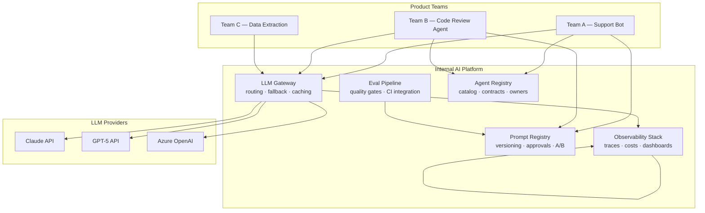

Most enterprises reach a point where the AI chaos becomes expensive. Teams are calling LLM providers directly with hardcoded API keys. Prompts live in YAML files committed to five different repos. Nobody knows what AI features are running in production, what they cost, or whether they're degrading. The solution isn't another governance policy — it's shared infrastructure.

An internal AI platform is not a product. It's not a prototype. It's the plumbing that makes building AI features repeatable, governed, and observable across every team in your organization.



## The Core Components

**LLM Gateway** is the unified ingress for every LLM API call in your organization. Instead of each team managing provider credentials and calling APIs directly, all traffic flows through the gateway. The gateway handles routing (send this request to Claude, that one to GPT-5), fallback (primary provider down, route to secondary), semantic caching (similar prompts reuse cached responses), spend limits (team A has a $500/day cap), and audit logging (every prompt and response recorded).

**Prompt Registry** is a versioned store of every prompt used in production. Prompts are first-class artifacts: they have versions, owners, approval workflows, and rollback capability. When a prompt changes, it goes through review and an eval gate before reaching production. Teams pull prompts by ID and version rather than embedding them in code.

**Eval Pipeline** runs automated quality checks on every prompt change and model update. Golden datasets, regression checks, quality metrics — all automated, all in CI. Without this, prompt changes are deployed on faith.

**Agent Registry** is the catalog of deployed agents: what each agent does, its input/output contract, who owns it, what its dependencies are. When Team B's code review agent wants to call Team C's data extraction agent, they look it up in the registry rather than emailing someone to ask.

**Observability Stack** gives you traces, metrics, and dashboards for all AI workloads. Cost per team per day, latency P95, model distribution, error rates. Without this, you're flying blind on AI spend.

## Build vs. Buy

**LLM Gateway**: Don't build from scratch. LiteLLM is the strongest OSS option — it supports 100+ providers through an OpenAI-compatible interface, has built-in semantic caching (Redis-backed), fallback routing, and budget limits per virtual API key. Run it as a proxy service your teams point to instead of provider endpoints directly. Cloud-native alternatives: Azure API Management with the AI extension (enterprise governance, Azure Monitor integration), or AWS Bedrock as the unified gateway if you're AWS-native.

```yaml
# LiteLLM proxy config.yaml — minimal production setup
model_list:
  - model_name: gpt-4-primary
    litellm_params:
      model: gpt-5-chat
      api_key: os.environ/OPENAI_API_KEY
  - model_name: claude-fallback
    litellm_params:
      model: claude-sonnet-5
      api_key: os.environ/ANTHROPIC_API_KEY

router_settings:
  routing_strategy: latency-based-routing
  fallbacks:
    - gpt-4-primary: [claude-fallback]

litellm_settings:
  semantic_cache: true
  semantic_cache_similarity_threshold: 0.95

general_settings:
  master_key: os.environ/LITELLM_MASTER_KEY
```

**Prompt Registry**: Langfuse's prompt management feature handles versioning, staging, and usage tracking and is available as a self-hosted OSS install. LangSmith's prompt hub integrates tightly with LangChain workflows. If neither fits, a Postgres table with an API is genuinely enough for most organizations — the concept is simple even if the tooling varies.

**Eval Pipeline**: DeepEval plus a CI integration is a reasonable build. It provides assertion-based evaluation, golden dataset comparison, and CI-friendly output. Confident AI wraps this with enterprise features (team management, SLAs, scheduled evals). The important thing is that evals run automatically — not that you used a particular tool.

**Agent Registry**: Build a thin service and YAML files. No mature off-the-shelf product exists yet. A simple API that stores agent metadata (ID, description, input schema, output schema, owner, endpoint, version) is sufficient. Teams register their agents; other teams discover them.

**Observability**: Langfuse self-hosted covers traces, cost attribution, and dashboards for AI workloads and integrates with the LLM gateway. Azure Monitor + Application Insights works if you're Azure-native. OpenTelemetry instrumentation with your existing observability stack (Datadog, Grafana) is also viable if you're already invested there.

## Avoiding the Platform Team Trap

The platform team trap is building infrastructure so heavy and centralized that product teams route around it. You've seen this with internal developer portals, service meshes, and data platforms. AI platforms are no different.

The platform must be thin. It provides the plumbing — credential management, routing, logging, cost caps — not the intelligence. Product teams own their agents, their prompts, and their evaluation datasets. The platform gives them the rails to run on; it doesn't drive the train.

The platform team's job is to make the right thing easy, not to be a gatekeeper. If a team has to file a ticket to deploy a prompt update, the platform is failing. If the gateway adds 50ms of latency, teams will call providers directly. Design for adoption, not mandate.

**Platform success metric**: number of teams using it voluntarily. Not number of teams mandated to use it. A platform that three teams choose to use is worth more than a platform twelve teams are forced to use and route around whenever they can.

## Team Structure

Who runs the platform? Three patterns work depending on org size:

- **Platform engineering team**: your existing platform/SRE team takes ownership of the AI platform alongside Kubernetes, CI/CD, and observability infrastructure. Works if the platform engineers have enough AI context to build useful abstractions.
- **Center of Excellence (CoE)**: a small central team of AI specialists who build the platform and also embed with product teams periodically. Works in large enterprises where platform engineering and AI knowledge don't overlap.
- **Shared components model**: senior AI engineers across product teams contribute to a shared component library (no dedicated platform team). Works in smaller organizations where a dedicated team isn't justified.

## When You Don't Need a Platform

If you have three or fewer AI features in production, a platform is premature. The duplication isn't painful enough yet to justify the coordination overhead of shared infrastructure.

Standardize when the pain is real, not when you anticipate it. Start with the LLM gateway — it has the highest leverage (credential management, cost visibility) and lowest disruption. Add the prompt registry when you have prompts changing in production and you wish you could roll them back. Add eval pipeline when you've shipped a bad prompt update to production. Let the platform grow from actual pain.

The goal is not a complete AI platform. The goal is AI features that work reliably, cost predictably, and improve measurably. The platform serves that goal. When it stops serving it, reconsider what you've built.
