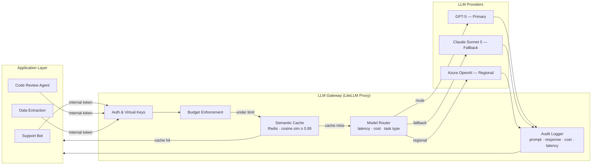

Calling LLM providers directly from application code works fine for a prototype. It works terribly at scale. You end up with API keys scattered across ten repositories, no visibility into what's being spent or by whom, no fallback when a provider has an outage, and no way to cache identical (or near-identical) requests that cost real money every time they hit the wire.

A production LLM gateway solves all of this in one place. It's not a complex system — but the teams that skip it regret it after their first large unexpected invoice or their first outage caused by a provider going down.



## What the Gateway Does That Direct Calls Don't

**Model routing**: different tasks have different cost and latency profiles. A support chat needs a fast, cheap model. A complex reasoning task needs a frontier model. The gateway routes based on the virtual key the caller presents, the task type declared in the request metadata, or explicit routing rules. Teams don't make this decision per-call — the gateway makes it consistently.

**Fallback**: when the primary provider is rate-limited or down, the gateway automatically retries against a secondary. From the application's perspective, the call succeeded. Without a gateway, a provider outage is your outage. With a gateway, it's a latency spike.

**Semantic caching**: two prompts that ask the same thing in different words shouldn't both hit the provider. Semantic caching embeds each prompt, computes cosine similarity against cached responses, and returns the cached response if similarity exceeds a threshold (typically 0.95). For read-heavy use cases — knowledge base Q&A, document summarization with similar inputs — cache hit rates of 30-60% are realistic. That's a 30-60% cost reduction on those workloads.

**Spend limits**: the gateway enforces per-team and per-day cost caps before requests reach the provider. Team A gets $500/day; when they've spent $500, requests return a 429 with a budget-exceeded message. Finance loves this. It turns AI costs from unpredictable to bounded.

**Credential centralization**: teams call the gateway with an internal virtual token the gateway issues. The actual provider API keys live only in the gateway's environment. No API key rotation across ten repositories when a key is compromised.

**Unified logging**: every prompt, response, model used, latency, and estimated cost is logged centrally. Teams don't instrument this separately. One query gets you AI spend by team, by product, by day.

## LiteLLM in Production

LiteLLM is the strongest OSS choice for a self-hosted gateway. It exposes an OpenAI-compatible API (teams that already use the OpenAI client library change only the base URL), supports 100+ providers through a unified interface, and ships with semantic caching, fallback routing, and budget management built in.

Run it as a Docker service. Point your teams at it instead of provider endpoints. Issue them virtual keys tied to their team and budget.

```yaml
# litellm/config.yaml — production proxy configuration
model_list:
  - model_name: fast-chat
    litellm_params:
      model: gpt-5-mini
      api_key: os.environ/OPENAI_API_KEY
      rpm_limit: 500

  - model_name: reasoning
    litellm_params:
      model: gpt-5
      api_key: os.environ/OPENAI_API_KEY
      rpm_limit: 100

  - model_name: claude-fallback
    litellm_params:
      model: claude-sonnet-5
      api_key: os.environ/ANTHROPIC_API_KEY

router_settings:
  routing_strategy: latency-based-routing
  fallbacks:
    - reasoning: [claude-fallback]
    - fast-chat: [claude-fallback]
  retry_after: 5

litellm_settings:
  # Semantic caching via Redis
  cache: true
  cache_params:
    type: redis
    host: os.environ/REDIS_HOST
    port: 6379
    similarity_threshold: 0.95
    ttl: 3600

  # Log everything to Langfuse for observability
  success_callback: ["langfuse"]
  failure_callback: ["langfuse"]
  langfuse_public_key: os.environ/LANGFUSE_PUBLIC_KEY
  langfuse_secret_key: os.environ/LANGFUSE_SECRET_KEY

general_settings:
  master_key: os.environ/LITELLM_MASTER_KEY
  database_url: os.environ/POSTGRES_URL  # Stores virtual keys + budget tracking
```

Issuing virtual keys with budget caps:

```bash
# Create a virtual key for the support team with a $500/month budget
curl -X POST http://gateway.internal:4000/key/generate \
  -H "Authorization: Bearer $LITELLM_MASTER_KEY" \
  -H "Content-Type: application/json" \
  -d '{
    "team_id": "support-team",
    "key_alias": "support-team-prod",
    "max_budget": 500,
    "budget_duration": "30d",
    "models": ["fast-chat", "reasoning"],
    "metadata": {"team": "support", "env": "production"}
  }'
```

Application code changes nothing except the base URL:

```python
from openai import OpenAI

# Was: client = OpenAI(api_key="sk-...")
# Now:
client = OpenAI(
    base_url="http://gateway.internal:4000",
    api_key="sk-virtual-key-from-gateway"
)

response = client.chat.completions.create(
    model="fast-chat",  # Gateway resolves this to the actual model
    messages=[{"role": "user", "content": prompt}]
)
```

## Cloud-Native Alternatives

**Azure API Management with AI extension**: if you're already Azure-native, APIM gives you enterprise governance, Azure Active Directory integration, policy enforcement (quota, rate limiting, content filtering), and Azure Monitor analytics out of the box. The AI extension adds LLM-specific features: token quota management, backend load balancing across Azure OpenAI deployments, prompt filtering. Higher operational cost than self-hosted LiteLLM but lower operational overhead for teams already managing APIM.

**AWS Bedrock as gateway**: if your AI workloads run on AWS, Bedrock's unified API covers Claude, Titan, Llama, Mistral, and others. Bedrock Guardrails adds content filtering, topic restriction, and PII detection at the gateway layer. The tradeoff: you're limited to models available on Bedrock (no OpenAI GPT models), but for AWS-native enterprises, the operational simplicity often wins.

## Deployment Considerations

Run the gateway in the same region as your primary workloads. LLM API calls are latency-sensitive; adding a gateway in a different region adds meaningful latency.

For high availability: two instances minimum, load balanced, stateless. All state lives in external Redis (semantic cache) and Postgres (virtual keys, budget tracking). The gateway itself is a stateless service. If one instance dies, the load balancer routes to the other.

The gateway is in your application's critical path. A gateway that goes down takes every AI feature in your organization with it. Treat it with the same reliability engineering as your API gateway or database:
- Health check endpoints monitored by your alerting system
- Circuit breakers for provider connections
- Graceful degradation: if the semantic cache is unavailable, bypass it rather than failing the request
- Runbooks for the scenarios that matter: provider outage, budget exhausted, cache full

## Monitoring the Gateway

The metrics that matter:

| Metric | Alert threshold | Why |
|--------|----------------|-----|
| Cache hit rate | < 20% for stable workloads | Low hit rate means cache is ineffective or threshold is wrong |
| Cost by team (daily) | > 80% of budget | Early warning before budget cap triggers |
| Model distribution | Sudden shift | Fallback routing firing unexpectedly |
| Error rate | > 2% over 5 minutes | Provider or gateway issue |
| P99 latency | > 3× baseline | Provider degradation or cache miss spike |

Set these up in your observability stack before you think you need them. An unexpected $10,000 invoice from a provider is a bad way to discover you needed spend monitoring.

The gateway is boring infrastructure. That's exactly the point. The teams building AI features shouldn't be thinking about provider credentials, cost caps, or fallback routing — they should be thinking about the feature. The gateway takes those problems off their plate and puts them somewhere they can be managed systematically.
