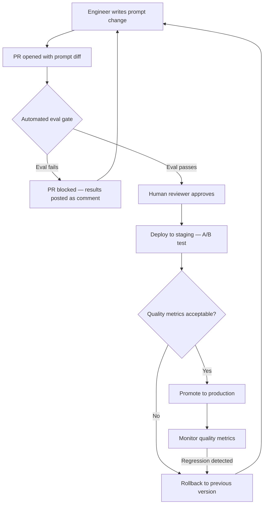

At some point every AI team reaches the same inflection point: prompts have multiplied across codebases, config files, Notion docs, and Slack DMs, and nobody knows which version is running in production. A bug report comes in, and the first question — "what prompt triggered this?" — takes three engineers an hour to answer. This is the moment you need a prompt registry, and the longer you wait to build one, the more expensive that moment becomes.



## Why Ad-Hoc Prompt Management Fails at Scale

The problem compounds predictably. It starts with one prompt hardcoded in an environment variable. Then someone adds a second one for a different feature. Then a teammate modifies the first prompt by editing the source code directly, which means a deploy to change three words. Then someone else pastes a "better version" into a config file without telling anyone.

Three months in, you have:

- Prompts in source code that require a full code deploy to change — your fastest iteration cycle is now tied to your slowest deployment process
- Prompts in docs that have no version history, no diff, no record of who changed what or why
- Teams overwriting each other's prompt changes with no visibility into conflicts
- No way to run a rollback when a prompt change causes a quality regression in production

The deeper problem is that prompts are not documentation — they are the control logic of your system. A change to a customer support greeting that accidentally introduces an aggressive tone is a production incident, the same as a code change that breaks a feature. But teams treat prompt changes with the same rigor as editing a README.

## What a Prompt Registry Provides

A registry is the minimum viable infrastructure for treating prompts as first-class production artifacts. The core capabilities:

**Versioning**: Every change creates a new version with an immutable ID. Running systems reference a specific version — not "latest". When you need to know what prompt triggered a bad response from three weeks ago, you look up the version ID from the trace log.

**Approval workflow**: Prompt changes go through review before reaching production. This is not bureaucracy — it is the same code review gate you require for every other change that affects system behavior.

**A/B testing**: Route a configurable percentage of traffic to a new prompt version and compare quality metrics against the current production version. Promotion is data-driven.

**Rollback**: Revert to a previous prompt version without a code deploy. When a prompt change causes a regression at 2 AM, your on-call engineer should be able to roll back in two minutes from the registry UI.

**Audit trail**: Who changed a prompt, when, what the before/after diff was, and what approval process was followed. Required for regulated industries; useful for everyone.

## Registry Schema

A prompt entry contains more than just the text. Here is a reference schema:

```json
{
  "prompt_id": "customer-support-greeting",
  "version": "2.4.1",
  "status": "production",
  "template": "You are a support agent for {{company_name}}. The customer's name is {{customer_name}} and their account tier is {{account_tier}}. Respond in a helpful, professional tone.",
  "variables": {
    "company_name": {"type": "string", "required": true},
    "customer_name": {"type": "string", "required": true},
    "account_tier": {"type": "string", "required": true, "enum": ["free", "pro", "enterprise"]}
  },
  "model_override": null,
  "eval_results": {
    "dataset": "support-golden-v3",
    "run_at": "2026-09-23T14:22:00Z",
    "scores": {
      "helpfulness": 0.91,
      "tone": 0.95,
      "resolution_rate": 0.78
    }
  },
  "approver": "priya.k@example.com",
  "approved_at": "2026-09-23T16:05:00Z",
  "change_reason": "Soften tone for free-tier customers following NPS feedback"
}
```

The `eval_results` field is critical. Every version that reaches production must have an eval run attached — no human reviewer should be approving prompts blind, without quality data to compare against the previous version.

## CI/CD for Prompts — The Test-Then-Promote Workflow

The prompt lifecycle mirrors code deployment. A prompt change opens a PR; an automated eval gate must pass before human review; staging gets an A/B test window; production promotion is explicit and tracked.

Here is a concise GitHub Actions step for the eval gate:

```yaml
name: Prompt Eval Gate

on:
  pull_request:
    paths:
      - 'prompts/**/*.json'

jobs:
  eval:
    runs-on: ubuntu-latest
    steps:
      - uses: actions/checkout@v4

      - name: Set up Python
        uses: actions/setup-python@v5
        with:
          python-version: '3.12'

      - name: Install dependencies
        run: pip install -r requirements-eval.txt

      - name: Run prompt evals
        id: eval
        env:
          ANTHROPIC_API_KEY: ${{ secrets.ANTHROPIC_API_KEY }}
          EVAL_DATASET: "support-golden-v3"
          MIN_SCORE_HELPFULNESS: "0.85"
          MIN_SCORE_TONE: "0.90"
        run: |
          python scripts/run_prompt_eval.py \
            --changed-prompts $(git diff --name-only origin/main...HEAD -- prompts/) \
            --output eval_results.json

      - name: Post eval results as PR comment
        uses: actions/github-script@v7
        with:
          script: |
            const fs = require('fs');
            const results = JSON.parse(fs.readFileSync('eval_results.json', 'utf8'));
            const body = `## Prompt Eval Results\n\n${results.summary}\n\n${results.passed ? '✅ Eval gate passed' : '❌ Eval gate failed — review scores before merging'}`;
            github.rest.issues.createComment({
              issue_number: context.issue.number,
              owner: context.repo.owner,
              repo: context.repo.repo,
              body
            });

      - name: Fail if eval gate not passed
        if: ${{ steps.eval.outputs.passed != 'true' }}
        run: exit 1
```

The eval script runs your changed prompts against a golden dataset — a curated set of inputs with expected output characteristics — and reports quality scores. Scores below threshold block merge.

## Tool Options

**Langfuse** is the most mature open-source option. It provides versioned prompt storage, deployment staging (you set a `production` label; your app fetches by label not version ID), and usage tracking that links prompt versions to traces. Self-hostable.

**LangSmith** offers prompt hub with version control and eval integration. Tighter LangChain coupling, which is either a feature or a constraint depending on your stack.

**DIY — Postgres + API**: For teams that want to avoid SaaS dependencies, a minimal registry is a Postgres table and a thin REST API. The schema maps directly to the JSON structure above. Add a caching layer (Redis, in-memory with TTL) so your app is not making a database call per LLM request. The table:

```sql
CREATE TABLE prompts (
    prompt_id       TEXT NOT NULL,
    version         TEXT NOT NULL,
    status          TEXT NOT NULL CHECK (status IN ('draft','review','staging','production','deprecated')),
    template        TEXT NOT NULL,
    variables       JSONB,
    model_override  TEXT,
    eval_results    JSONB,
    approver        TEXT,
    approved_at     TIMESTAMPTZ,
    change_reason   TEXT,
    created_at      TIMESTAMPTZ DEFAULT now(),
    PRIMARY KEY (prompt_id, version)
);

CREATE INDEX idx_prompts_status ON prompts (prompt_id, status);
```

Your application fetches the production version at startup (and on a cache miss), and logs the version ID with every LLM request for full traceability.

## Who Owns Prompts

Unclear ownership is where prompt governance collapses. Make it explicit in the registry:

- **Engineering** owns the template structure, variable schema, and technical implementation — they decide what information gets injected into context and how.
- **Product** owns tone, content policy, and business logic embedded in the prompt — they decide what the AI should say and what it should avoid.
- **AI Safety / Compliance** reviews for harmful patterns, regulatory constraints, and alignment with usage policies — required for any prompt that could surface in a regulated context.

Every prompt entry in the registry should have a designated owner per category. Approval requires sign-off from engineering and product; safety review is triggered by a flag on the PR when the change touches policy-sensitive territory.

## The Business Case

Teams resist building this because it feels like overhead. The honest response: at five prompts across two products with one engineer, you don't need it. At fifty prompts across ten products with eight engineers, you're already in pain and rebuilding your own ad-hoc version. Build it before you need it, because when you need it, you'll need it immediately after a production incident.

The registry also makes your AI systems auditable. When a regulator or an enterprise customer asks "how do you ensure your AI outputs are consistent and controlled?" — a prompt registry with version history and approval workflows is a concrete answer.

Prompts are production code. Ship them that way.
