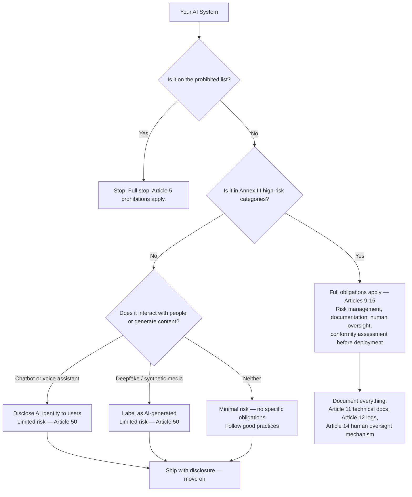

If you have spent time reading EU AI Act coverage in tech media, you have encountered two failure modes: breathless summaries that treat every AI product as if it faces the same obligations as a medical diagnostic system, and dismissals that say it only affects big companies so you can ignore it. Neither is useful for an engineer who needs to know what to actually do.

Here is what applies to most engineering teams right now, based on the structure of the law as it stands in September 2026.



## Timeline Recap — What Has Applied Since August 2026

The AI Act uses a phased timeline measured from August 1, 2024 (entry into force):

- **August 2, 2025** (12 months): Prohibited practice rules and GPAI governance apply. AI literacy obligations for providers and deployers.
- **August 2, 2026** (24 months): General transparency obligations for limited-risk systems, conformity assessment infrastructure for high-risk systems, and GPAI model documentation requirements. This is where we are now.
- **August 2, 2027** (36 months): High-risk systems covered by existing sectoral legislation (medical devices, machinery, etc.) must comply fully.

The practical effect as of September 2026: if your AI system interacts with users, you must disclose that it is AI. If your GPAI model provider (Anthropic, Google, OpenAI) has more than 10^25 FLOP training compute, they must publish technical documentation and maintain incident reporting — that is their obligation, not yours as an API consumer.

## Risk Classification — The Decision You Actually Need to Make

The compliance burden scales sharply with risk tier. Getting this classification right is the most important thing an engineering team can do.

**Prohibited (Article 5)** — do not build these:
- Social scoring systems that lead to detrimental treatment of individuals
- Real-time remote biometric identification in public spaces (law enforcement)
- Systems that exploit psychological vulnerabilities to manipulate behavior against user interests
- Predictive policing based on profiling

If any of these describe your system, the AI Act is the least of your problems.

**High-risk (Article 6 + Annex III)** — full obligations, phased deadlines:
The Annex III categories are specific: critical infrastructure management, education and vocational training assessment, employment decisions (hiring, firing, task allocation), credit scoring, essential services access, law enforcement, border control, justice administration, and biometric categorization. Most enterprise AI products — chatbots, code assistants, search, content generation, internal tools — are not in these categories. If you are uncertain whether your system qualifies, you almost certainly need a lawyer, not an engineer.

**Limited risk (Article 50)** — transparency obligations:
Chatbots and virtual assistants must notify users they are interacting with an AI system. AI-generated content (deepfakes, synthetic images/audio) must be labeled as such. The disclosure requirement is lightweight: a clear notice at the start of the interaction, or a persistent label in the UI.

**Minimal risk** — no specific obligations:
Spam filters, recommendation systems, most AI-assisted internal tools, code completion. Voluntary codes of conduct exist; the law imposes nothing.

## What Most Enterprise AI Teams Actually Need to Do Right Now

For a team shipping a customer-facing chatbot or AI-assisted feature to users in the EU:

**1. Transparency disclosure (Article 50)**

Tell users they are interacting with an AI. This is not legally complicated. Options:
- An opening message: "Hi, I'm an AI assistant..."
- A persistent "Powered by AI" label in the chat UI
- Terms of service with clear AI disclosure (weaker — buried disclosures may not satisfy the spirit of the requirement)

The disclosure must happen before or at the start of the interaction, not after.

**2. No prohibited practices (Article 5)**

Run a quick audit of your system: does it use manipulative techniques the user is unaware of? Does it score users in ways that could harm them? Does it use biometric data in ways the law prohibits? For most teams building internal productivity tools or customer support bots, the answer to all three is no. Document that you checked.

**3. GPAI model usage**

If you are calling Claude, GPT-5, Gemini, or another general-purpose AI model via API, the model provider's compliance with the GPAI provisions (Articles 51-56) is their problem. Your obligations as a downstream deployer are lighter: you must not deploy the model in a way that creates a prohibited practice, and if you build a high-risk application on top of it, the high-risk obligations still apply to you.

## What High-Risk Teams Actually Need

If you are in Annex III territory (employment decisions, credit scoring, educational assessment — the real ones, not adjacent ones):

```python
# Minimum viable high-risk compliance artifact set
required_documentation = {
    "technical_documentation": {
        "article": "Article 11",
        "contents": [
            "System description and intended purpose",
            "Design specifications and architecture",
            "Training data description and data governance",
            "Performance metrics and accuracy targets",
            "Known risks and mitigation measures",
            "Monitoring and update procedures"
        ]
    },
    "risk_management": {
        "article": "Article 9",
        "contents": [
            "Risk identification process",
            "Risk mitigation measures",
            "Residual risk assessment",
            "Post-market monitoring plan"
        ]
    },
    "human_oversight": {
        "article": "Article 14",
        "contents": [
            "Override mechanism: humans can reject AI output",
            "Escalation path for uncertain cases",
            "Operator training documentation"
        ]
    },
    "logging": {
        "article": "Article 12",
        "contents": [
            "Input logging with timestamps",
            "Output logging",
            "Operator actions logged",
            "Retention period defined"
        ]
    }
}
```

The conformity assessment (Article 43) for most Annex III categories is self-assessment — you document compliance and declare conformity. A few categories (biometric identification, critical infrastructure) require third-party assessment.

## Practical Checklist — 30 Days for a Limited-Risk Team

If your AI product is limited-risk (most of you), these five things cover your August 2026 obligations:

- [ ] **Add AI disclosure to user-facing interactions.** One sentence, visible before the first AI response. Test it in your own product — would a naive user know they are talking to AI?
- [ ] **Document your risk classification.** One paragraph: what category your system falls under and why. Store it in your compliance wiki. If the classification is challenged later, you want evidence of a deliberate decision, not a gap.
- [ ] **Review for prohibited practices.** Explicitly check whether your system uses subliminal manipulation, generates social scores, or collects biometric data. Write down that you checked and what you found.
- [ ] **Confirm your GPAI provider's documentation.** Anthropic, OpenAI, and Google publish conformity documentation for their foundation models. Download or link to the current version in your compliance records.
- [ ] **Assign an AI Act owner.** Someone in engineering or legal owns this topic and stays current as guidance evolves. Not a committee — one person with a defined responsibility.

## What Does Not Work

Do not write a 40-page AI Ethics Policy that no engineer will read. Do not hold a compliance workshop that produces a slide deck and no code changes. Do not assume that because your GPAI provider is compliant, you have no obligations.

The teams that navigate this well treat it as an engineering problem: classify the risk, implement the required technical controls, document the decisions, assign an owner. The teams that struggle treat it as a compliance problem — they produce documents that do not reflect how the system actually works.

The law is new, enforcement is still being established, and guidance from national supervisory authorities is still emerging. Building good documentation habits and clear ownership now puts you in a much better position when the details crystallize over the next 12-18 months.
