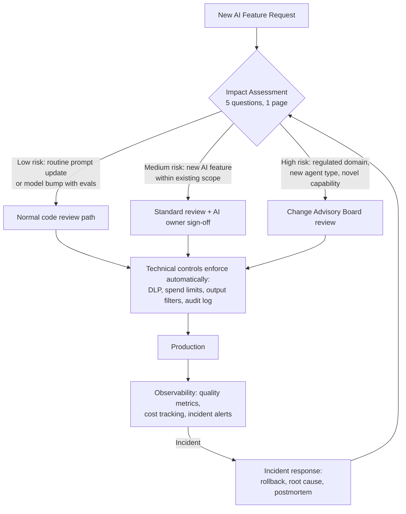

Every engineering organization that adopts AI at scale reaches the same fork in the road. One path leads to compliance theatre: risk committees, policy documents, quarterly attestations, and a governance process that engineers route around because it adds two weeks to every feature without making anything safer. The other path leads to governance that actually changes behavior — technical controls enforced by infrastructure, lightweight processes for high-impact decisions, and ownership that means something.

The irony of the first path is that the teams who feel the most pressure to govern AI are the ones moving fast with it. And the governance systems that create the most friction end up blocking the teams that would otherwise self-govern, while the teams that would skip it find ways around it anyway.



## The Three-Layer Model

Governance that scales has three layers with different enforcement mechanisms. The lowest layer is automated; the middle layer is lightweight process; the top layer is organizational accountability.

### Layer 1: Technical Controls — Enforced Automatically

These controls do not require team compliance because infrastructure enforces them. Teams do not need to remember to follow a policy; the system prevents violations.

- **Permission model and API gateway**: All LLM calls go through a central gateway. Permissions, rate limits, model access, and cost caps are enforced there, not in individual services. Engineers cannot accidentally call a model they are not approved to use, or blow through a cost budget.
- **DLP policies**: Data loss prevention scanning runs on prompts before they leave your perimeter. PII, secrets, and classified data patterns trigger blocks or alerts before reaching the model provider.
- **Output filtering**: Responses from the model pass through a filter layer before reaching users. Blocks or flags content that violates policy. Logged regardless.
- **Audit logging**: Every LLM call is logged with prompt version, model, latency, cost, user context (not PII), and response hash. This is the foundation of all other governance — you cannot investigate incidents or demonstrate compliance without it.
- **Spend limits**: Hard caps per team, per product, per day. Automated alerts at 70% of limit; automatic throttling at 100%. No engineer should be able to accidentally spend $40,000 because a loop misfired.

Teams interact with these controls through the infrastructure they are already using. The governance happens invisibly.

### Layer 2: Process Controls — Lightweight and Repeatable

Process controls require human action, which means they create friction. The design principle is: make the friction proportional to the risk. Routine changes should feel almost frictionless. High-impact changes should feel harder.

**AI Impact Assessment**: Before shipping a new AI feature, complete a one-page form with five questions. Not a 50-page risk assessment — five questions, fillable in 20 minutes, reviewed by one person before approval.

The five questions:
1. What does this AI system do, and who does it affect?
2. What is the worst realistic failure mode (not the catastrophic fantasy, the realistic bad outcome)?
3. What risk classification does it fall under? (Prohibited / High-risk / Limited-risk / Minimal-risk)
4. What controls are in place for the failure modes you identified?
5. Who is the accountable owner for this AI feature?

This document lives with the PR that introduces the feature. When an incident happens six months later, you want to be able to answer "what was known about this risk at deployment time?"

**Prompt change review**: Prompt changes go through code review the same as code changes. Reviewers look at the diff, the eval results attached to the PR, and the stated change reason. A PR for a prompt change with no eval results should not be merged — that is a process control, enforced at code review.

**Eval gate**: The CI pipeline runs evals on changed prompts before the PR can merge. This is the intersection of technical and process control — the technical system blocks the merge; the process requires that evals exist.

### Layer 3: Organizational Controls — Accountability

Someone has to be accountable when a technical control fails or a process gets bypassed. Organizational controls define who that is.

- **AI owner per product**: One named engineer owns the AI behavior in a given product area. They are the first call when there is an incident, the person who signs off on high-risk changes, and the escalation point for policy questions. This is not a job title — it is an explicit responsibility assigned in writing.
- **Escalation path**: Teams know who to call when they encounter something the existing controls do not cover. A new capability they are not sure how to classify. An incident that crosses product boundaries. An edge case in the impact assessment. The escalation path should be short: AI owner → platform team → legal/compliance.
- **Regular review cadence**: Monthly review of AI usage metrics (cost, quality, incidents) against policy. Quarterly review of the governance framework itself — is it still calibrated to actual risk? Is it blocking the wrong things?

## The Change Advisory Board Pattern — When to Use It

Not every AI change needs committee review. Reserve the Change Advisory Board (or equivalent review for your organization) for:

- New AI features in regulated domains (financial decisions, healthcare, HR)
- Changes to models in high-impact decision flows (switching from one model to another in a credit-related product)
- First deployment of a new agent type (your first agentic workflow in production, a new multi-agent topology)
- Any system that crosses the line from tool-assisted decisions to fully autonomous decisions

Routine changes that do not require CAB review:
- Prompt updates within existing scope with passing evals
- Model version bumps (same model family, new minor version, eval results attached)
- New features in minimal-risk territory using approved infrastructure
- Performance improvements with no behavioral changes

The test is: could this change plausibly affect users in a way that existing controls do not cover? If yes, CAB. If no, normal review.

## Metrics That Tell You Whether Governance Is Working

Governance exists to reduce risk without becoming a blocker. Measure both sides:

```python
governance_metrics = {
    # Is governance a bottleneck? (Should be low)
    "mean_time_pr_to_production_ai_features": "target: < 5 days",
    "percentage_ai_features_delayed_by_governance": "target: < 10%",

    # Is governance catching risks? (Should be high)
    "percentage_incidents_covered_by_prior_impact_assessment": "target: > 80%",
    "percentage_prompt_changes_with_eval_results": "target: > 95%",

    # Is the system improving? (Should trend down over time)
    "ai_incident_rate_per_1000_requests": "track monthly, flag increases",
    "cost_overrun_incidents": "track monthly, should decrease after spend limits",

    # Is the process sustainable? (Survey quarterly)
    "team_satisfaction_with_ai_governance_process": "scale 1-5, target > 3.5"
}
```

If governance is consistently blocking features without catching incidents, the process is too heavy. If incidents are happening that were not on anyone's radar, the process is too light. Both are measurable.

## What Consistently Does Not Work

**Policy documents that do not translate to code**: A written policy that says "all AI outputs must be reviewed by a human" accomplishes nothing if the system ships outputs without human review. The policy and the technical controls must match.

**Centralized approval for every AI feature**: Does not scale past five teams. Creates a bottleneck that engineers route around by framing AI features in ways that avoid triggering the process. Reserve central review for genuinely high-risk decisions and get out of the way for everything else.

**Governance by committee without technical members**: A risk committee that does not include engineers who understand how the systems work will make decisions disconnected from the actual risk surface. The people who can identify real failure modes need to be in the room.

**Retroactive governance**: Reviewing systems for compliance after they are in production is harder, more expensive, and less effective than building governance into the development workflow. Start at the impact assessment phase, before code is written.

## Practical Checklist — Shipping Your First Agent to Production

For a team deploying their first agentic system:

- [ ] Complete AI impact assessment — 5 questions, documented, attached to the launch PR
- [ ] Confirm technical controls are in place: all LLM calls through the gateway, audit logging active, spend limit set
- [ ] Define the agent's permission boundary explicitly — what can it do autonomously? What requires human approval?
- [ ] Set up quality monitoring before launch, not after: what metric indicates the agent is working correctly?
- [ ] Define rollback procedure: if the agent starts producing bad output at 3 AM, what does the on-call engineer do?
- [ ] Name the AI owner — one person, written down, knows they own it
- [ ] Run at least one adversarial test session: try to make the agent do something it should not

The checklist is not the governance. The checklist is evidence that the governance happened.
