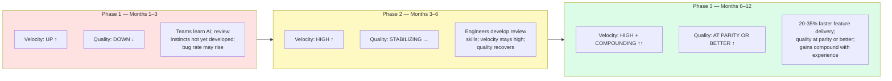

Leadership asks for a productivity number. You have AI coding tools deployed across the team for six months. You look at your DORA metrics: deployment frequency is up. Lead time for changes is down. Sounds good. Then you look at change failure rate, which is also up. You are shipping faster and breaking things more often. Is that productivity, or just faster failure?

Standard engineering metrics were designed for a world where code output is the bottleneck. When a developer can produce three times as much code in a day with AI assistance, the bottleneck shifts — to review quality, to architectural judgment, to whether the AI-generated code is actually correct. The metrics that told you the old bottleneck was clear do not tell you whether the new one is.



## The Three Phases of AI Adoption

This pattern is consistent enough across teams that it is worth naming explicitly.

**Phase 1 (months 1-3): Velocity up, quality often down.** Engineers are still developing intuition for when to trust AI output. The temptation is to accept AI-generated code that looks right rather than verifying it is right. PR review velocity increases — reviewers feel implicit pressure to match the pace of AI-assisted authors. Bug rate rises.

The teams that navigate Phase 1 well are the ones that treat AI review as a distinct skill to develop, not a permission to rubber-stamp faster.

**Phase 2 (months 3-6): Quality stabilizes, velocity stays high.** Engineers who stick with it develop a reliable mental model for which AI outputs to trust and which need scrutiny. They learn which task types produce consistently good AI output (test scaffolding, boilerplate, documentation) and which need heavy review (business logic with complex state, security-sensitive code, new integrations). Quality recovers toward baseline while velocity remains elevated.

**Phase 3 (months 6-12): Benefits compound.** Teams that reached Phase 2 successfully start seeing 20-35% faster feature delivery with quality at parity or better versus the pre-AI baseline. The biggest gains are in boilerplate (data models, CRUD handlers, type definitions), test scaffolding (unit tests for new code are generated in seconds), documentation (inline docs, READMEs, changelogs), and code review preparation (AI generates PR descriptions and highlights changes worth reviewing).

## Metrics That Reflect AI Impact

Replace or supplement standard metrics with these:

**Feature cycle time** — spec-complete to production-deployed. This captures the full value chain. AI should reduce it. If it is not reducing it, the bottleneck has shifted elsewhere (likely review or QA) and that is where to focus.

```python
# Tag PRs by lifecycle phase and compute cycle times
# Associate with AI-assisted flag to compare distributions

def compute_cycle_time(pr_data: list[dict]) -> dict:
    """
    pr_data fields: spec_completed_at, pr_opened_at,
    pr_merged_at, deployed_at, ai_assisted (bool)
    """
    ai_cycle_times = []
    baseline_cycle_times = []

    for pr in pr_data:
        cycle_time = (pr['deployed_at'] - pr['spec_completed_at']).days
        if pr.get('ai_assisted'):
            ai_cycle_times.append(cycle_time)
        else:
            baseline_cycle_times.append(cycle_time)

    return {
        "ai_assisted_p50": median(ai_cycle_times),
        "ai_assisted_p90": percentile(ai_cycle_times, 90),
        "baseline_p50": median(baseline_cycle_times),
        "baseline_p90": percentile(baseline_cycle_times, 90),
        "reduction_pct": (1 - median(ai_cycle_times) / median(baseline_cycle_times)) * 100
    }
```

**Rework rate on AI-assisted features** — how often does a feature need a follow-up fix or rework within 30 days of shipping? A rising rework rate on AI-assisted work signals that the review process is not catching AI errors. Compute separately for AI-assisted and non-AI-assisted features and watch the gap.

**Spec-to-code fidelity** — how often does the delivered feature match the original spec? This sounds hard to measure, but a lightweight version is a QA check against the acceptance criteria at the time of spec-complete. AI improves this when specs are well-written; it degrades it when specs are vague because AI will confidently produce the wrong thing based on an ambiguous prompt.

**Review depth ratio** — are reviewers catching substantive issues or rubber-stamping AI output? Track the ratio of substantive review comments (behavior change, correctness issue, architectural concern) to trivial ones (style, naming, whitespace). A declining ratio suggests reviewers are moving faster without going deeper — which is how AI bugs reach production.

**Engineer satisfaction** — this is not a soft metric. Burned-out engineers leave, and experienced engineers are hardest to replace. Survey quarterly, ask specifically about the AI workflow, and treat a declining score as a leading indicator of retention risk.

## The Dual Metric Problem

AI adoption simultaneously increases velocity and can increase defect rate. These two effects are real and pull in opposite directions. A team that tracks only velocity will declare success while shipping more bugs. A team that tracks only defect rate will see AI as a risk without seeing the productivity benefit.

Track both, together, and be explicit about the target state: velocity up, defect rate flat or improving. Until you reach Phase 3, you will likely be trading some quality for speed. Know that you are doing it, and know when you have closed the gap.

```yaml
# Example team dashboard spec
ai_productivity_dashboard:
  weekly_metrics:
    - name: feature_cycle_time_p50
      split_by: ai_assisted
      target: "ai_assisted < baseline"

    - name: deployment_frequency
      notes: "should increase; if not, check CI/CD pipeline, not AI adoption"

    - name: change_failure_rate
      target: "< 5%; if rising, review depth ratio is the likely cause"

    - name: rework_rate_30d
      split_by: ai_assisted
      alert_if: "ai_assisted rework > 1.5x baseline rework"

  monthly_metrics:
    - name: review_depth_ratio
      target: "> 0.4 substantive / total comments"
      alert_if: "trending down for 2+ consecutive months"

    - name: engineer_satisfaction_ai_workflow
      scale: 1-5
      alert_if: "< 3.5 or declining by > 0.5 in one quarter"
```

## Building Measurement Without Surveillance

Individual-level metrics create perverse incentives. An engineer who knows their AI usage is tracked at the individual level will optimize for the metric rather than for good engineering decisions. Measure at the team level, share results with the team, and use the data to improve process — not to evaluate individual performance.

The `ai_assisted` tag on a PR should be voluntary and at engineer discretion. The goal is population-level understanding, not attribution. This is the same principle that makes blameless postmortems work: if people know the data is used punitively, they stop providing accurate data.

Concretely:
- Add an `ai-assisted` PR label — voluntary, applied by the author
- Aggregate all metrics at team level, never display individual breakdowns
- Share metrics in team retros, not in performance reviews
- Close the feedback loop: engineers should see the same data as leadership, so they can self-correct

## Reporting to Leadership

Executives are not interested in review depth ratios. Translate:

| Engineering Metric | Business Outcome |
|---|---|
| Feature cycle time reduction | Time to market for new capabilities |
| Rework rate | Engineering cost of ownership; support cost |
| Defect rate | Customer-facing incident rate; SLA exposure |
| Engineer satisfaction | Retention cost; recruiting signal |

A useful format: "Over the 6 months since AI tool adoption, feature cycle time decreased by 24%. Defect rate is flat versus baseline (not improved yet, but not degraded). Rework rate on AI-assisted features is currently 1.2x the baseline — above target; we are addressing it by adding an AI-review checklist to our code review process. One-sentence forecast: we expect quality to reach parity with baseline by Q4 as the team builds AI-review proficiency."

That is a report leadership can act on. It is honest about where things are not yet working and has a specific diagnosis and a proposed fix.

## What to Do With the Numbers

The metrics do not tell you what to do — they tell you where to look. A rising rework rate does not mean "stop using AI." It means something in the review process is not catching AI errors, which is an engineering problem to solve. A flat feature cycle time does not mean AI is not working — it might mean the bottleneck has moved to a step that AI does not help with, and that step is now the constraint.

Treat the metrics as a bottleneck identification system, not a verdict. Find the step that is not improving, and improve it. That is the same engineering discipline that works everywhere else.
