The premise of traditional onboarding is that reading the code, reading the commits, and talking to the people who wrote it gives a new engineer sufficient context to contribute. In a codebase where AI wrote 40-60% of the code and the humans who reviewed it are gone or moved on, that premise breaks. The code is there. The intent often is not.

This is not a future problem. Any team that has been using AI coding tools for 18 months or longer is starting to feel it during hiring. New engineers hit the codebase and find that it is technically coherent at the function level but opaque at the module and system level. Architectural decisions that were obvious to the person directing the AI at the time are invisible to everyone else now.

```mermaid
flowchart LR
    subgraph Day1["Day 1 — AI Navigation"]
        D1A["Claude Code: explain\nauthentication flow"]
        D1B["Claude Code: walk through\nrequest lifecycle"]
        D1C["Claude Code: map\ndependency graph"]
    end
    subgraph Week1["Week 1 — Architecture with Human Mentor"]
        W1A["ADR review:\nwhy these decisions?"]
        W1B["Module CLAUDE.md files:\nconstraints and invariants"]
        W1C["Pair on first small PR:\nhuman reviews AI review"]
    end
    subgraph Month1["Month 1 — Contributing with AI + Spec"]
        M1A["Write specs before\ninvoking AI"]
        M1B["AI-assisted PRs\nwith full review"]
        M1C["First feature owned\nend-to-end"]
    end
    subgraph Month3["Month 3 — Full AI-Native Workflow"]
        M3A["Autonomous AI-assisted\nfeature development"]
        M3B["Mentoring next\nnew hire"]
        M3C["Contributing to\nteam AI practices"]
    end
    Day1 --> Week1 --> Month1 --> Month3
```



## The Three Problems Specific to AI-Native Codebases

**The intent gap.** Human-written code leaves an artifact trail: commit messages that explain why a change was made, PR discussions that document what options were considered, inline comments that flag non-obvious constraints, and an author you can message. AI-written code leaves a PR description generated by a model that ran once and a code diff. The "why" — why this approach over alternatives, why this constraint exists, why this file is structured this way — is missing or thin.

**Local coherence, global opacity.** AI generates code that is locally clean. Function naming is consistent. Type signatures are explicit. The file reads well in isolation. But AI operates in a context window, not across a whole system. Decisions about how modules relate to each other, how data flows across service boundaries, which assumptions are load-bearing across the whole system — these are underrepresented in AI-generated code because the AI rarely had the full picture. The new engineer who can read any individual file fluently still cannot piece together how the system works.

**Documentation that describes what, not why.** AI generates docstrings and READMEs quickly, and they are usually accurate about what a function does. But they rarely explain why the function has its constraints, why the interface is designed the way it is, or what assumptions the caller is expected to maintain. Documentation generated by AI from code is largely redundant with the code itself.

## What to Build Into the Codebase

The solution to the intent gap is explicit documentation written by humans at decision time — before the context fades.

**Architecture Decision Records (ADRs)**: An ADR is a short document (one to two pages) capturing a significant technical decision. It includes the context, the options considered, the reason for the choice, and the consequences. The format is less important than the discipline of writing one at the time the decision is made.

```markdown
# ADR 012 — Event sourcing for order state transitions

## Status: Accepted

## Context
Orders have 14 possible state transitions. Multiple services need to react to
state changes (payments, inventory, notifications). We explored three approaches:
polling, direct service calls, and event sourcing.

## Decision
Event sourcing via the internal event bus. Each state transition produces an event.
Interested services consume the stream independently.

## Why not the alternatives
- Polling: 5-second latency is unacceptable for payment confirmation flows
- Direct service calls: creates tight coupling across 4 services; any one service's
  downtime blocks the transition

## Consequences
- Order aggregate must be rebuilt from event stream (not just DB read) for audit purposes
- Services must be idempotent — events may be delivered more than once
- New engineers MUST read this ADR before working on the order service
```

**Module-level CLAUDE.md files**: A `CLAUDE.md` file at the root of a module or package serves two audiences: the AI tools that will help engineers work in this module, and the humans reading it to understand the module's architectural intent.

```markdown
# payments/ — Module Architecture Guide

## Purpose
Handles payment authorization, capture, and refund flows. Integrates with Stripe
and a legacy internal payment processor (see `adapters/`).

## Critical constraints
- **Idempotency is required for all mutations.** Every payment operation accepts
  an idempotency key. Callers must generate and store this key. If a call fails
  ambiguously (timeout, 5xx), the caller retries with the SAME key. The module
  handles deduplication.
- **Never log card numbers or CVVs.** PCI DSS scope. The `PaymentMethod` object
  masks these at construction time. If you see raw card data anywhere in logs,
  that is a P0 incident.
- **The legacy processor (`adapters/legacy.py`) is read-only.** Do not add
  new charge paths to it. All new payment flows use Stripe.

## Testing
Use `payments.testing.FakePaymentGateway` in unit tests. Never call Stripe in
tests — it will fail in CI and accidentally charge test accounts.

## Architecture decision references
- ADR 015: Why Stripe over Braintree
- ADR 021: Idempotency key design
- ADR 028: Legacy processor deprecation timeline
```

The constraints section is the highest-value part. These are the things that AI-generated code may get wrong and that a new engineer cannot infer from reading the code.

## Using AI for Onboarding — What Works and What Does Not

**What works**: Claude Code as a codebase navigator. New engineers get up to speed on the structure faster by asking "explain how a payment authorization request flows from the API handler to the Stripe call" than by tracing it manually through six files. The AI synthesizes across files in ways that would take a new engineer hours.

Give new engineers a set of structured first-day prompts:

```markdown
# Day 1 Claude Code prompts for new engineers

1. "Explain the overall architecture of this service. What are the main modules
   and how do they communicate?"

2. "Walk me through what happens when a user submits a payment. Trace the request
   from the API handler to the external call and back."

3. "What are the most important constraints or invariants I need to know about
   this codebase? Look in CLAUDE.md files and ADRs."

4. "What parts of this codebase are the most complex or have the most active
   bugs recently? Look at git history for frequent changes."

5. "What is the testing strategy here? How are unit tests, integration tests,
   and end-to-end tests organized?"
```

**What does not work**: Using AI to explain why architectural decisions were made when those decisions are not documented. AI explaining AI-generated code can be circular — it accurately describes what the code does, but it cannot tell you whether the approach is intentional or a historical accident that is now stuck in place. The AI will answer confidently either way.

The rule: use AI to navigate (what is here, how does it work); use humans and documentation to understand intent (why is it this way, what constraints are load-bearing).

## The Onboarding Checklist for an AI-Native Codebase

For teams receiving new engineers into an AI-assisted codebase, the infrastructure that makes onboarding work:

- [ ] CLAUDE.md at the repo root with architecture overview and key constraints
- [ ] CLAUDE.md in each major module with purpose, constraints, and ADR references
- [ ] ADR directory with decisions documented at decision time (not reconstructed later)
- [ ] "Constraints" sections explicit in module docs — things that MUST be true that AI might get wrong
- [ ] First-day prompt guide for new engineers to use with Claude Code
- [ ] Pair programming session in week 1 specifically to review AI-generated code with a senior engineer (not just to contribute — to learn the review standard)
- [ ] Clear escalation: new engineer knows who to ask when AI explanations conflict with what they observe in the code
- [ ] Codebase walkthrough covers ADRs, not just files — architectural reasoning, not just structure

## The Honest Tradeoff

AI-native codebases ramp up faster in some ways and slower in others. The new engineer gets to working code faster — AI helps them understand structure and generate their first contributions quickly. But they reach genuine architectural understanding more slowly, because the documentation of decisions and reasoning that comes from human commit history and PR conversation is thinner.

The fix is not to stop using AI. It is to be deliberate about what AI cannot do: document the decisions, the constraints, the invariants, and the reasoning at decision time, with the specificity that only the humans who made the decisions have. The discipline of writing good ADRs and constraint documentation would improve a human-written codebase too. In an AI-native one, it is the difference between a codebase that onboards well and one that becomes increasingly opaque to everyone except the original authors.
