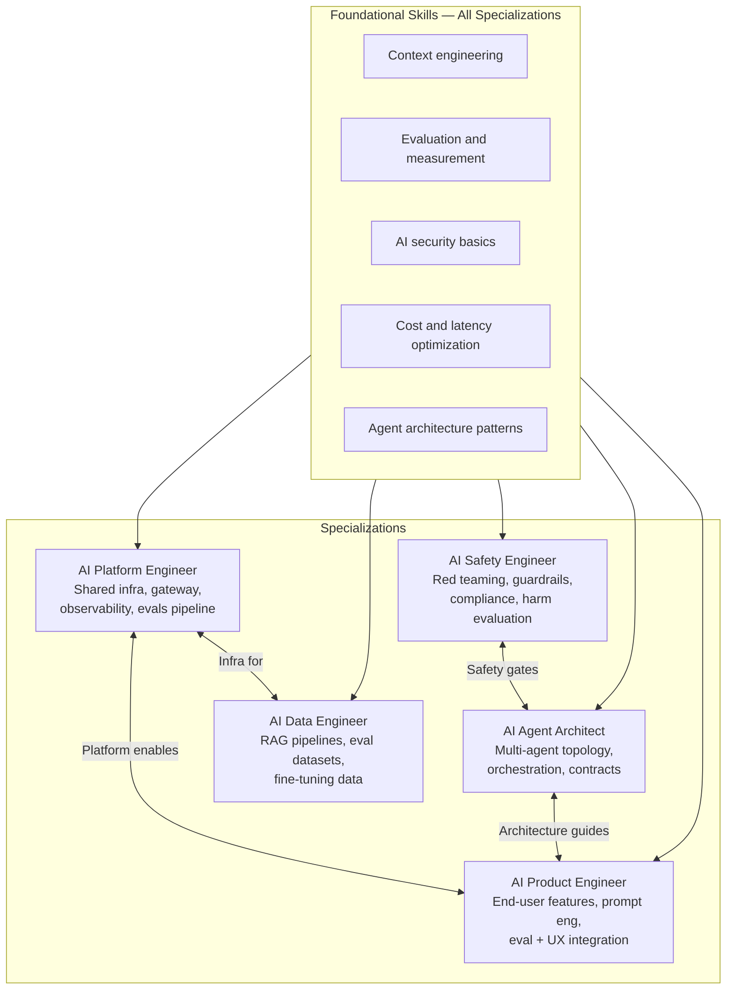

Eighteen months ago, "AI engineer" was a catch-all title that meant roughly "engineer who touches anything related to machine learning or LLMs." That ambiguity is starting to resolve. Teams that have been building with AI at scale long enough to understand what actually needs doing are now hiring for specific things, not "AI engineers" in general. If you are navigating this landscape — either building toward it or already in it — the specializations matter for how you develop skills and how you position yourself.

## The Five Specializations

**AI Platform Engineer** builds the shared infrastructure that every other AI product team depends on: the LLM gateway, prompt registry, evaluation pipeline, observability layer, cost management, and developer tooling. Background: distributed systems, platform engineering, SRE. This is closest to the traditional Platform or DevOps role, applied to AI infrastructure.

This specialization is currently the most in demand and the hardest to hire. The intersection of platform engineering depth and working AI knowledge is genuinely rare. Teams that have one good AI Platform Engineer can scale multiple product teams off that foundation. Teams that do not have one build redundant, inconsistent infrastructure in each product team separately and pay the cost in reliability and governance gaps.

**AI Safety Engineer** evaluates model outputs for harmful or out-of-policy behavior, red teams AI systems to surface failure modes before production, designs guardrails and filtering layers, and ensures systems comply with internal policy and external regulation. Background: security engineering, ML research, or a combination.

The salary premium for this specialization is real, particularly in fintech, healthcare, and government. The demand comes partly from EU AI Act and similar regulations creating explicit compliance requirements, and partly from organizations that have had high-profile AI incidents and are now taking the problem seriously. This is a specialized role — not every team needs a dedicated AI Safety Engineer — but the skills translate broadly and organizations without dedicated capacity often need to hire for it when they reach regulated territory.

**AI Agent Architect** designs multi-agent topologies, defines agent contracts and interfaces, and solves the orchestration problems that arise when multiple AI agents interact in complex workflows. Background: software architecture, distributed systems. Equivalent to a solutions architect, but applied to agentic systems.

This specialization is the most nascent of the five. The patterns for designing reliable multi-agent systems are still being worked out across the industry. Engineers who have built agentic systems in production — with all the failure modes that involves — have knowledge that is not yet in any textbook. That experience gap is why the role commands attention even though the formal title is new.

**AI Product Engineer** builds end-user AI features, owns the prompt engineering and evaluation for those features, and integrates AI capabilities into product surfaces. Background: full-stack engineering with product orientation. This is the largest and most accessible category.

This is the specialization most general software engineers transition into. The ceiling is high — engineers who are excellent at context engineering, evaluation, and UX integration for AI are valuable — but the floor is accessible. If you have been shipping product features and have started using AI tools to do it, you are already moving in this direction.

**AI Data Engineer** builds and maintains the data pipelines that AI systems depend on: retrieval systems for RAG, evaluation datasets, and fine-tuning data pipelines. Background: data engineering, ML pipelines. The work is less glamorous than it sounds and more important than it gets credit for — the quality of a RAG system is largely determined by the quality of the retrieval pipeline, not the model.

## Skills That Matter Across All Specializations

**Context engineering**: The ability to construct prompts, system messages, retrieval contexts, and tool definitions that reliably produce the output you need. This is not just prompt writing — it is understanding how models process context, how to manage context windows under constraints, and how to structure information so a model can use it effectively.

**Evaluation and measurement**: How to design an eval dataset, how to run evals at scale, how to interpret results, and how to build the measurement infrastructure that makes quality decisions data-driven. This is systematically under-invested in. Engineers who are comfortable with evals are a differentiating asset on any AI team.

**AI security**: Prompt injection, data exfiltration via model responses, jailbreaking patterns, supply chain risks in AI dependencies. Most AI engineers do not understand the security surface of the systems they build. This is a gap that attackers exploit.

**Cost and latency optimization**: Token counting, caching strategies (prompt caching, semantic caching), model selection for cost-quality tradeoffs, batching, streaming. At scale, these decisions have direct revenue impact.

**Agent architecture patterns**: Orchestrator-worker, tool-calling, multi-agent coordination, error recovery, state management in agentic flows. Understanding these patterns is becoming a baseline expectation for engineers building with AI, not just a specialty skill.

## Skills Depreciating in Value

This is the uncomfortable part of the conversation. Some skills that took years to develop are worth less in an AI-augmented world:

**Boilerplate coding**: Writing data models, CRUD handlers, type definitions, and standard library usage. AI generates this correctly and quickly. The skill is not gone — you still need to review it — but hours-of-effort boilerplate coding is no longer a differentiator.

**API and syntax memorization**: Knowing that `Array.prototype.reduce` takes `(accumulator, currentValue, currentIndex, array)` matters less when you can get that from AI instantly. The value is in knowing which operation to use and whether the result is correct, not in having the signature memorized.

**Low-level implementation without architectural judgment**: Writing code that works for the immediate case without understanding the broader system context. AI can do this. What AI cannot do is decide whether the immediate case is the right thing to build at all, or whether the approach fits the system's constraints.

The pattern: implementation detail knowledge depreciates; architectural judgment, systems thinking, and evaluation capability appreciate.

## The Market in September 2026

The job title "AI Engineer" as a generic designation is signal-poor. It includes both engineers who understand the underlying systems deeply and engineers who have assembled a few LLM API calls and call themselves AI engineers. Candidates who title themselves with a specific specialization communicate more, and recruiters who specify specializations in job postings attract more relevant candidates.

Demand is highest for AI Platform Engineers for the reason stated above: rare intersection of skills, foundational impact. This is not a role you hire fresh — it requires platform engineering experience plus AI knowledge. Teams that have a strong Platform Engineer willing to specialize into the AI domain are well-positioned.

AI Safety Engineers command salary premiums in regulated industries. Fintech and healthcare organizations that have operationalized AI systems face regulatory pressure and board-level scrutiny that makes this role a priority hire rather than a nice-to-have.

The "AI Product Engineer" title is increasingly common in job postings for roles that would have been called "Senior Software Engineer" two years ago. AI tool proficiency has moved from a nice-to-have to an expected skill at senior level at most organizations building software products.

## For Engineers Transitioning Into AI Engineering

The learning is in the building. Reading about agentic systems and building one are different activities. Build something with an agentic workflow end-to-end — something real enough to break in interesting ways. The failure modes you encounter in a working system teach you things that no course or blog post will.

Get comfortable with evaluation before you need it under pressure. Most engineers' instinct is to evaluate manually — run it a few times, does it look right? At production scale, this does not work. Learn to build eval datasets, run automated evals, and interpret the results. This skill is differentiating because it is systematically skipped.

Understand the security landscape. Read about prompt injection. Try to jailbreak your own system. Know what data exfiltration via model output looks like. Security knowledge is not optional for AI systems that process sensitive data or take real-world actions.

## The Honest Assessment

AI engineering is simultaneously overhyped and genuinely important, which is an unusual combination. It is overhyped in the sense that many teams are building AI features that add complexity without adding value, driven by hype rather than user need. It is genuinely important in the sense that the engineers who understand how to use AI systems well — when they help, when they fail, and how to build them reliably — are working on something that will affect how software is built for decades.

Engineers who thrive in this landscape use AI as a force multiplier for solid engineering fundamentals, not as a replacement for them. The fundamentals — system design, debugging discipline, understanding failure modes, measuring what you care about — matter more, not less, when AI is in the loop. The AI amplifies both good judgment and bad judgment. Developing good judgment remains the job.
