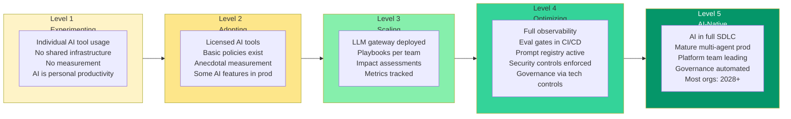

Every organization thinks it is at a higher maturity level than it actually is. This is not cynicism — it is a predictable artifact of how teams report internally. The engineering team describes the system they are building toward. Leadership hears a description of the system they have. The gap between those two things is where overconfidence lives.

A maturity model is useful precisely because it offers a shared language for the gap. When you can say "we say we're at Level 3 but three of the five Level 3 indicators are missing," you have a tractable problem instead of a vague feeling that the AI program is less mature than the slides suggest.

## The Five Levels — Honest Indicators

### Level 1 — Experimenting

Individual engineers are using AI tools; organizational policy either does not exist or is a blanket restriction that some engineers work around. No shared infrastructure. No measurement beyond individual anecdote. AI is a personal productivity tool, like a better search engine.

**Honest indicator**: "We use Copilot."

**What that actually means**: A portion of engineers have Copilot or similar licenses, some use them regularly, most have no idea whether it is helping, and nobody is tracking it at an organizational level. The tools are present; the practice is not.

**What you actually have**: Individual adoption variance from very high to zero, no shared understanding of what AI tools are appropriate for which tasks, and no ability to scale or govern what is working.

### Level 2 — Adopting

AI tools are officially licensed and policy-governed. Some shared guidelines exist (approved tools, acceptable use, data handling). Basic tooling is standardized. A few AI-assisted features are in production. Measurement is anecdotal or ad-hoc.

**Honest indicator**: "We have AI policies."

**What that actually means**: An AI Acceptable Use Policy exists. A percentage of the organization has read it. Enforcement is manual and inconsistent. Teams that want to move fast are already ahead of the policy's ability to govern them.

**What you actually have**: Policies that are not yet enforced by technical controls, standardization in name but not in practice, and measurement that stops at "it feels faster."

### Level 3 — Scaling

Shared infrastructure exists: an LLM gateway, basic eval pipeline, centralized cost management. Teams have playbooks for common AI patterns. Some governance is in place — impact assessments for new AI features, model approval process. Metrics are tracked but not consistently acted upon. AI features are in production across multiple products.

**Honest indicator**: "We have an LLM gateway."

**What that actually means**: The gateway is deployed and some teams use it. Other teams call providers directly because the gateway adds latency or lacks the model they need or the approval process is slow. Usage is tracked for some teams but not all. The gateway is infrastructure; the discipline to use it consistently is not yet there.

**What you actually have**: Infrastructure with partial adoption, governance on paper but not in automated controls, and metrics that generate charts but do not drive decisions.

### Level 4 — Optimizing

Full observability: every LLM call is traced, latency and cost are measured, quality metrics exist and are acted on. Eval gates in CI/CD block merges when prompt changes do not meet quality thresholds. Prompt registry with approval workflow and version history. Security controls enforced: DLP in the gateway, output filtering, red teaming performed regularly. Governance is implemented as technical controls, not just policy. Quality metrics drive model selection and feature decisions.

**Honest indicator**: "Evals are in our CI pipeline."

**What that actually means**: One team has evals in CI. Two other teams are planning to add them. The fourth team does not know this is expected. The eval datasets are not shared. The quality thresholds are inconsistent between teams. The infrastructure exists for the team that built it; it is not yet organizational practice.

**What you actually have**: Pockets of Level 4 practice inside a generally Level 3 organization. The gap between "we have this" and "we all do this consistently" is where most organizations sit when they believe they are at Level 4.

### Level 5 — AI-Native

AI is embedded in every phase of the engineering lifecycle: spec generation, code generation, testing, documentation, code review, incident investigation. Multi-agent systems in production for non-trivial workflows. A mature platform team provides shared infrastructure that product teams consume without thinking about it. Evaluation and governance are invisible because they are automated. Teams think about what to build and what the agent should do; the infrastructure handles the how.

**Honest indicator**: "We are AI-native."

**What that actually means**: Most organizations will not be here before 2028. The few who claim it now typically mean they have aggressive AI tool adoption but do not yet have the platform maturity, governance automation, or evaluation discipline that "AI-native" actually requires.

## Common Mistakes at Each Transition

**1→2: Rushing to standardize before learning what works.** The temptation at Level 1 is to observe that some engineers are getting value from AI tools and immediately standardize across the organization. But what works for one team's workflow and stack may not work for another. Let teams experiment for 60-90 days. Learn from variation. Standardize what proved out. Standardizing too early locks in the wrong things.

**2→3: Building a platform that is too heavy.** Organizations that have centralized engineering infrastructure often try to solve AI governance the same way: build a comprehensive internal platform and mandate its use. The problem is that a heavy platform built by a central team for hypothetical needs will miss what product teams actually need. Start with a thin gateway — routing, logging, cost tracking — and let product teams pull in capabilities they need. Voluntary adoption at Level 2 beats mandated adoption of something that does not fit.

**3→4: Treating governance as a process problem instead of an engineering problem.** Level 3 organizations add governance through process: review meetings, sign-off requirements, checklists. This works at small scale and fails at large scale. The transition to Level 4 is implementing governance as technical controls that enforce themselves. DLP that runs in the gateway does not depend on engineers remembering to handle PII correctly. Eval gates that block CI do not depend on reviewers catching prompt regressions. Build the control into the system; do not rely on people following a process.

**4→5: Automating everything without judgment.** The mistake at Level 4 is seeing automation working well and concluding that more automation is always better. Some decisions should stay human — not because automation is technically impossible, but because the judgment required is genuinely contextual in ways current systems do not handle. The discipline is knowing which decisions to automate and which to keep human, and revisiting that boundary regularly.

## Self-Assessment — 10 Questions

Answer honestly. The cluster of answers will locate your actual level.

1. Does every LLM call in production go through a central gateway, with no exceptions? *(Level 3+ indicator)*
2. Are eval results required before any prompt change reaches production? *(Level 4 indicator)*
3. Do you have an audit log of every LLM call, accessible to both engineering and security? *(Level 4 indicator)*
4. Has your AI system been red-teamed in the past 6 months? *(Level 4 indicator)*
5. Do you have a prompt registry with versioning and approval workflow? *(Level 4 indicator)*
6. Are AI cost overruns prevented by automated controls, or by engineers manually checking costs? *(Level 3/4 boundary)*
7. Do impact assessments exist for all AI features currently in production? *(Level 3 indicator)*
8. Are quality metrics for AI features tracked weekly, and do they drive decisions? *(Level 3/4 boundary)*
9. Do new engineers have documented onboarding paths for AI-native workflows? *(Level 3 indicator)*
10. Are multi-agent systems in production doing non-trivial decision-making? *(Level 5 indicator)*

Score: mostly "yes" above Level 3 indicators with "no" on Level 4 indicators — you are Level 3. Mostly "no" on Level 3 indicators — you are Level 2. Any "no" answers on Level 4 indicators mean you are not at Level 4 yet, regardless of what you said in the last all-hands.

## How to Use the Model

The maturity model is not a goal — it is a diagnostic. The useful question is not "how do we get to Level 5?" but "what are the three concrete changes that move us from our current level to one level up?"

Pick the level directly above where you actually are. Identify the specific missing indicators. Build a 90-day plan around those gaps. Do not jump two levels — the prerequisites matter. Level 4 evaluation discipline requires Level 3 shared infrastructure to run evals on. Level 3 governance requires Level 2 policy foundation to govern against.

The organizations that make steady progress treat maturity advancement as an engineering project: scoped work, concrete deliverables, measurable outcomes. The ones that stall treat it as a transformation: vision statements, roadmaps that go two years out, steering committees. Advance one level at a time. Measure whether you got there. Then advance again.
