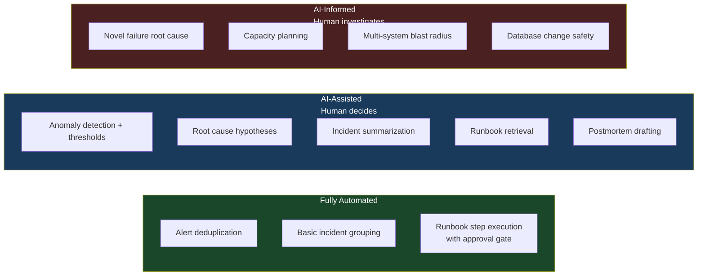

Gartner coined "AIOps" in 2017 and the industry promptly over-indexed on it. The promise was compelling: AI that monitors your infrastructure, detects anomalies, correlates alerts, executes remediation, and eventually replaces the need for humans in the loop during routine incidents. Nine years later, the reality is more useful and more modest than that promise. AI works well in narrow operational domains. It doesn't work as a general-purpose operations brain.

Here's an honest map of where AIOps actually delivers in 2026.

---

## What Actually Works

### Alert Correlation and Noise Reduction

This is the highest-ROI AIOps capability available today, and it works because the problem is well-suited to ML: alert patterns are structured, repetitive, and have historical signal for learning.

Modern distributed systems generate thousands of alerts per day. Most of them are either duplicates (the same condition from multiple monitors), downstream noise (a database is down, so twenty services alert on connection failures), or known oscillations that don't require action. A Kubernetes cluster failing readiness checks, then recovering, then failing again every 30 seconds should produce one incident ticket — not 180.

ML-based alert correlation groups related alerts into incidents using a combination of service dependency graphs, time-window co-occurrence, and learned alert co-occurrence patterns. Mature products — PagerDuty's AIOps, Datadog's alert correlation, ServiceNow's event management — do this well. Teams that tune correlation properly consistently report 40-70% reductions in actionable pages. That's real toil reduction.

The tuning investment is non-trivial. Out-of-the-box correlation produces good recall with too many false groupings. Precision requires ongoing feedback: on-call engineers marking incorrect correlations, teams mapping their service dependency topology, alert threshold cleanup to remove known-noisy monitors. Plan for 4-6 weeks of active tuning before correlation becomes reliable.

### Log Anomaly Detection

Statistical models and LLMs flagging unusual log patterns before they become visible incidents. This works well for services with stable "normal" behavior — a payment processor, an authentication service, a billing worker. If your logs have a known good state with clear structure, anomaly detection can flag deviations before users notice.

It fails on highly dynamic microservice environments where "normal" changes constantly. If you're deploying multiple times per day, your baseline is a moving target, and anomaly detectors produce noise during deploy windows unless you suppress them explicitly.

### Runbook Automation

AI agents that can execute documented runbook steps autonomously: restart a crashed pod, scale a deployment to its predefined maximum, clear an application cache, rotate a connection pool. This works when the runbooks are complete, current, and specific enough for automation.

The constraint is that the AI is only as good as your runbooks. If your runbook says "restart the service if memory exceeds 80%" and the service is at 82%, the agent can execute that step safely. If the runbook says "investigate and remediate the memory issue," the agent has no specific action to take. Runbook automation forces you to make your runbooks explicit and actionable — that's a forcing function that pays off beyond automation.

### Incident Summarization and Handoff

This is probably the highest-ROI AIOps application available right now, and it's underused. When an incident runs across an on-call handoff, the incoming engineer needs to understand the current state: what happened, what was tried, what's the current hypothesis, what actions are blocked waiting on something. Manually writing that summary takes the outgoing engineer 10-15 minutes at the worst possible time.

LLMs summarizing incident timelines — from alerts, Slack threads, PagerDuty notes, and runbook executions — produce a usable handoff document in under 30 seconds. Engineers who've used this describe it as a significant reduction in handoff friction. The AI doesn't understand the incident; it synthesizes the documented history of the incident. That distinction matters but the output is genuinely useful.

---

## What Doesn't Work Yet

**Autonomous remediation without human approval for consequential actions.** The blast radius of getting remediation wrong in production is too high. AI agents can draft remediation plans and execute pre-approved low-risk steps. They should not autonomously restart stateful services, roll back deployments, or modify network configuration without engineer review. The human-in-loop requirement isn't a limitation that AI will soon overcome — it's a deliberate control that reflects the irreversibility of some operations actions.

**Root cause analysis for novel failures.** AI reasons well about failure modes it's seen before — patterns in its training data, patterns in your historical incidents. Novel failures, by definition, look different from anything in that history. When something genuinely new breaks, experienced engineers who understand the system architecture are essential. AI can help gather and organize information; it can't replace the system mental model an experienced engineer carries.

**Capacity planning for complex systems.** AI tools help with capacity planning by extrapolating trends and flagging anomalies in utilization. They don't replace judgment about architectural changes, business seasonality, new product launches, or the non-linear scaling behavior of specific components under load. Treat AI capacity analysis as a starting point, not a conclusion.

---

## The Honest Picture

AIOps works best when the problem is either pattern-matching at scale (alert correlation, log anomaly detection) or information synthesis (incident summarization, postmortem drafting). These are problems where the data is available, the patterns are learnable, and the stakes of getting it wrong are bounded.

It doesn't work as a general-purpose operations brain. The marketing promise of AI that autonomously manages your infrastructure is still science fiction for anything beyond tightly scoped, low-blast-radius tasks.

The teams getting real value from AIOps in 2026 are not the ones who deployed an AIOps platform and hoped it would work. They're the teams who identified specific operational pain points — alert noise, incident handoffs, runbook retrieval — and built or configured AI assistance for those specific problems. Narrow, targeted, tuned to your environment. That's what actually works.

---

## Where to Start

If you're evaluating AIOps investment, rank your starting points by ROI and time-to-value:

1. **Alert correlation** — immediate noise reduction with existing monitoring data. Payoff in weeks.
2. **Incident summarization** — deploy an LLM that can read your incident timeline and produce a handoff summary. Low engineering investment, high engineer satisfaction.
3. **Runbook retrieval** — make your runbooks semantically searchable. Engineers find the right procedure faster; this is the foundation for automation later.
4. **Log anomaly detection** — requires clean structured logging as a prerequisite. Medium-term investment.
5. **Runbook automation** — requires mature runbooks, tested APIs, and careful blast-radius controls. Long-term investment with high payoff when done right.

The pattern across all of these: the AI works better as your operational knowledge (runbooks, postmortems, service topology) becomes more structured and accessible. Investing in that knowledge structure pays dividends beyond AI — and makes the AI dramatically more useful when you do apply it.
