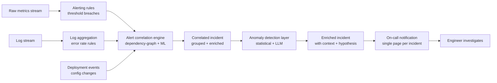

Alert fatigue isn't a monitoring problem — it's a signal-to-noise problem, and it's getting worse. A typical microservices deployment triggers thousands of alerts per day. On-call engineers develop what amounts to learned helplessness: they ignore most alerts because most alerts don't require action. Then the one that does require action gets buried in the noise.

The alert fatigue crisis is where AI-driven incident detection has its clearest mandate. Two distinct approaches — alert correlation and anomaly detection — each solve a different part of the noise problem. Getting both right requires understanding which problem each actually solves.



---

## Alert Correlation: Grouping Related Alerts into Incidents

Alert correlation is the problem of taking a stream of related alerts — a database is down, twenty downstream services are timing out, and your synthetic tests are failing — and producing a single incident ticket that captures all of them with the database failure as the root.

### Two Approaches to Correlation

**Dependency-graph-based correlation** uses your service topology to determine which alerts are structurally related. If `payment-service` depends on `postgres-primary`, and both alert simultaneously, they belong to the same incident. This approach has high precision (correlated alerts really are related) but lower recall (it only catches topology-explainable relationships).

**ML-based correlation** learns co-occurrence patterns from historical incident data. Alerts that frequently appear together in the same incident window get grouped together, even if the dependency relationship isn't in your topology. Higher recall, more false groupings until tuned.

The right sequence: start with dependency-graph correlation, then layer ML-based correlation on top to catch the relationships your topology model missed. Don't start with ML — you need historical incident data for it to learn from, and the false groupings are harder to debug.

### What You Need for Correlation to Work

Your service dependency topology needs to be in a queryable form. Service meshes (Istio, Linkerd) expose this automatically. APM tools (Datadog APM, Honeycomb, Tempo) build it from trace data. If you don't have this, start with a manually maintained dependency YAML — imperfect, but enough to bootstrap correlation.

```yaml
# Example: simple dependency topology for correlation config
services:
  payment-service:
    depends_on:
      - postgres-primary
      - redis-session
      - fraud-detection-api
  fraud-detection-api:
    depends_on:
      - postgres-primary
      - ml-inference-service
  order-service:
    depends_on:
      - payment-service
      - inventory-service
      - postgres-primary
```

The tuning cycle for ML correlation is ongoing. Every false grouping is training signal. Build a feedback mechanism: on-call engineers mark incorrect correlations with a label or a thumbs-down in your incident tool. Pipe that feedback into your correlation model weekly. Without this loop, ML correlation degrades as your system evolves.

---

## Anomaly Detection: Finding What Threshold Rules Miss

Threshold-based alerting has a fundamental problem: the threshold that makes sense at 09:00 Tuesday is wrong at 01:00 Saturday. Traffic patterns, error rates, and latency all have diurnal and weekly seasonality. Static thresholds produce either false positives at low traffic (alert fires even though the error rate is normal for this time) or late detection at high traffic (alert doesn't fire until you're well past the point of user impact).

Anomaly detection solves this by learning "normal" for the given time window and flagging deviations from that expected baseline.

### Seasonal Decomposition for Time-Series Metrics

For metrics with clear periodicity — request rate, latency percentiles, error rates — seasonal decomposition (STL, Facebook Prophet) learns the daily and weekly pattern and alerts on residuals. This handles most threshold-related false positives.

```python
from prophet import Prophet
import pandas as pd

def train_anomaly_model(metric_history: pd.DataFrame) -> Prophet:
    """
    Train a seasonal anomaly detection model on historical metric data.
    metric_history: DataFrame with columns ['ds' (datetime), 'y' (metric value)]
    """
    model = Prophet(
        interval_width=0.95,       # 95% confidence interval
        yearly_seasonality=False,   # not enough data typically
        weekly_seasonality=True,
        daily_seasonality=True,
        changepoint_prior_scale=0.05  # conservative: resist overfitting to spikes
    )
    model.fit(metric_history)
    return model

def detect_anomaly(model: Prophet, current_value: float,
                   timestamp: pd.Timestamp) -> dict:
    future = pd.DataFrame({'ds': [timestamp]})
    forecast = model.predict(future)
    lower = forecast['yhat_lower'].iloc[0]
    upper = forecast['yhat_upper'].iloc[0]
    is_anomaly = current_value < lower or current_value > upper
    return {
        'is_anomaly': is_anomaly,
        'expected_range': (round(lower, 2), round(upper, 2)),
        'actual': current_value,
        'deviation_sigma': (current_value - forecast['yhat'].iloc[0]) /
                           max(forecast['yhat_upper'].iloc[0] - forecast['yhat'].iloc[0], 0.001)
    }
```

### LLM-Enhanced Detection: Adding Context

Statistical anomaly detection flags deviations. It doesn't explain them. An LLM layer can combine the anomaly signal with deployment events and recent alert context to produce a human-readable hypothesis.

```python
def generate_anomaly_context(anomaly: dict, recent_deployments: list,
                              active_alerts: list) -> str:
    prompt = f"""
A metric anomaly was detected:
- Metric: {anomaly['metric_name']} on {anomaly['service']}
- Actual value: {anomaly['actual']} (expected: {anomaly['expected_range'][0]:.1f}-{anomaly['expected_range'][1]:.1f})
- Detected at: {anomaly['timestamp']}

Recent deployments in the last 2 hours:
{chr(10).join(f"  - {d['service']} v{d['version']} at {d['time']}" for d in recent_deployments)}

Other active alerts:
{chr(10).join(f"  - {a['name']}: {a['service']}" for a in active_alerts)}

Provide a 2-3 sentence hypothesis for what might be causing this anomaly.
Focus on correlations with deployments and related alerts. Be specific, not generic.
""".strip()
    return prompt
```

---

## The Practical Implementation Path

Don't try to implement everything at once. The path that minimizes wasted effort:

1. **Clean up your alerting rules first.** Remove alerts that have never fired and resulted in action. Fix thresholds that fire constantly. This is unglamorous but essential — AI correlation of noisy alerts produces noisy incidents.

2. **Add dependency-graph correlation.** Use your APM topology or write a simple YAML dependency map. Even imperfect topology correlation cuts incident noise significantly.

3. **Add LLM incident summarization.** Take the correlated alerts and feed them to an LLM for a natural-language description of what's happening. This costs almost nothing and the payoff is immediate.

4. **Add seasonal anomaly detection for your highest-traffic services.** Train on 4+ weeks of historical data. Deploy with high interval width (95%+) to minimize false positives initially.

5. **Add ML-based correlation and tune over 6-8 weeks** with on-call feedback.

---

## What to Instrument for Effective AI Detection

The quality of AI detection is a direct function of the quality of your observability data.

- **Structured logs**: JSON, consistent field names across services (`service`, `level`, `trace_id`, `span_id`, `error_code`). Free-text logs are almost useless for AI analysis.
- **SLI metrics at service boundaries**: latency percentiles (p50/p95/p99), error rate, request rate — measured at each service's inbound and outbound edges.
- **Deployment events as metric annotations**: every deployment should appear as an event in your metric timeline. Without this, anomaly detection can't correlate spikes with deployments.
- **Service topology in a queryable form**: either from your service mesh, APM tool, or a maintained config. Without this, correlation is limited to time-window co-occurrence.

The teams who get the most from AI-driven incident detection are the ones who treat their observability data as a product, not a byproduct. Clean data, consistent schemas, rich context. That investment compounds — better data makes every AI application in your operations stack more useful.
