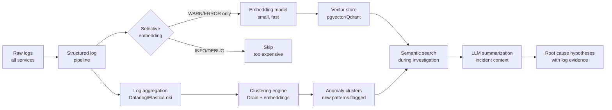

A modern microservices deployment generates gigabytes of logs per hour. During an incident, you need to find the 10 relevant lines in 10 million. The traditional workflow — grep, filter by time window, scroll, grep again — breaks at this scale. At 10 million lines per hour, even a well-crafted grep is slow, and without knowing what you're looking for, you might grep for the wrong thing.

AI-powered log analysis doesn't replace the engineer's judgment about what matters. It does handle the search-and-filter work that consumes most incident investigation time, so engineers spend time thinking instead of scrolling.



---

## Three AI Approaches to Log Analysis

### 1. Semantic Search Over Logs

Traditional log search is exact-match or regex. Semantic search lets you query in natural language against the meaning of your logs. "Find authentication failures that started after the 3pm deploy" returns relevant log clusters even if the exact word "authentication" doesn't appear in every relevant log line.

The implementation requires an embedding pipeline: stream logs to an embedding model, store vectors in a vector database, query with the incident context. The cost reality: embedding every log line is prohibitively expensive at scale. The practical approach is to embed selectively.

```python
import asyncio
from typing import AsyncIterator
from anthropic import AsyncAnthropic

client = AsyncAnthropic()

# Embed only WARN and ERROR logs — typically 2-5% of total volume
LOG_LEVELS_TO_EMBED = {"WARN", "WARNING", "ERROR", "CRITICAL", "FATAL"}

def should_embed(log_entry: dict) -> bool:
    """Filter logs worth embedding — keeps cost manageable."""
    level = log_entry.get("level", "").upper()
    return level in LOG_LEVELS_TO_EMBED

async def embed_log_batch(logs: list[dict],
                          embed_fn) -> list[dict]:
    """Embed a batch of pre-filtered log entries."""
    texts = [
        f"{log['service']} [{log['level']}] {log['message']}"
        for log in logs
        if should_embed(log)
    ]
    if not texts:
        return []
    # Use a small fast model for embeddings — not a frontier model
    embeddings = await embed_fn(texts)
    return [
        {"log": log, "embedding": emb}
        for log, emb in zip(
            [l for l in logs if should_embed(l)],
            embeddings
        )
    ]

async def search_logs(query: str, time_window: tuple,
                      services: list[str],
                      vector_store) -> list[dict]:
    """
    Semantic search over embedded logs.
    Returns the most relevant log entries for the query.
    """
    query_embedding = await embed_fn([query])
    results = vector_store.search(
        embedding=query_embedding[0],
        filters={
            "timestamp": {"gte": time_window[0], "lte": time_window[1]},
            "service": {"in": services}
        },
        limit=50
    )
    return results
```

### 2. Log Clustering for Anomaly Detection

Rather than searching for something specific, clustering identifies new error patterns that didn't exist in normal operation. This is useful for proactive detection: a new error cluster appearing in your payment service at 14:32 might be the first signal of a problem before it reaches threshold-based alert levels.

The Drain algorithm (a streaming log parser) is the standard approach for structured log parsing — it extracts the template from log messages, grouping log lines with the same structure but different variable fields. Combine Drain with embedding-based clustering for logs that resist template extraction.

```python
import numpy as np
from sklearn.cluster import DBSCAN
from drain3 import TemplateMiner

def cluster_error_logs(logs: list[dict],
                       embed_fn,
                       eps: float = 0.3,
                       min_samples: int = 3) -> list[dict]:
    """
    Cluster error logs by semantic similarity.
    Returns clusters sorted by size (largest first).
    Flags clusters that are new relative to a baseline window.
    """
    miner = TemplateMiner()
    templates = []
    for log in logs:
        result = miner.add_log_message(log["message"])
        templates.append(result["template_mined"])

    # Embed the extracted templates (deduped)
    unique_templates = list(set(templates))
    embeddings = embed_fn(unique_templates)
    template_to_embedding = dict(zip(unique_templates, embeddings))

    # DBSCAN clustering on embedding space
    X = np.array([template_to_embedding[t] for t in templates])
    clustering = DBSCAN(eps=eps, min_samples=min_samples,
                        metric='cosine').fit(X)

    # Group logs by cluster
    clusters = {}
    for log, label in zip(logs, clustering.labels_):
        if label == -1:
            label = "noise"
        clusters.setdefault(label, []).append(log)

    return sorted(
        [{"cluster_id": k, "logs": v, "size": len(v)}
         for k, v in clusters.items()],
        key=lambda x: x["size"],
        reverse=True
    )
```

The output is a ranked list of error clusters. Engineers investigate the largest new clusters first. During an incident, you can diff the cluster distribution against a baseline window (the same time yesterday, or the hour before the incident) to find clusters that emerged with the incident.

### 3. LLM-Powered Root Cause Summarization

The highest-ROI application, and the simplest to implement. Given a set of filtered log clusters (not millions of lines — 50-100 representative log entries), ask an LLM to synthesize what they tell you about the incident.

This is not asking the LLM to magically divine the root cause from logs. It's asking the LLM to do what a junior engineer does when handed a log dump: read it, identify patterns, and describe what's happening in human terms.

```python
async def summarize_incident_logs(error_clusters: list[dict],
                                   incident_context: dict) -> str:
    """
    Ask an LLM to synthesize error clusters into a root cause hypothesis.
    """
    cluster_summary = "\n\n".join([
        f"Cluster {i+1} ({c['size']} occurrences):\n"
        + "\n".join(log["message"] for log in c["logs"][:5])
        for i, c in enumerate(error_clusters[:5])  # top 5 clusters only
    ])

    prompt = f"""
You are analyzing logs from a production incident.

Incident context:
- Service: {incident_context['service']}
- Alert: {incident_context['alert_name']}
- Started: {incident_context['started_at']}
- Recent deployments: {incident_context.get('recent_deployments', 'none')}

Top error clusters (most frequent error patterns):
{cluster_summary}

Provide:
1. A 2-3 sentence summary of what the logs indicate is happening
2. The most likely root cause based on the error patterns
3. Which specific log pattern is the strongest signal and why
Be direct and specific. Do not hedge excessively.
""".strip()

    response = await client.messages.create(
        model="claude-sonnet-4-6",
        max_tokens=500,
        messages=[{"role": "user", "content": prompt}]
    )
    return response.content[0].text
```

---

## The Data Quality Prerequisite

AI log analysis is only as good as your logging. None of these approaches work on free-text, inconsistent logs. Requirements:

- **Structured logging (JSON)** with consistent field names across all services: `service`, `level`, `message`, `timestamp`, `trace_id`, `span_id`, `error_code`
- **Correct log levels**: DEBUG for internal state, INFO for business events, WARN for recoverable issues, ERROR for failures requiring investigation. Services that emit everything at ERROR level produce useless signal.
- **Correlation IDs that span service boundaries**: without `trace_id` flowing through your logs, you can't reconstruct a request's path across services.
- **Error codes in structured fields**: `error_code: "PAYMENT_GATEWAY_TIMEOUT"` is searchable; `error: "timeout connecting to payment gateway: connection refused after 30s"` is harder to cluster.

If your logs don't meet these requirements, fix the logging before building AI analysis on top. The AI analysis will be only as useful as the structure and signal in the underlying data.

---

## Cost Reality

At scale, embedding costs are the constraint. A service emitting 100,000 log lines per hour at 100 tokens per line is 10 million tokens per hour — expensive with any commercial embedding API.

Practical cost controls:
- Embed only WARN/ERROR logs (typically 2-5% of volume)
- Use a small, fast embedding model (e.g., `text-embedding-3-small`, or a self-hosted `all-MiniLM-L6-v2`) — semantic log search doesn't require frontier model quality
- Embed only during active incidents or a rolling 2-hour window, not continuously
- Deduplicate before embedding: identical log lines from horizontal replicas should be embedded once, not N times

The sweet spot for most teams: run embedding pipelines on-demand during incidents rather than continuously. The latency of starting an embedding pipeline (30-60 seconds) is acceptable during an investigation that will take minutes to hours.
