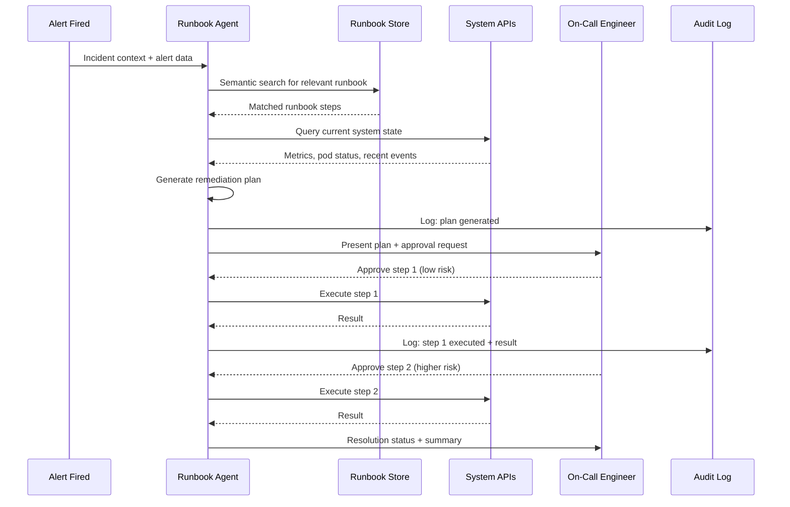

Runbook automation is one of the most misunderstood AIOps promises. The pitch is "AI that executes your runbooks automatically." The reality is more specific: AI agents that can execute the deterministic steps of a runbook — the ones where an experienced engineer would say "I'm not making a judgment call here, I'm just following the documented procedure."

The judgment calls still belong to humans. The execution of pre-approved, low-blast-radius steps can be automated. Understanding that distinction is the foundation of building runbook automation that actually helps rather than creates new incidents.



---

## The Automation Spectrum

Not every runbook step should be automated the same way. Think in three tiers:

**Fully automated (no human approval required)**: Safe only for reversible, low-blast-radius actions with high confidence. The AI executes without waiting for human sign-off.
- Clear application cache (can be re-populated)
- Restart a single crashed pod (when count < 3 restarts in 1 hour)
- Scale up a deployment to its predefined maximum (not beyond)
- Rotate a connection pool to clear stale connections

**AI-assisted with mandatory human approval**: AI drafts the plan and requests explicit approval before each step. For actions that are harder to reverse.
- Restart a stateful service (data in memory may be lost)
- Roll back a deployment to the previous version
- Modify rate limits or circuit breaker thresholds
- Drain traffic from a node

**AI-informed, human executes**: AI retrieves the runbook, summarizes current system state, and presents relevant past incidents. Engineer reads, decides, acts.
- Novel incident types with no matching runbook
- Changes to production databases
- Network-level configuration changes
- Anything affecting data durability

---

## Building a Runbook Agent

The minimal viable runbook agent needs four things: a way to find the relevant runbook, a way to query current system state, a way to generate a plan, and a safe execution loop with approval gates.

```python
import anthropic
import json
from dataclasses import dataclass
from typing import Callable

client = anthropic.Anthropic()

@dataclass
class IncidentContext:
    alert_name: str
    service: str
    severity: str
    metrics: dict
    recent_events: list[str]

def find_relevant_runbook(alert_name: str, service: str,
                           runbook_store) -> dict | None:
    """Semantic search for the best-matching runbook."""
    query = f"{alert_name} {service} remediation"
    results = runbook_store.search(query, limit=1, min_score=0.75)
    return results[0] if results else None

def generate_remediation_plan(context: IncidentContext,
                               runbook: dict) -> str:
    """Use LLM to generate a step-by-step plan from runbook + current state."""
    prompt = f"""
You are an SRE agent analyzing an incident and planning remediation.

Incident:
- Alert: {context.alert_name}
- Service: {context.service}
- Severity: {context.severity}

Current system state:
{json.dumps(context.metrics, indent=2)}

Recent events:
{chr(10).join(f"  - {e}" for e in context.recent_events)}

Relevant runbook:
{runbook['content']}

Generate a numbered remediation plan. For each step:
1. Describe the action clearly
2. Classify risk level: LOW (fully reversible, isolated) / MEDIUM (partially reversible) / HIGH (hard to reverse)
3. Specify the exact command or API call to execute
4. Define success criteria

Only include steps that are directly relevant to the current incident state.
Do not include steps already completed.
""".strip()

    response = client.messages.create(
        model="claude-sonnet-4-6",
        max_tokens=1000,
        messages=[{"role": "user", "content": prompt}]
    )
    return response.content[0].text

def execute_with_approval(steps: list[dict],
                           execute_fn: Callable,
                           notify_fn: Callable,
                           audit_fn: Callable,
                           auto_approve_risk: str = "LOW") -> dict:
    """
    Execute remediation steps with appropriate approval gates.
    auto_approve_risk: steps at or below this risk level execute automatically.
    """
    results = []
    for step in steps:
        risk = step.get("risk_level", "HIGH")

        if risk == "LOW" and auto_approve_risk == "LOW":
            # Execute automatically, but always audit
            audit_fn(f"AUTO-EXECUTING: {step['description']}")
            result = execute_fn(step["command"])
            audit_fn(f"RESULT: {result}")
        else:
            # Request explicit approval
            approved = notify_fn(
                f"APPROVAL NEEDED [{risk}]: {step['description']}\n"
                f"Command: {step['command']}\n"
                f"Success criteria: {step['success_criteria']}"
            )
            if not approved:
                audit_fn(f"REJECTED by engineer: {step['description']}")
                break
            audit_fn(f"APPROVED by engineer: {step['description']}")
            result = execute_fn(step["command"])
            audit_fn(f"RESULT: {result}")

        results.append({"step": step, "result": result})

        # Check success criteria before proceeding
        if not step.get("success_criteria_met", True):
            notify_fn(f"Step {step['number']} did not meet success criteria. Halting.")
            audit_fn("HALTED: success criteria not met")
            break

    return {"completed_steps": results}
```

---

## The Runbook Quality Problem

This is where most runbook automation projects fail. The AI agent is only as good as your runbooks. Common runbook failures that break automation:

**Outdated procedures**: "Restart the uwsgi service" — except you migrated to containers 18 months ago and uwsgi is no longer how this service runs. The runbook was never updated.

**Implicit operator knowledge**: "Check if the issue is in the primary or replica" — but the runbook doesn't tell you how to check. An experienced engineer knows the monitoring dashboard to look at; the AI doesn't.

**Missing error handling**: "Run the cache-clear script" — but what if the script fails? The runbook has no branching for failure cases. The agent doesn't know what to do.

**Scope drift**: Runbooks written for version 1.x of a system applied to version 3.x, where the architecture changed significantly.

Treating runbooks as code is the prerequisite for automation. This means:
- Version-controlled in Git alongside the service code
- Reviewed when the service architecture changes
- Tested: the remediation steps are validated in staging after each major change
- Complete: explicit success criteria, explicit failure handling, explicit escalation paths

```yaml
# Example: runbook as code — structured for AI consumption
runbook:
  name: "payment-service-high-latency"
  version: "2.3.1"
  service: "payment-service"
  triggers:
    - alert: "payment_service_p99_latency_high"
      threshold: "> 2000ms for 5 minutes"
  last_validated: "2026-09-15"
  steps:
    - id: 1
      description: "Check connection pool utilization"
      risk_level: LOW
      command: "kubectl exec -n payments deploy/payment-service -- curl localhost:9090/metrics | grep db_pool"
      success_criteria: "pool_used < pool_max * 0.9"
      on_failure: "escalate to step 3"
    - id: 2
      description: "Rotate connection pool if saturation detected"
      risk_level: LOW
      command: "kubectl rollout restart deploy/payment-service -n payments"
      prerequisites: "step 1 shows pool_used > pool_max * 0.9"
      success_criteria: "latency returns below 500ms within 3 minutes"
      on_failure: "escalate to on-call lead"
    - id: 3
      description: "Escalate: investigate upstream postgres query performance"
      risk_level: HIGH
      requires_human: true
      description_for_human: "Check pg_stat_activity for long-running queries. Consider pg_cancel_backend for blocking queries older than 5 minutes."
  escalation:
    after_steps_exhausted: "page on-call lead immediately"
```

---

## Safety Rails That Must Exist

Before deploying any runbook agent, these controls must be in place:

**Blast radius limits**: the agent must never automate steps that simultaneously affect more than N services. Set N conservatively (1-2 for production environments).

**Irreversibility check**: any step that cannot be easily undone requires human approval regardless of risk classification. Database truncations, deployment downgrades affecting persistence, and network topology changes are always human decisions.

**Full audit logging**: every decision, every execution, every approval or rejection is logged with timestamp, actor (AI or human), and outcome. This is non-negotiable — you need this for postmortem analysis when automation does something unexpected.

**Circuit breaker**: if an automated step fails, the agent halts and escalates rather than continuing down the runbook. Two consecutive failures always require human judgment.

**Time bounds**: automated steps have execution time limits. A restart that doesn't complete in 5 minutes is a signal to halt and escalate, not to keep waiting.

The goal is automating the boring, predictable parts of incident response — not removing human judgment from consequential decisions. Done right, runbook automation gives on-call engineers back 20-30 minutes per incident on routine remediation, and lets them focus that time on the parts that actually require judgment.
