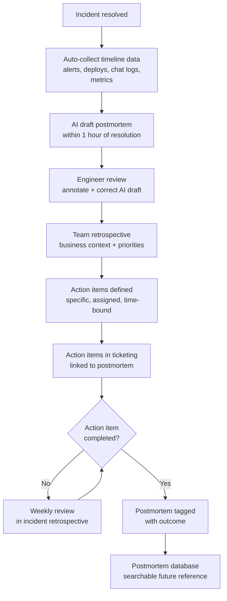

Postmortems fail in predictable ways. They're written a week after the incident when memory has faded and the adrenaline is gone. They identify symptoms rather than causes. They generate action items that never get prioritized or tracked. The same class of incident recurs six months later, and someone digs out the old postmortem and says "we said we'd fix this."

The value of a postmortem isn't the document — it's the learning and the organizational change it produces. AI assistance makes the document faster and more thorough. The learning and change still require humans.



---

## How AI Improves Postmortem Quality

### Timeline Reconstruction

This is where AI saves the most time per postmortem, and where the quality improvement over manual timelines is most consistent. Building an accurate incident timeline manually means correlating timestamps across PagerDuty alerts, Slack messages, deployment logs, and runbook notes — often across multiple systems with different timezone settings.

AI can ingest all of this and produce a chronological narrative in minutes. What takes an engineer 30-60 minutes of manual work becomes a 90-second automation.

```yaml
# System prompt for a postmortem timeline agent
system_prompt: |
  You are an SRE postmortem analyst. You reconstruct accurate incident timelines
  from raw operational data.

  Input you will receive:
  - Alert history (timestamp, name, severity, resolution time)
  - Deployment events (timestamp, service, version, deployer)
  - On-call chat log (timestamps, engineer names, messages)
  - Monitoring metric anomalies (timestamp, metric, deviation)
  - Runbook execution log (timestamp, step, result)

  Output format:
  A chronological timeline in this exact structure:
  [TIMESTAMP] [CATEGORY] Description
  Categories: ALERT / DEPLOY / ACTION / DISCOVERY / RESOLUTION / COMMS

  Rules:
  - Include only events that were causally relevant to the incident
  - Mark the moment of first user impact explicitly
  - Mark the moment of detection (first alert or human report)
  - Mark each remediation attempt and its outcome
  - Do not infer causation — report only what the data shows
  - If timestamps are ambiguous or missing, note the uncertainty
```

```python
import anthropic
import json

client = anthropic.Anthropic()

def reconstruct_timeline(incident_data: dict) -> str:
    """
    Reconstruct a chronological incident timeline from raw operational data.
    incident_data: dict with keys alerts, deployments, chat_log, metric_anomalies
    """
    with open("postmortem_system_prompt.yaml") as f:
        system_prompt = yaml.safe_load(f)["system_prompt"]

    user_message = f"""
Build the incident timeline from the following data:

Alert history:
{json.dumps(incident_data['alerts'], indent=2)}

Deployment events (24 hours before incident):
{json.dumps(incident_data['deployments'], indent=2)}

On-call chat log:
{chr(10).join(incident_data['chat_log'])}

Metric anomalies:
{json.dumps(incident_data['metric_anomalies'], indent=2)}
""".strip()

    response = client.messages.create(
        model="claude-sonnet-4-6",
        max_tokens=2000,
        system=system_prompt,
        messages=[{"role": "user", "content": user_message}]
    )
    return response.content[0].text
```

### Root Cause Hypothesis Generation

An LLM reading the timeline, error logs, and system topology will generate plausible root cause hypotheses. The key word is hypotheses — the AI generates candidates for engineers to evaluate, it doesn't determine the root cause.

This distinction matters in practice. If you treat AI root cause output as a conclusion rather than a hypothesis, you'll ship postmortems with wrong root causes — which produces wrong action items. The AI is a junior engineer who did the reading and has a first draft. The senior engineer validates it.

The AI is specifically good at generating the systemic and contributing factor hypotheses that humans tend to underweight. Humans involved in an incident naturally focus on the immediate technical cause ("the deploy introduced a regression"). The AI will also flag "the monitoring didn't detect this for 47 minutes" and "the incident response runbook hadn't been updated since 2024" — contributing factors that drive real process improvement but get dropped from postmortems written under time pressure.

### Action Item Generation

Vague action items are postmortem waste. "Improve monitoring" is not an action item. "Add p99 latency alert on payment-service with a 1.5 second threshold and 5 minute evaluation window" is an action item.

LLMs are good at generating specific action items when given specific failure modes. The quality of action item generation is a direct function of the specificity of the root cause analysis — which is why the engineer annotation step is non-negotiable before action items are generated.

```python
def generate_action_items(root_causes: list[str],
                           contributing_factors: list[str],
                           system_context: dict) -> str:
    prompt = f"""
Generate specific, actionable remediation items for a production incident.

Root causes identified:
{chr(10).join(f"  - {rc}" for rc in root_causes)}

Contributing factors:
{chr(10).join(f"  - {cf}" for cf in contributing_factors)}

System context:
- Affected service: {system_context['service']}
- Time to detect: {system_context['time_to_detect_minutes']} minutes
- Time to resolve: {system_context['time_to_resolve_minutes']} minutes
- User impact: {system_context['user_impact']}

For each action item, provide:
1. Description: specific and measurable (not "improve X" — "add X alert with Y threshold")
2. Type: PREVENTION / DETECTION / RESPONSE / PROCESS
3. Priority: HIGH (prevent recurrence) / MEDIUM (reduce impact) / LOW (nice-to-have)
4. Estimated effort: story points or hours
5. Owner team (not a person — teams rotate)

Generate action items only for the failures actually identified.
Do not generate generic "best practice" items not connected to this incident.
""".strip()

    response = client.messages.create(
        model="claude-sonnet-4-6",
        max_tokens=1500,
        messages=[{"role": "user", "content": prompt}]
    )
    return response.content[0].text
```

### Similar Incident Matching

"We've seen this before" is a powerful insight that's surprisingly hard to surface without tooling. Your organization has accumulated postmortems over years — but they live in Confluence, Notion, or a shared drive, and nobody searches them systematically during incident response.

Semantic search over your postmortem library surfaces similar past incidents within seconds. Engineers can see what the previous root cause was, what remediation was attempted, and whether the action items from that postmortem were completed. That last part is often the most uncomfortable finding: the action item that would have prevented this incident was already identified in a postmortem from 14 months ago.

---

## What AI Can't Do

**Determine blast radius in business terms.** The AI knows the technical impact — services affected, error rates, duration. It doesn't know that the 47-minute payment processing outage affected the quarterly revenue recognition, or that the impacted customers were specifically the enterprise tier. That business context requires humans.

**Prioritize action items against team capacity.** The AI generates good action items. Deciding which of the seven action items gets done before the next sprint, given that the team is already mid-way through a platform migration, requires humans who understand the team's current commitments.

**Navigate the organizational dynamics.** Some postmortem findings are politically sensitive. Some contributing factors involve decisions made by people who are still in the room. The AI will identify the systemic failures; the humans decide how to frame them constructively.

---

## Building the Postmortem Dataset Over Time

Well-structured postmortems with consistent format and metadata are a compounding asset. Tag each postmortem with:
- Failure category (infrastructure / code regression / dependency / process / human error)
- Affected systems (list of services)
- Root cause type (configuration / capacity / code / external dependency / etc.)
- Time to detect
- Time to resolve
- Whether action items were completed (updated after the fact)

This metadata makes pattern analysis possible. Over 50+ postmortems, you can answer questions like "what's our most common failure category?" and "which service appears in the most incidents?" Those answers drive prioritization of reliability investment — which is the long-term purpose of the postmortem practice.
