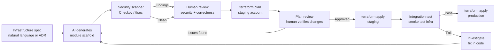

Infrastructure as Code is one of the best use cases for AI coding assistance in enterprise environments. Terraform, Pulumi, and Bicep are declarative and structured. Their patterns are well-represented in training data. The semantics are testable — `terraform plan` shows exactly what will change before you commit to it. And most IaC is boilerplate: VPCs, security groups, IAM roles, and database configurations that follow predictable patterns.

That combination — structured, learnable, testable, repetitive — is what AI coding tools are built for. But IaC also has failure modes that AI handles poorly: state management complexity, provider-specific edge cases, and multi-account dependency patterns. Knowing where the line is determines whether AI accelerates your IaC work or introduces subtle misconfigurations that don't surface until `terraform apply`.



---

## What AI Handles Well for IaC

### Standard Resource Definitions

For common resource types, AI generates solid first drafts. VPCs with public/private subnets, ECS services with task definitions, RDS instances with parameter groups, IAM roles with appropriate policies — these are patterns that appear thousands of times in public Terraform code. The AI has seen them, learned them, and can produce them.

The practical workflow: describe what you need in natural language (or reference an ADR), have AI generate the module, run a security scanner, review the output. You're reviewing and correcting rather than writing from scratch. For a team that writes a lot of IaC, this is a meaningful time saving.

```hcl
# AI-generated ECS service module scaffold — this is the typical output quality
# for a well-specified prompt. Review required, not a rubber stamp.

variable "service_name" {
  description = "Name of the ECS service"
  type        = string
}

variable "container_image" {
  description = "Docker image URI for the service container"
  type        = string
}

variable "desired_count" {
  description = "Number of task instances to run"
  type        = number
  default     = 2
}

variable "cpu" {
  description = "CPU units for the task (256 = 0.25 vCPU)"
  type        = number
  default     = 256
}

variable "memory" {
  description = "Memory for the task in MiB"
  type        = number
  default     = 512
}

resource "aws_ecs_task_definition" "this" {
  family                   = var.service_name
  network_mode             = "awsvpc"
  requires_compatibilities = ["FARGATE"]
  cpu                      = var.cpu
  memory                   = var.memory
  execution_role_arn       = aws_iam_role.execution.arn
  task_role_arn            = aws_iam_role.task.arn

  container_definitions = jsonencode([{
    name      = var.service_name
    image     = var.container_image
    essential = true
    portMappings = [{
      containerPort = 8080
      protocol      = "tcp"
    }]
    logConfiguration = {
      logDriver = "awslogs"
      options = {
        "awslogs-group"         = "/ecs/${var.service_name}"
        "awslogs-region"        = data.aws_region.current.name
        "awslogs-stream-prefix" = "ecs"
      }
    }
  }])
}
```

### Documenting Existing IaC

This might be the most underrated AI IaC application. You've inherited a 15,000-line Terraform codebase with no README, no module documentation, and comments like `# TODO: clean this up`. Understanding what a complex Terraform module actually does — the dependencies, the security posture, the assumptions baked into the resource configuration — takes hours of reading.

AI reads it in seconds and explains it. "What does this module do and what are the non-obvious things an engineer needs to know before modifying it?" produces useful documentation from a codebase that has none. This is particularly valuable during onboarding and when inheriting infrastructure from a different team.

### Security Review of IaC

AI reliably catches the common IaC security misconfigurations:

- S3 buckets with `acl = "public-read"` or `block_public_acls = false`
- Security groups with `cidr_blocks = ["0.0.0.0/0"]` on ingress
- IAM policies with `actions = ["*"]` or `resources = ["*"]`
- RDS instances with `publicly_accessible = true`
- KMS keys without rotation enabled
- CloudTrail with log file validation disabled

This is pattern matching, which AI does well. Combine AI review with a static scanner like Checkov or tfsec — the AI catches context-specific issues (this S3 bucket holds user PII and shouldn't have this ACL), the scanner catches the deterministic rules. Together they're more thorough than either alone.

```bash
# Run Checkov against AI-generated Terraform before human review
checkov -d ./modules/ecs-service \
  --framework terraform \
  --output json \
  --quiet \
  | jq '.results.failed_checks[] | {id: .check_id, resource: .resource, description: .check.name}'
```

---

## What AI Struggles With

### State Management

Terraform's state is a representation of actual infrastructure. When state gets out of sync with reality — through manual changes, failed applies, or resource drift — fixing it requires context that AI doesn't have: what the infrastructure actually looks like right now, what partial changes were made, what the desired end state is after fixing.

`terraform state mv`, `terraform import`, and manual state file editing require understanding the gap between desired and actual state. AI can explain the commands and their syntax. It can't determine whether using them is the right call without knowing the actual infrastructure state at that moment.

Don't ask AI to generate state manipulation commands. Review them with someone who understands the actual infrastructure.

### Provider-Specific Edge Cases

Terraform providers have behaviors that aren't in their documentation and aren't in AI training data. Examples from experience:

- The AWS ECS task definition `volumes` attribute interacts with `mount_points` in the container definition in ways that aren't obvious from reading either block independently.
- Some AWS resource parameters can be set on creation but can't be updated in-place — they require destroy/recreate. AI doesn't reliably know which ones these are for every resource type.
- Provider version pinning matters because provider behavior changes between minor versions in ways that affect resource behavior.

For resource types you haven't used before, treat AI output as a starting point and read the provider docs. The AI will be confident about things it's wrong about.

### Multi-Account Architectures

Cross-account IAM permission patterns, cross-account resource sharing, and the dependencies between accounts in a multi-account AWS Landing Zone have enough non-obvious moving parts that AI-generated Terraform frequently misses required trust relationships, incorrect principal ARN formats, or condition keys that are required for cross-account assume-role to work.

This is one area where AI assistance is best used for scaffolding and explanation, not for full code generation. Write the cross-account patterns yourself, then ask AI to review them.

---

## Claude Code Workflow for IaC

For teams using Claude Code for IaC work, a useful `CLAUDE.md` section:

```markdown
## Terraform Conventions

- Provider versions pinned in `versions.tf` — always check before generating new resources
- Module structure: one directory per logical resource group, inputs in `variables.tf`, outputs in `outputs.tf`
- Naming: `{environment}-{region}-{resource-type}-{name}` (e.g., `prod-us-east-1-ecs-payment-service`)
- All resources tagged with `Environment`, `Service`, `ManagedBy: terraform`, `Owner`
- No hardcoded account IDs — use `data.aws_caller_identity.current.account_id`
- All S3 buckets must have `block_public_acls = true` (enforced by SCP; will fail apply if not set)
- IAM policies: follow least privilege, never use `*` for actions on write operations
- Run `checkov` and `tfsec` before any PR — CI enforces this
```

With this context, Claude Code generates IaC that follows your team's actual conventions from the start, rather than generic Terraform that needs substantial revision.

---

## The Full IaC Workflow with AI

A workflow that consistently produces safe, correct IaC:

1. **Spec**: write a brief description of what the infrastructure needs to do. Include any constraints (multi-AZ, private subnets only, data classification, compliance requirements).
2. **AI generates**: module scaffold, security group rules, IAM policies. Accept the scaffold, not the final code.
3. **Security scan**: Checkov + tfsec. Fix any findings before human review.
4. **Human review**: focus on the non-obvious — state dependencies, cross-resource relationships, provider-specific behaviors you know from experience.
5. **Plan review**: `terraform plan -out=plan.tfplan` in staging. Read every line. Any unexpected change is a signal to investigate before applying.
6. **Apply to staging**: validate that the infrastructure actually behaves as expected, not just that the plan looks right.
7. **Apply to production**: after staging validation. Never skip staging for anything that touches production data paths.

The plan review step is where human judgment is indispensable. AI can generate the Terraform; it can't tell you whether a plan that shows 14 resource replacements in a production database cluster is acceptable or catastrophic for your application.
