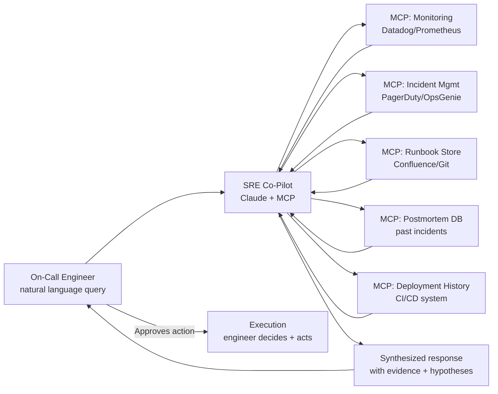

On-call engineers spend a disproportionate amount of time on information gathering. "What's the current error rate? What changed in the last two hours? Has this happened before? What does the runbook say?" These questions have deterministic answers available in your monitoring systems, deployment history, and runbook library. Getting those answers manually, under pressure, at 2am, takes time and mental bandwidth that should be spent on the actual problem.

An AI SRE co-pilot handles the information gathering and preliminary synthesis. The engineer focuses on decisions, judgment calls, and execution. That division of labor is what makes on-call sustainable and reduces mean time to resolution.



---

## Core Capabilities

### 1. System State Querying

Natural language interface to your monitoring stack. Instead of navigating dashboards during an incident, the engineer asks directly.

> "What's the current error rate and p99 latency on payment-service?"
> "Show me the last 6 deploys for order-service."
> "Which services have active alerts right now?"

The co-pilot calls your monitoring APIs, retrieves the current metrics, and presents them with context. This sounds simple. Under incident pressure, not having to navigate to the right dashboard, apply the right time filter, and read the right graph is a meaningful cognitive load reduction.

### 2. Runbook Retrieval

Semantic search over your runbook library. The engineer describes the problem, the co-pilot returns the most relevant runbooks.

> "We're seeing connection pool exhaustion on the payment service. What should I do?"

Returns the matching runbook ranked by relevance, with the specific relevant sections highlighted. For engineers who didn't write the service they're on-call for, this is the difference between having context and starting from zero.

### 3. Past Incident Search

> "Have we seen this before? Payment service high latency at the same time as Redis errors."

Semantic search over your postmortem database. Returns similar incidents with their timelines, root causes, and — critically — whether the action items from those incidents were completed. If the action item that would have prevented tonight's incident was identified in a postmortem 8 months ago and is still open, that's information the engineer needs for both immediate response and morning escalation.

### 4. Timeline Reconstruction

> "Give me a timeline of everything that happened in the last 3 hours on the payment service."

The co-pilot pulls from alerts, deployment events, and relevant metrics to reconstruct a chronological narrative. For incident handoffs, this becomes the handoff document — auto-generated, accurate, and produced in the time it used to take to find the right Slack channel.

### 5. Remediation Planning

> "Given the current state, what does the runbook say I should do next?"

The co-pilot retrieves the matching runbook, checks the current system state against the runbook's preconditions, and generates a step-by-step remediation plan. The engineer reviews, approves the steps they're comfortable with, and executes. The co-pilot doesn't execute autonomously unless explicitly configured for pre-approved low-risk steps.

---

## Building It with Claude Code and MCP

The architecture is an agent with MCP servers connecting to your operational systems. The LLM reasons over the information; the MCP tools fetch it.

```yaml
# .claude/mcp_servers.yaml — SRE co-pilot MCP configuration
mcpServers:
  datadog:
    command: node
    args: ["/opt/mcp-servers/datadog/index.js"]
    env:
      DD_API_KEY: "${DD_API_KEY}"
      DD_APP_KEY: "${DD_APP_KEY}"
      DD_SITE: "datadoghq.com"
    # Exposes tools: get_metrics, list_active_alerts,
    #   get_service_map, search_dashboards, get_logs

  pagerduty:
    command: node
    args: ["/opt/mcp-servers/pagerduty/index.js"]
    env:
      PD_API_KEY: "${PD_API_KEY}"
    # Exposes tools: get_incident, list_active_incidents,
    #   get_incident_timeline, get_on_call_schedule

  runbooks:
    command: python3
    args: ["/opt/mcp-servers/runbooks/server.py"]
    env:
      RUNBOOK_STORE: "confluence"
      CONFLUENCE_URL: "${CONFLUENCE_URL}"
      CONFLUENCE_TOKEN: "${CONFLUENCE_TOKEN}"
      EMBEDDING_MODEL: "text-embedding-3-small"
    # Exposes tools: search_runbooks, get_runbook,
    #   list_runbooks_for_service

  postmortems:
    command: python3
    args: ["/opt/mcp-servers/postmortems/server.py"]
    env:
      POSTMORTEM_DB_URL: "${POSTMORTEM_DB_URL}"
    # Exposes tools: search_postmortems, get_postmortem,
    #   find_similar_incidents

  deployments:
    command: node
    args: ["/opt/mcp-servers/ci-cd/index.js"]
    env:
      GITHUB_TOKEN: "${GITHUB_TOKEN}"
      ARTIFACTORY_URL: "${ARTIFACTORY_URL}"
    # Exposes tools: get_recent_deploys, get_deploy_details,
    #   get_service_version, list_open_prs
```

A minimal MCP server that connects to a Prometheus-compatible monitoring API:

```python
import json
import httpx
from mcp.server import Server, NotificationOptions
from mcp.server.models import InitializationOptions
import mcp.types as types

server = Server("prometheus-monitoring")

@server.list_tools()
async def list_tools() -> list[types.Tool]:
    return [
        types.Tool(
            name="get_metric_current",
            description="Get current value of a Prometheus metric for a service",
            inputSchema={
                "type": "object",
                "properties": {
                    "metric": {"type": "string",
                               "description": "PromQL metric name (e.g., 'http_request_duration_seconds')"},
                    "service": {"type": "string",
                                "description": "Service label value"},
                    "percentile": {"type": "string",
                                   "enum": ["p50", "p95", "p99"],
                                   "description": "Percentile for histogram metrics"}
                },
                "required": ["metric", "service"]
            }
        ),
        types.Tool(
            name="list_active_alerts",
            description="List all currently firing alerts, optionally filtered by service",
            inputSchema={
                "type": "object",
                "properties": {
                    "service": {"type": "string",
                                "description": "Filter alerts by service name (optional)"},
                    "severity": {"type": "string",
                                 "enum": ["critical", "warning", "info"]}
                }
            }
        )
    ]

@server.call_tool()
async def call_tool(name: str, arguments: dict) -> list[types.TextContent]:
    prometheus_url = "http://prometheus.internal:9090"

    if name == "get_metric_current":
        service = arguments["service"]
        metric = arguments["metric"]
        pct = arguments.get("percentile", "p99")
        quantile = {"p50": "0.5", "p95": "0.95", "p99": "0.99"}[pct]

        query = f'histogram_quantile({quantile}, rate({metric}_bucket{{service="{service}"}}[5m]))'
        async with httpx.AsyncClient() as client:
            resp = await client.get(
                f"{prometheus_url}/api/v1/query",
                params={"query": query}
            )
            data = resp.json()

        result = data["data"]["result"]
        if result:
            value = float(result[0]["value"][1])
            return [types.TextContent(
                type="text",
                text=json.dumps({
                    "metric": metric,
                    "service": service,
                    "percentile": pct,
                    "value": round(value * 1000, 2),
                    "unit": "milliseconds"
                })
            )]
        return [types.TextContent(type="text", text='{"error": "No data found"}')]

    raise ValueError(f"Unknown tool: {name}")
```

---

## Deployment Pattern

Run the co-pilot as a Slack bot that on-call engineers can query during incidents. This keeps the interface in the same place where incident response already happens.

The Slack bot model has practical advantages: the conversation is logged (useful for postmortem timeline reconstruction), other engineers on the incident can see the queries and responses (reduces duplicate questions), and the interface is already familiar to the team.

For teams that want more structure, an internal web UI with incident-specific sessions gives a more organized view — especially for complex incidents involving multiple services and long investigation threads.

---

## What Makes It Work vs Fail

**The knowledge quality problem.** The co-pilot's value is limited by the quality of the knowledge it can access. A runbook library with 40% outdated procedures will produce unreliable runbook suggestions. A postmortem database with 3 incidents in it has no meaningful search results. A monitoring system with poor metric naming produces unhelpful metric queries.

The co-pilot amplifies your operational knowledge. If that knowledge is sparse or stale, the amplification still happens — you just get louder wrong answers. Investing in runbook quality, postmortem discipline, and structured observability is a prerequisite for a useful co-pilot, not something you do after deploying one.

**The human-in-loop requirement is not optional.** The co-pilot never executes anything without explicit engineer approval. Every time you're tempted to automate an execution path "because this step is always obvious," run the scenario where the step is executed in the wrong context. The consequences of autonomous execution in the wrong state are almost always worse than the 30 seconds saved by not requiring approval.

**Feedback loops.** After each incident, engineers should take 2 minutes to rate the co-pilot's responses: did it find the right runbook? Was the incident search useful? Were there gaps in the timeline reconstruction? This feedback informs both prompt improvements and knowledge base gaps. The co-pilot gets meaningfully better over months if you treat those feedback signals as engineering work items.

The goal isn't an AI that replaces the on-call engineer. It's an on-call engineer who has a research assistant that never sleeps, knows where everything is, and has read every postmortem in your history. That's a real improvement in both incident response speed and on-call quality of life.
