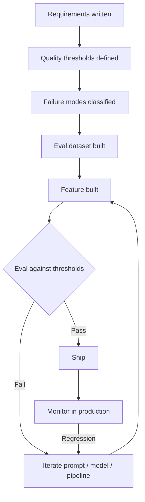

User stories fail AI features before the first line of code gets written. "As a user, I want the AI to summarize my emails" tells you nothing about what quality of summary is acceptable, what happens when the model gets it wrong, how to handle edge cases (empty inbox, non-English emails, 50,000-token threads), or what the fallback is when the AI service is unavailable. Your engineers will build something. It will not be what anyone imagined, because nobody wrote down what they imagined precisely enough.



Standard user stories work for deterministic software because the system either does the thing or it doesn't. AI features introduce a third state: the system does something that is partially right, arguable, or wrong in a way that's hard to detect automatically. Specs that don't account for this produce features that technically work but fail in production.

## What standard specs can't express

A user story gives you a feature request and acceptance criteria. For a traditional form submission, acceptance criteria is clear: "the form submits and the data appears in the database." For an AI summarization feature, what does acceptance criteria mean? "The summary is good"? Who decides? When?

The gap is measurement. Traditional software is either correct or incorrect according to a binary check. AI outputs exist on a quality spectrum, and where on that spectrum is acceptable is a product decision — not a technical one — that has to be made before development starts, not during code review.

## The five things an AI feature spec needs

**Quality thresholds with measurement methods**

Not "the summary should be good." The spec should read: "Summaries are rated acceptable by 80% or more of a 3-person blind evaluation panel reviewing 50 randomly sampled outputs." Or, if you're automating evaluation: "Faithfulness score above 0.85 on the RAGAS benchmark against our held-out test set of 200 labeled summary pairs."

These become your definition of done. They also become your regression threshold — if you change the model or prompt and the score drops below the threshold, the change doesn't ship.

**Failure mode definitions**

Every AI feature has failure modes. Write them down and classify them by severity.

For an email summarization feature:
- **P0 (blocking)**: AI includes content from emails the user did not ask to summarize (confidentiality breach). Auto-rollback trigger.
- **P1 (high)**: AI fabricates facts not present in the email (hallucination). Must be caught in eval before ship.
- **P2 (medium)**: AI misses a critical action item. Acceptable at low rate (< 10% of summaries); user correction path required.
- **P3 (low)**: Summary tone doesn't match email tone. Known limitation; documented.

Writing failure modes forces you to answer the question "what does wrong look like?" before you build anything. This shapes your test cases, your eval dataset, and your user-facing error handling.

**Acceptable input range**

What inputs is this feature designed for? What happens outside that range?

```markdown
## Input Scope

**Optimized for:**
- English-language emails
- Individual emails or threads up to 8,000 tokens
- Business correspondence (not transactional receipts or newsletters)

**Degraded behavior:**
- Non-English emails: system detects language and surfaces a warning to user; summary still attempted
- Emails 8,000–20,000 tokens: chunked summarization with section headers; quality may vary
- Emails > 20,000 tokens: rejected with user-facing error and suggestion to summarize sections manually

**Not supported:**
- Image-only emails (no text extraction)
- Encrypted email content
```

This section lives in the spec so the feature team knows what to build for and the design team knows what edge case UI states to design. If you don't define scope, scope becomes "everything," and "everything" is not buildable.

**Latency contract**

AI inference is slow and variable. Your P50 might be 800ms; your P95 might be 8 seconds. Users need to know what to expect and the UX needs to be designed for it.

```markdown
## Latency Contract

- P50 response: < 2 seconds (streaming starts)
- P95 response: < 10 seconds (streaming starts)
- Timeout threshold: 30 seconds (surface error with retry option)
- UX during wait: streaming with skeleton text; not a loading spinner
```

Latency contracts matter for two reasons: they tell the frontend team what loading state to design, and they set an expectation you'll be held to in production monitoring.

**Human override path**

For every AI output that affects the user's work, the spec must describe how users can override, correct, or reject it.

This is not optional. It directly affects whether users trust the feature. Users who cannot correct AI output stop using it. Users who can correct it continue engaging, and their corrections become your quality feedback signal.

## The spec template

```markdown
# AI Feature Spec: [Feature Name]

## Problem statement
[What user problem does this solve?]

## User story
As a [user type], I want [goal] so that [outcome].

## Quality thresholds
| Metric | Target | Measurement method |
|--------|--------|-------------------|
| [e.g., Faithfulness] | [e.g., > 0.85] | [e.g., RAGAS on 200-item test set] |
| [e.g., User acceptance rate] | [e.g., > 80%] | [e.g., Blind 3-rater panel, 50 samples] |

## Failure modes
| ID | Description | Severity | Handling |
|----|-------------|----------|----------|
| FM-1 | [Description] | P0/P1/P2/P3 | [Auto-rollback / eval gate / user correction / documented] |

## Input scope
- Optimized for: [...]
- Degraded behavior: [...]
- Not supported: [...]

## Latency contract
- P50: [...]
- P95: [...]
- Timeout: [...]
- UX during wait: [...]

## Human override path
[How users correct, reject, or override AI output]

## Eval dataset
- Source: [...]
- Size: [...]
- Labeling method: [...]
- Location: [...]

## Fallback behavior
[What happens when the AI service is unavailable?]

## Data requirements
[What data does the AI use? What's the freshness requirement?]
```

## The cost-benefit of tight specs

Tighter specs produce better AI features with fewer rework cycles. But writing them takes longer than writing a user story. The heuristic I use: budget 3x more time speccing an AI feature than an equivalent non-AI feature. The variance in AI output makes front-loaded clarity worth it.

The payoff shows up in two places. First, your eval dataset gets built alongside the spec instead of retroactively, which means you have real measurement before you've committed to a design direction. Second, when the feature comes back for revision (it will), you have a written record of what you intended versus what you got — and that gap is where the fix lives.

## Getting non-technical stakeholders to the right level

Product managers and designers need to engage with quality thresholds concretely. Showing example outputs is more effective than abstract percentages.

Before the spec is finalized, run a calibration session: show five "good" AI outputs and five "bad" AI outputs (pull from similar systems or manually write them), and get agreement on which pile each example belongs in. Then translate that shared intuition into the measurable threshold that goes in the spec.

If the team can't agree on what "bad" looks like in a calibration session, the spec isn't ready and the feature shouldn't be built yet. Disagreement at calibration time is cheap. Disagreement in production code review is expensive.

> The spec is not a constraint on the AI — the AI doesn't read it. The spec is a constraint on the team, so everyone's building toward the same definition of done.
{: .prompt-info }
