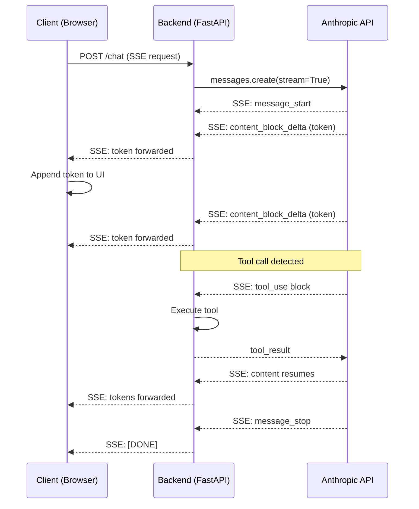

A 10-second wait for a full AI response feels long. The same 10 seconds with text appearing immediately feels fast. This isn't just perception — users abandon waiting interactions at much higher rates than streaming ones. Time to first token (TTFT) is the metric that determines whether your AI feature feels responsive, and streaming is how you optimize it.

Streaming is not a cosmetic improvement. Getting it right in production requires handling errors mid-stream, rendering partial markdown without flickering, managing tool calls during a live response, and proxying SSE correctly from your backend. Getting it wrong is visible to users in ways that errors inside a completed response aren't.



## The streaming stack

Every streaming implementation has three layers, and each layer must not buffer what it receives:

1. **Provider level**: Anthropic, OpenAI, and others stream server-sent events (SSE). Each token arrives as a separate event.
2. **Backend level**: your server receives the SSE stream and forwards it to the client. The single most common mistake is buffering the full response on the backend before sending it. This eliminates all streaming benefit — the user sees nothing until the complete response is done.
3. **Frontend level**: the client receives events and renders tokens as they arrive.

## Backend implementation

Here's a FastAPI streaming endpoint that proxies correctly. The key is `StreamingResponse` with an async generator — no buffering.

```python
from fastapi import FastAPI
from fastapi.responses import StreamingResponse
import anthropic
import json

app = FastAPI()
client = anthropic.Anthropic()

async def generate_stream(messages: list[dict]) -> AsyncGenerator[str, None]:
    with client.messages.stream(
        model="claude-opus-4-5",
        max_tokens=2048,
        system="You are a helpful assistant.",
        messages=messages,
    ) as stream:
        for text in stream.text_stream:
            # Format as SSE event
            yield f"data: {json.dumps({'type': 'token', 'text': text})}\n\n"
        
        # Signal completion
        yield f"data: {json.dumps({'type': 'done'})}\n\n"

@app.post("/chat/stream")
async def chat_stream(request: ChatRequest):
    return StreamingResponse(
        generate_stream(request.messages),
        media_type="text/event-stream",
        headers={
            "Cache-Control": "no-cache",
            "X-Accel-Buffering": "no",  # Critical for nginx — disables proxy buffering
        }
    )
```

The `X-Accel-Buffering: no` header is easy to miss and painful when you do. Nginx buffers proxy responses by default. Without this header, your streaming endpoint works perfectly locally and breaks completely behind nginx in production.

## Frontend rendering

The naive approach — re-render the full accumulated text on each token — causes visible flickering and layout shifts. Append instead.

```typescript
async function streamChat(messages: Message[]) {
  const response = await fetch("/chat/stream", {
    method: "POST",
    headers: { "Content-Type": "application/json" },
    body: JSON.stringify({ messages }),
  });

  const reader = response.body!.getReader();
  const decoder = new TextDecoder();
  let buffer = "";

  // Target element — append to this, don't replace it
  const outputEl = document.getElementById("output")!;

  while (true) {
    const { done, value } = await reader.read();
    if (done) break;

    buffer += decoder.decode(value, { stream: true });
    const lines = buffer.split("\n\n");
    buffer = lines.pop() ?? "";

    for (const line of lines) {
      if (!line.startsWith("data: ")) continue;
      const event = JSON.parse(line.slice(6));
      
      if (event.type === "token") {
        // Append text node — no DOM replacement, no re-render
        outputEl.appendChild(document.createTextNode(event.text));
      }
    }
  }
}
```

This keeps the DOM stable during streaming. The tradeoff: you're rendering plain text, not parsed markdown.

## Markdown rendering during streaming

Streaming and markdown don't naturally coexist. Partial markdown is invalid markdown — a half-rendered code fence or bold tag produces broken output. Three strategies:

**Render plain text during streaming, apply markdown at the end.** Simplest. Users see unformatted text appear word by word, then it's formatted when complete. Works for most use cases; the jump from plain to formatted is slightly jarring but acceptable.

**Render markdown at natural pause points.** Parse the accumulated buffer at sentence endings (`.`, `!`, `?`) or double newlines. Replace the container's innerHTML at these points. Reduces flickering versus per-token re-render while keeping real-time formatting.

**Use a streaming-aware markdown parser.** Libraries like `marked` with an incremental parser or `micromark` with a streaming mode can handle partial input. More complexity, better UX. Worth it if markdown formatting is prominent in your UI.

For most production cases, option one is sufficient and option two is worth implementing if you get user feedback that the formatting jump is distracting.

## Handling errors mid-stream

A completed response either succeeded or failed — you know which before the user sees anything. A streaming response can fail after the user has already read several sentences. Three distinct failure types:

**Connection drop mid-stream.** The network goes away during output. The SSE connection closes. Client-side: detect `EventSource` close, show a message indicating the response was cut off, offer retry. For retry to resume (rather than restart), you'd need checkpoint storage on the backend — rarely worth the complexity for most applications. Restart with a note: "Connection lost. Here's what was generated so far: [...]"

**Content filter mid-stream.** The model starts a response that the moderation layer catches partway through. Anthropic's API will emit a `stop_reason: "end_turn"` with a shorter-than-expected response, or surface an error event. The partial response is already visible. Show: "[Response stopped — content policy]" appended to the visible partial text. Do not silently truncate.

**Token limit hit.** `stop_reason: "max_tokens"`. The response is cut off at the limit you set. UI should append "[Response truncated — ask to continue]" and offer a "Continue" button that sends the partial conversation back with a "continue your response" user message.

## Tool use during streaming

Tool calls add a layer: the model pauses mid-response to invoke a tool, then resumes. The stream emits a `tool_use` content block followed by the model waiting for your `tool_result`. During tool execution, the visible response is frozen — the model isn't generating text.

Handle this with a status indicator:

```python
async def generate_stream_with_tools(messages: list[dict]) -> AsyncGenerator[str, None]:
    with client.messages.stream(
        model="claude-opus-4-5",
        max_tokens=2048,
        tools=TOOLS,
        messages=messages,
    ) as stream:
        for event in stream:
            if event.type == "content_block_start":
                if event.content_block.type == "tool_use":
                    # Notify client that tool execution is starting
                    yield f"data: {json.dumps({'type': 'tool_start', 'name': event.content_block.name})}\n\n"
            
            elif event.type == "content_block_delta":
                if event.delta.type == "text_delta":
                    yield f"data: {json.dumps({'type': 'token', 'text': event.delta.text})}\n\n"
        
        # Handle tool calls if present
        if stream.current_message_snapshot.stop_reason == "tool_use":
            tool_results = execute_tools(stream.current_message_snapshot)
            # Continue the conversation with tool results
            # ... (recursive call or loop)
            yield f"data: {json.dumps({'type': 'tool_done'})}\n\n"
```

On the frontend, `tool_start` events show "Looking up information..." or equivalent. `tool_done` removes the indicator and text resumes. Don't leave users staring at a frozen streaming indicator with no explanation.

## Performance notes

A few optimizations that matter at scale:

**Connection pooling**: keep HTTP connections to the AI provider alive. Cold TCP connections add 50–200ms to TTFT. Anthropic's Python SDK handles this automatically if you reuse the client instance across requests. Don't instantiate a new client per request.

**Response caching before streaming starts**: if identical prompts are common (e.g., FAQ chatbots), cache complete responses in Redis keyed on a hash of the system prompt + user message. Cache lookup adds ~5ms; inference adds 2–10 seconds. For cache hits, you can still stream the cached response token-by-token to maintain UX consistency.

**Keep-alive for SSE**: SSE connections time out in load balancers if they're idle too long. Send a comment event (`": keepalive\n\n"`) every 15 seconds to prevent premature close.

> If streaming tokens appear correctly in development but arrive in chunks (or all at once) in production, check nginx/ALB/CloudFront buffering settings first. Buffering configuration is the cause 80% of the time.
{: .prompt-warning }

Streaming is table stakes for production AI features today. Users have been trained by ChatGPT and Claude.ai to expect live text. A feature that returns a completed response after a loading spinner will feel broken by comparison, even if the content is identical.
