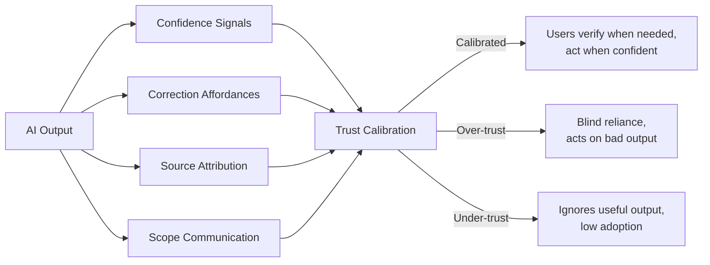

Every UX convention we've built over 30 years assumes a deterministic system. The button either submits or it doesn't. The sort either works or throws an error. The search either finds results or finds none. AI breaks this assumption at the foundation: the output is usually right, sometimes wrong, and the system is equally confident in both cases.

Designing UX for probabilistic systems requires patterns that don't exist in most design systems. The teams that figure this out produce AI features users trust. The teams that don't produce features users try once, conclude aren't reliable, and stop using.



The goal is calibrated trust: users who can accurately predict when the AI is reliable and when they need to verify. Over-trust produces errors at scale — users act on hallucinated information. Under-trust produces abandoned features — users don't engage with output they assume is wrong. Both are product failures.

## Pattern 1: Confidence signaling

Users need signals that the AI is less certain than usual. The implementation options are:

**Hedged language in the output.** The most practical approach: write system prompts that instruct the model to signal uncertainty linguistically. "If you are not certain about a factual claim, prefix it with 'I believe' or 'you may want to verify.'" This produces natural-language signals that work without any UI changes.

**Explicit confidence labels.** "High confidence / Low confidence" labels attached to responses or response sections. Requires a calibration layer — raw LLM logprobs are not reliable confidence indicators. A model's high logprob output can be wrong, and its low logprob output can be correct. Don't surface raw logprobs as user-facing confidence without calibration against a held-out dataset.

**Visual differentiation.** Uncertain outputs rendered with different styling (italic, lighter weight, bordered callout). Useful when you have a classifier that can tag uncertain responses. Risk: users learn to ignore consistently styled text.

The practical recommendation for most teams: start with hedged language in the system prompt. It costs nothing, is interpretable by any user, and doesn't require a calibration pipeline.

## Pattern 2: Correction affordances

Users who can correct AI output trust the feature more than users who can't. This is counterintuitive — you'd expect that acknowledging the AI can be wrong would reduce trust. In practice, it signals that the product team thought about errors and gave users a path to handle them. That signals competence, not weakness.

Correction affordances need three components:

**Inline editing.** When the AI generates content the user will use (draft text, categorized items, filled-form fields), make the output directly editable. Clicking into it to change it should feel like editing any text field.

**Reject / regenerate path.** A "try again" button that regenerates with the same input. Useful when the output is wrong in a way that's hard to fix inline (wrong tone, wrong structure, missed the point). Optionally allow the user to add guidance: "Try again but make it shorter."

**Feedback capture.** A minimal feedback mechanism — thumbs down with a reason selector (Wrong information / Incomplete / Wrong format / Other) — that sends a signal to your quality pipeline. This is your best source of production quality data. Design it to be low-friction; a modal with a text field gets ~2% completion rate, a thumbs down with pre-selected reasons gets ~15–20%.

```markdown
<!-- UI component sketch: AI response with correction affordances -->

[AI-generated response text here]

[Edit ✏️]  [Regenerate 🔄]  [👎 Not helpful]

<!-- On 👎 click: inline reason selector -->
Why wasn't this helpful?
● Wrong information
○ Incomplete
○ Wrong format
○ Other
[Submit]
```

## Pattern 3: Source attribution

For any AI feature grounded in specific data (documents, knowledge bases, databases), show the sources. This is the single highest-ROI investment in AI UX. It converts "I have to trust this" into "I can verify this."

The implementation: for RAG-grounded responses, extract the chunk sources from the retrieval step and surface them as citations in the response. Each factual claim or paragraph links to the document section it came from.

Users interact with citations in two ways: they click through to verify something they're uncertain about, and they use the citation to find the original document for deeper context. Either way, they're engaging with the output rather than passively accepting it.

Without source attribution, the AI feature is a black box. With it, it's a research assistant.

## Pattern 4: Progressive disclosure

AI output is often more than users need at once. Progressive disclosure reduces cognitive load: show a short summary first, let users expand to the full response or underlying sources.

This works particularly well for:
- Document summarization (show 3 key points, let users expand to full summary, expand again to source)
- AI-categorized items (show the category, let users see the reasoning, let users see the training examples that produced the category)
- AI recommendations (show the recommendation, let users see why, let users see alternatives)

The pattern also helps with length calibration. Some users want the short version; some want everything. Progressive disclosure serves both without forcing a choice upfront.

## Pattern 5: Explicit scope communication

Tell users what the AI knows and doesn't know, prominently, before they're surprised by a gap.

```markdown
ℹ️ This assistant has access to:
- Your company knowledge base (last updated July 28, 2026)
- Your team's Confluence pages
- Public documentation for your tech stack

It does not have access to:
- Real-time data or the internet
- Documents shared only in Slack
- Your email or calendar
```

This text should live somewhere users see it before they start a conversation, not buried in a help page. The sidebar or the empty-state of the chat interface are good locations.

The scope statement prevents the most common support ticket for AI features: "I asked about X and it gave me wrong information" — where X is outside the AI's knowledge and the user didn't know that. Scope communication shifts responsibility correctly: if the user knows the AI doesn't have real-time data and asks anyway, that's an informed choice.

## Pattern 6: Graceful degradation

When the AI fails — timeout, error, content filter, service unavailable — the UX must handle it without exposing raw error text or leaving users stuck.

Every AI feature needs a designed failure state with:
- A human-readable explanation of what happened ("The AI isn't available right now")
- A non-AI fallback path (search the knowledge base manually, contact support, try again later)
- An indication of whether their input was saved so they don't have to re-enter

The failure state UX should be designed in your design tool, not discovered when the service goes down.

## Anti-patterns

**Anthropomorphizing past usefulness.** Saying "Claude is thinking" is fine — it's a metaphor users understand. Saying "Claude feels confident about this" or "Claude wants to help you" sets expectations that the AI has emotional states or intentions. These collapse when the AI does something the metaphor wouldn't predict.

**Hiding AI generation.** The EU AI Act and emerging regulations in multiple jurisdictions require disclosure when AI generates content users interact with. Aside from regulatory compliance, hiding it is a trust violation. When users discover they weren't told — and they often do — they distrust everything the feature produces.

**Infinite loading spinners.** For multi-second AI operations, a spinner with no progress indication signals broken software. Use streaming for text generation. For longer multi-step operations, use progress indicators with step labels ("Searching documents... Generating summary...").

## The undo requirement

Any AI action that changes user data needs an undo path. Auto-drafted email? Undo sends it back to draft. Auto-categorized document? Undo returns the original category. Auto-filled form? Undo clears the AI-filled fields to their prior state.

This is not a nice-to-have. Users adopt AI features that change their data only when they believe they can correct mistakes. Without undo, they either don't use the feature or they verify every AI action before accepting it — which eliminates the efficiency benefit.

> The test for whether your AI UX handles uncertainty well: show it to a skeptical user and watch how they interact with the output. If they accept everything without looking at it, your trust signals are insufficient. If they don't use the output at all, your trust signals are too aggressive.
{: .prompt-tip }

Getting AI UX right requires designing explicitly for the failure case, not just the success case. Traditional UX design can treat errors as edge cases. In AI features, errors are part of the normal operating range — and the UX has to treat them accordingly from day one.
