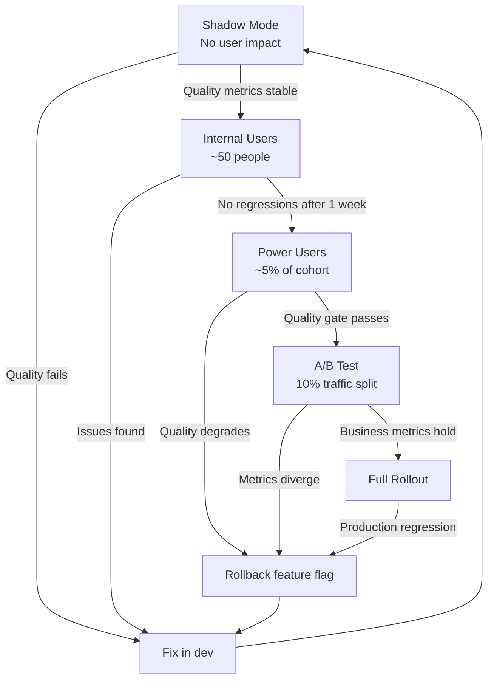

Standard canary deployments catch broken software. They do not catch bad AI outputs. A service that returns 200 OK with a hallucinated answer looks identical to a service returning 200 OK with a correct one. Your error rate dashboard will be flat. Your users will be getting wrong information.

This is the core problem with applying traditional rollout strategies to AI features: the failure mode isn't an exception or a 5xx response — it's a semantically wrong output that metrics can't see. You need additional tooling to detect quality degradation, and you need rollout strategies that give you time to detect it before most users are affected.



## Shadow mode: the safest first stage

Shadow mode runs the AI feature in parallel with your existing system. AI generates output for real user requests, but that output is never shown to users. Instead, it's captured to a log or database for quality evaluation.

This gives you weeks of real-world quality data before any user sees an AI output. The inputs are real (production traffic), the outputs are real (the model responding to actual user requests), and the stakes are zero (nobody sees anything).

Shadow mode is particularly valuable for catching edge cases you missed in dev. The diversity of real production inputs reveals failure modes that synthetic test data doesn't cover. The email summarization feature that scored 87% on your test set? Shadow mode will find the one email format that causes it to output complete nonsense — before it reaches a user.

Implementation: route all qualifying requests through a shadow inference path. Log (prompt, output, metadata) tuples. Run your eval pipeline against the log — either automated metrics or a human review queue. Set a quality gate threshold. Don't proceed to the next stage until the gate is clear.

The cost is double inference during the shadow period. For low-traffic features this is negligible. For high-traffic features, shadow on a sample (10–20% of traffic) rather than everything.

## Feature flags with cohort targeting

Once shadow mode clears, gate the live feature behind a feature flag that targets specific user cohorts.

Rollout order by cohort:

1. **Internal users**: your own team and company employees. They're tolerant of rough edges, will report issues directly, and won't churn or post negative reviews if something goes wrong.
2. **Beta opt-in users**: users who explicitly signed up for early access. They have self-selected for higher tolerance and are often power users who give useful feedback.
3. **Low-risk segments**: users where a wrong AI output has lower stakes. For a documentation assistant, this might be personal projects rather than enterprise accounts.
4. **General rollout**: after quality metrics have been stable across previous cohorts.

The flag configuration should control more than just on/off:

```yaml
# Feature flag config for AI summarization
ai_summarization:
  enabled: true
  
  # Cohort targeting
  cohorts:
    internal_users: 100%
    beta_users: 100%
    enterprise_tier: 25%
    standard_tier: 0%
  
  # Quality gates — auto-disable if thresholds crossed
  quality_gates:
    hallucination_rate_max: 0.05        # Disable if > 5% of sampled outputs hallucinate
    user_correction_rate_max: 0.30      # Disable if > 30% of outputs are corrected
    thumbs_down_rate_max: 0.15          # Disable if > 15% of ratings are negative
  
  # Model and prompt version pinned for this rollout
  model: "claude-opus-4-5"
  prompt_version: "v2.3.1"
  
  # Fallback behavior when feature is disabled for a user
  fallback: "show_manual_summary_option"
```

The quality gate configuration is the critical addition over standard feature flags. If a quality metric crosses the threshold, the flag flips off automatically — no human intervention required at 3am.

## A/B testing with quality measurement

Traffic-split A/B testing for AI features differs from standard A/B testing in one important way: you're measuring both user engagement metrics and output quality metrics. These don't always move together.

A feature that users engage with more is not necessarily better if the quality is lower. A summarization feature that generates shorter, punchier summaries might see higher engagement (users click through more often) but actually miss more key information. You want both.

Quality metrics to run in parallel with your standard A/B metrics:
- **Automated eval on sampled outputs**: run your LLM-as-judge pipeline on 5% of AI outputs from both the control and treatment groups. Compare faithfulness, completeness, and hallucination rate.
- **User correction rate**: what percentage of AI outputs in each group are edited before use? Higher correction rate = AI quality below expectation.
- **Thumbs down rate**: direct negative signal from users.
- **Task completion rate**: for task-oriented AI features, do users successfully complete the task at a higher or lower rate in the AI group?

Don't ship based on engagement metrics alone. A feature that drives engagement while degrading quality is a liability.

## Rolling back AI features

AI feature rollback is more complex than code rollback because there are multiple independent axes:

1. **The feature flag**: on/off per cohort. Immediate effect, no deployment.
2. **The prompt version**: a bad prompt change can degrade quality. Roll back in your prompt registry.
3. **The model version**: if you upgraded from model A to model B and quality dropped, rolling back is a configuration change, not a code deployment.
4. **The retrieval configuration**: for RAG features, changes to the retrieval strategy or knowledge base content can affect quality independently of the prompt.

These must be independently rollbackable. If your prompt version and model version are hardcoded in the application code, a quality regression requires a code deployment to fix. If they're in configuration managed by your feature flag system or a prompt registry, you can roll them back in minutes without touching code.

Keep the last three known-good versions of your prompt explicitly archived. When a quality regression hits production, the first question is "what changed?" — prompt, model, retrieval, or code. Being able to answer that immediately narrows the diagnosis significantly.

## Prompt changes are deployments

The most commonly under-controlled change in AI features is the system prompt. Teams iterate on prompts frequently, often outside of any change management process, because it feels like changing a config string rather than deploying code.

It isn't. A system prompt change affects every response the feature produces. It needs the same canary treatment as a code change:

```
Prompt change → shadow mode eval → internal users → A/B test → full rollout
```

This requires a prompt registry — a versioned store of system prompts with an audit trail of who changed what when. If you change a prompt by editing a string in a database with no version history, you cannot roll back, cannot correlate quality changes to prompt changes, and cannot run a proper A/B test.

Minimum viable prompt registry: a Git repository with prompts as versioned files. Each prompt change is a commit. Prompt version is referenced by the feature flag config. Rollback is `git revert`.

## Quality monitoring in production

After full rollout, the monitoring requirements are different from pre-rollout. You need continuous quality signals, not one-time gates:

- **Sampling-based eval**: run your LLM-as-judge pipeline on 1–5% of production outputs continuously. Alert if quality score drops by more than 0.05 over a rolling 24-hour window.
- **User signal dashboards**: thumbs down rate, correction rate, regenerate rate tracked as time series with anomaly detection.
- **Model provider incident monitoring**: subscribe to your AI provider's status page and wire status incidents to your alerting system. Model quality can degrade on the provider side — you need to know when that's the likely explanation before spending hours debugging your own code.

> A model provider releasing a new model version doesn't mean your feature quality is stable. Providers silently update models, change safety filters, and adjust behavior between named versions. Pin to a specific model version in production and test before upgrading.
{: .prompt-warning }

Safe AI rollouts require treating non-deterministic output quality as a first-class operational concern — not an afterthought that you monitor with the same dashboards you'd use for a CRUD API.
