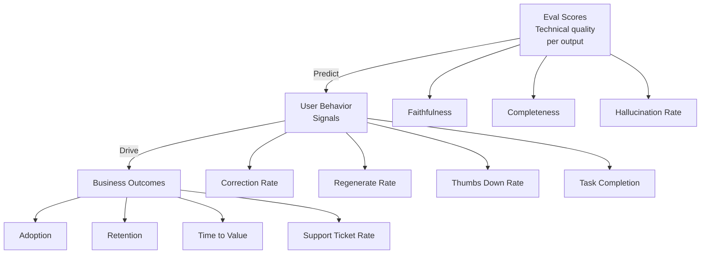

You can ship an AI feature with an 87% faithfulness score on your eval benchmark and watch adoption flatline. You can also ship a feature that barely clears your eval thresholds and see users rely on it heavily. Eval scores and business metrics measure different things, and confusing them is one of the more common failure modes in AI product development.

Eval scores measure whether individual AI outputs are technically correct by your definition of correct. Business metrics measure whether the feature actually moves the needle for users. Both matter. A feature with poor eval scores will eventually fail even if initial adoption is high — users will hit enough bad outputs that they stop trusting it. A feature with excellent eval scores but poor product metrics failed in the design or positioning, not the model.



## The eval score trap

A high eval score can coexist with a failing product. Here's how:

Your eval dataset is a sample of inputs you thought to include. Production traffic is the full distribution of inputs users actually send. These don't match — your eval covers the cases you anticipated; production covers the cases you didn't. An 87% eval score on a 200-item dataset means you're handling 87% of those 200 cases well. It says little about the long tail of inputs your users will actually send.

Additionally, eval measures output quality per interaction. It doesn't measure whether the feature fits into the user's actual workflow, whether the UI makes the output easy to act on, or whether users trust the feature enough to use it at all. A feature can produce technically excellent outputs that users ignore.

Track eval scores as a floor, not a ceiling — they tell you the feature isn't broken, not that it's working.

## Business metrics for AI features

**Adoption rate**

Percentage of eligible users who tried the feature at least once within 30 days of being exposed to it. Low adoption tells you the feature isn't visible, the value proposition isn't clear, or users encountered the feature and immediately decided it wasn't for them.

Segment by how users first encountered the feature: proactive discovery (surfaced by the product), intentional search, tooltip/onboarding. If adoption is high from onboarding and low from organic discovery, you have a discoverability problem.

**Retention rate**

Percentage of users who used the feature more than once in the first 30 days. Single-use sessions are nearly always a sign that the AI output disappointed — the user tried it, got an output that didn't meet expectations, and didn't come back.

The gap between adoption and retention is your "disappointing first experience" rate. If adoption is 40% and retention is 8%, three-quarters of first-time users didn't return. That's a product problem, and it's usually quality or UX — not model capability.

**Task completion rate**

For AI features that help users accomplish a defined task (e.g., "draft a response to this email"), what percentage of sessions result in the user completing the task — with or without the AI? Compare the AI path vs the non-AI path.

If the AI path has a lower task completion rate than the non-AI path, the AI feature is making the task harder, not easier. This happens when: the AI output is wrong often enough that users have to redo work, the UI for correcting AI output is more effort than doing it from scratch, or the latency of AI generation exceeds users' tolerance.

**User correction rate**

How often do users edit AI output before using it? This is a nuanced metric: some correction is healthy (the AI handles 80% of the work, users polish the final 20%), but high correction rates indicate AI quality below user expectation.

A correction rate above 50% usually means users are using the AI as a starting point for work they largely do themselves. That may still deliver value, but it's not what "AI automates this task" looks like. A correction rate near zero may indicate users aren't engaging with the output carefully — which is a trust over-calibration problem, not a quality success.

**Time to value**

How long does it take users to accomplish the task with AI compared to without? If the AI path takes longer, the feature has failed on its primary promise. Measure wall-clock time from task initiation to completion, including the time users spend reviewing and correcting AI output.

AI features that are "faster on the first attempt but slower overall" are common. The model generates output quickly, but users spend time reviewing, catching errors, and correcting — totaling more elapsed time than doing the task manually. These features have the right capability but the wrong quality level.

**Support ticket rate**

AI features that produce confusing or wrong outputs generate support tickets. Track tickets by feature area and watch for increases after model changes, prompt changes, or distribution shifts in your input data.

A spike in support tickets 3–7 days after a model or prompt change is a strong signal that quality regressed. This lag (versus immediate detection) is why you need proactive quality monitoring — support tickets are a lagging indicator.

## Building the measurement dashboard

```yaml
# AI product metrics dashboard schema

feature_id: "document-summarization"
measurement_window: "rolling_30_days"

metrics:
  adoption:
    definition: "pct_eligible_users_with_at_least_one_session"
    collection: "event: feature_session_started"
    alert_threshold:
      below: 0.15  # Alert if adoption drops below 15%

  retention:
    definition: "pct_adopters_with_2plus_sessions_in_30_days"
    collection: "event: feature_session_started, count >= 2"
    alert_threshold:
      below: 0.40  # Alert if retention drops below 40%

  task_completion:
    definition: "pct_sessions_ending_with_output_used_or_submitted"
    collection: "event: output_accepted OR form_submitted WITH ai_assisted=true"
    alert_threshold:
      below: 0.60  # Alert if completion drops below 60%

  correction_rate:
    definition: "pct_ai_outputs_that_were_edited_before_use"
    collection: "event: output_edited / event: output_accepted"
    alert_threshold:
      above: 0.50  # Alert if more than half of outputs are edited

  thumbs_down_rate:
    definition: "pct_rated_sessions_with_negative_rating"
    collection: "event: feedback_submitted WHERE rating = negative"
    alert_threshold:
      above: 0.12  # Alert if thumbs down exceeds 12%

  support_ticket_rate:
    definition: "tickets_per_1000_sessions_tagged_with_feature_id"
    collection: "support system tag: document-summarization"
    alert_threshold:
      above: 5.0  # Alert if more than 5 tickets per 1000 sessions
```

## Segmentation: averages hide failures

An 85% task completion rate across all users may hide a 50% task completion rate for a specific user segment — users with non-English content, or enterprise accounts with longer documents, or users on mobile devices where the AI output is rendered in a compressed format that's hard to read and edit.

Always break down metrics by:
- **User tier** (free vs paid vs enterprise)
- **Use case type** (type of document, type of question, type of task)
- **Input characteristics** (length, language, domain)
- **Entry point** (where the user initiated the AI feature from)

AI quality is not uniform across the input space. Aggregate metrics flatten the distribution and hide the failure segments. The segment you're failing is usually a specific, identifiable group — and it's usually not evenly distributed across your user base.

## Connecting evals to business metrics

If you have enough production data (typically months of traffic with both eval scores and business metrics tracked), you can build a predictive model: given an eval score improvement from X to Y, what business metric change do you expect?

This is worth investing in once you have the data. It lets you prioritize eval improvements by business impact rather than treating all eval improvements as equally valuable. A 5-point improvement in faithfulness that predicts a 12% improvement in retention is worth more than a 5-point improvement that predicts a 2% change in adoption.

> If you can only track one business metric for an AI feature, track retention. Adoption can be manufactured with enough marketing. Retention is the honest signal — users come back because the feature actually delivered value.
{: .prompt-tip }

Eval scores are how you know your model isn't broken. Business metrics are how you know your product is working. Build measurement infrastructure for both before you ship, not after the first quarterly review where someone asks why adoption is below target.
