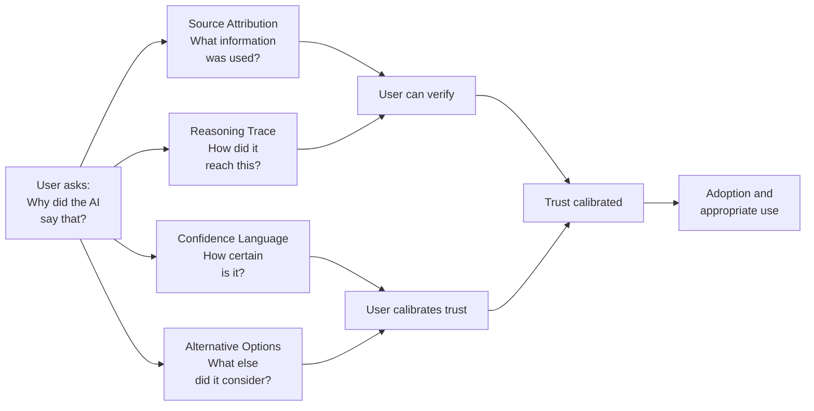

Users don't ask "what were the attention weights for this token?" They ask "why did it say that?" and "where did it get that from?" and "how confident is it?" These are not the same questions ML researchers mean by explainability — and the answers are not SHAP values or gradient attributions.

Product explainability and ML explainability are different problems. ML explainability is about understanding how a model works internally. Product explainability is about giving users enough context to decide whether to trust and act on the output. Only the second one produces adoption.



## What users actually need

When a user sees an AI output and asks "why?" they're almost always asking one of three questions:

1. **What information did you use?** They want to verify the AI didn't make something up or use outdated data.
2. **How did you reach this conclusion?** For decisions and recommendations, they want to understand the reasoning so they can evaluate whether it applies to their situation.
3. **Should I trust this?** They want a calibrated signal about when the AI is confident vs uncertain.

None of these require mechanistic model explanations. They require information architecture: designing what information gets surfaced alongside the AI output, and in what form.

## Pattern 1: Source attribution

For any AI feature grounded in specific data — documents, knowledge bases, databases, conversation history — source attribution is the highest-ROI explainability investment. Show the source. Let users click through to verify.

This changes the user's relationship with the output from "I have to take this on faith" to "I can check this." That shift in agency is why source attribution drives trust more than any other single feature.

Implementation for a RAG-based assistant:

```python
def format_response_with_citations(answer: str, source_chunks: list[dict]) -> dict:
    """
    Attach source citations to an AI response.
    source_chunks: list of {"text": str, "doc_id": str, "doc_title": str, "page": int}
    """
    # Ask the model to include inline citation markers
    system = """
    Answer questions based on the provided context.
    When citing specific information, include inline markers like [1], [2] etc.
    Each marker should correspond to the source chunk it references.
    """
    
    # Generate response with citation markers
    # ... (inference call) ...
    
    return {
        "answer": answer,
        "citations": [
            {
                "id": i + 1,
                "doc_title": chunk["doc_title"],
                "doc_id": chunk["doc_id"],
                "excerpt": chunk["text"][:300],  # First 300 chars of the relevant chunk
                "page": chunk.get("page"),
                "link": f"/docs/{chunk['doc_id']}#page={chunk.get('page', 1)}"
            }
            for i, chunk in enumerate(source_chunks)
        ]
    }
```

On the frontend, render inline citation markers as superscript links. Clicking opens a sidebar or tooltip with the source excerpt and a link to the full document. This pattern is well-understood by users — it's how academic papers and Wikipedia work.

## Pattern 2: Reasoning traces

For AI features that make recommendations or multi-step decisions, show the steps. Not the model's internal chain-of-thought (that's usually too verbose and technical), but a curated summary of the reasoning path.

For a project scoping assistant:

> **Recommendation**: Assign this to the Platform team with a 3-sprint estimate.
>
> **Reasoning**:
> - Reviewed 4 similar past tickets (IDs: PROJ-2341, PROJ-2198, PROJ-1876, PROJ-2401)
> - Similar scope ranged from 2–4 sprints; median was 3 sprints
> - This ticket requires changes to the authentication module (flagged in ticket), which the Platform team owns
> - No external dependencies identified that would block progress

The reasoning trace lets users evaluate whether the AI's reasoning applies to their situation. "It looked at past tickets" is information a user can agree or disagree with — they might know a reason why those past tickets aren't comparable.

Generating reasoning traces in your system prompt:

```python
system_prompt = """
When making recommendations, structure your response as:

**Recommendation**: [Your recommendation]

**Reasoning**:
- [What evidence or information you considered]
- [What made you choose this option over others]
- [Any uncertainty or caveats]

Keep reasoning concise — 3-5 bullet points maximum.
"""
```

## Pattern 3: Confidence language

Instruct the model to hedge appropriately. This is cheaper to implement than confidence classifiers and more interpretable to users.

```python
system_prompt = """
When you are certain about factual information you can directly verify from provided context: state it directly.

When you are less certain — reasoning from incomplete information, making an inference, or the information isn't in your provided context: use hedging language:
- "Based on the available information..."
- "It appears that..." or "This suggests..."
- "I'm not certain, but..."
- "You may want to verify this, but..."

Never present uncertain information as definitive fact.
"""
```

The honest limitation: LLMs are poorly calibrated. A model that hedges isn't necessarily less wrong than one that doesn't — the uncertainty language is a style trained into the model, not a reliable signal of actual uncertainty. Don't present hedged language as a ground truth confidence score. Present it as a signal worth paying attention to, not a precise measurement.

## Pattern 4: Alternative options

For categorization and classification tasks, show the runner-up options alongside the primary output.

For a document classifier:

```
Primary classification: **Contract Agreement** (confidence: high)

Other possibilities considered:
- NDA (similar structure, but missing mutual non-disclosure clause)
- Letter of Intent (referenced term sheet, but this document makes binding commitments)
```

For a recommendation engine:

```
Recommended: **Plan A**

Alternatives:
- Plan B: Similar outcome, 2 weeks longer, lower implementation risk
- Plan C: Faster, but requires team capacity not currently available
```

Alternatives serve two purposes: they help users evaluate whether the primary recommendation is right for their context, and they make the AI's decision-making visible enough that users can identify when the AI misunderstood their situation (e.g., "it recommends Plan A, but it didn't know about constraint X — Plan B is actually better for us").

## Pattern 5: Input sensitivity

Simple counterfactual explanations show users what drives the AI's output: "If you change X, the recommendation changes to Y."

This is most useful for AI features where the user has control over the inputs — configuration choices, parameter settings, scope of documents included. Showing how the output changes with input changes gives users a mental model of what the AI responds to.

Implementation: run the inference with variations of the key input parameters and present the deltas to the user. This adds latency (multiple inference calls), so it's best implemented as an on-demand "What if?" rather than computed automatically for every response.

## The regulatory layer

EU AI Act Article 13 (transparency obligations) applies to deployers of "limited-risk" AI systems. It requires:
- Informing users that they are interacting with an AI system
- Ensuring users have the information necessary to make informed decisions

Article 14 (human oversight) for "high-risk" AI systems requires mechanisms for humans to understand, oversee, and intervene in AI outputs.

Source attribution and reasoning traces are not just good UX — they're the implementation layer for these regulatory requirements. A feature that shows users where AI information came from and how conclusions were reached is more defensible than one that produces opaque outputs.

> Don't overengineer explanations. Showing users five layers of technical detail to explain a simple recommendation creates confusion, not understanding. Match explanation depth to the stakes of the decision.
{: .prompt-tip }

## What not to do

**Don't expose model internals.** Token probabilities, attention maps, and embedding distances are not useful to users. They're useful for debugging models; they're noise for users deciding whether to trust an output.

**Don't overclaim explanation completeness.** Source attribution shows what documents were retrieved; it doesn't prove the model actually used them correctly. Be accurate about what your explanations do and don't show.

**Don't make explanations an afterthought.** Bolting a "How was this generated?" accordion onto an existing feature often produces explanations that are technically accurate but practically useless — because the information needed for useful explanations wasn't collected during inference. Design explanations into the feature from the start, during the spec phase.

The goal of product explainability is a user who makes better decisions because of the AI feature — not a user who understands how the model works. Keep that goal in scope when you're deciding what to explain and how.
