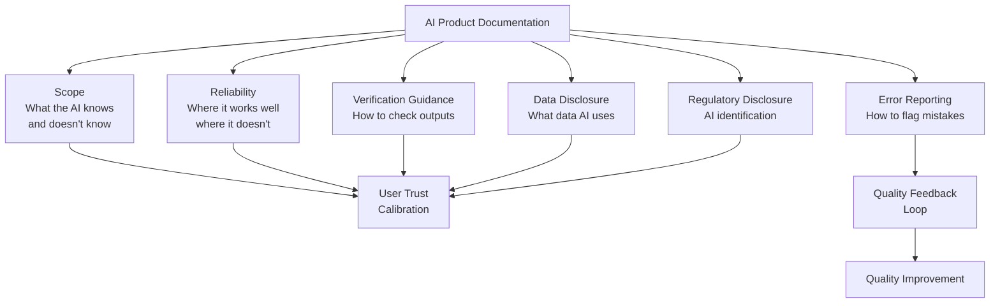

Standard software documentation describes what the software does. You describe inputs, outputs, and behavior — deterministically. AI product documentation can't make the same promises. You're documenting a system that does the right thing most of the time, the wrong thing some of the time, and the same input won't always produce the same output.

Teams that handle this poorly write docs that either overclaim ("Our AI accurately summarizes any document") or are so vague about limitations that users get no useful guidance ("Our AI may occasionally make mistakes"). Both fail users. The overclaiming version sets expectations the system can't meet. The vague version gives users no basis for deciding when to trust the output and when to verify.



## Why AI docs fail

**Overclaiming.** Marketing pressure pushes documentation toward positive framing. "Our AI accurately summarizes any document" sounds better than "Our AI produces acceptable summaries for 85% of standard business documents; quality degrades on technical papers, legal contracts, and non-English content." But the accurate version helps users. The overclaiming version gets you support tickets when users try to use the feature outside its reliable range and get bad outputs they had no reason to doubt.

**Underclaiming without guidance.** "Our AI may occasionally make mistakes" is technically accurate and practically useless. Users don't know what "occasionally" means. They don't know which tasks are reliable and which aren't. They don't know how to check whether a specific output is correct. Vague disclaimers don't help users make decisions — they just protect the company from specific liability claims while leaving users to figure out trust calibration on their own.

**Missing scope documentation.** Users don't know what the AI has access to unless you tell them. If your AI assistant uses a knowledge base last updated three months ago, users need to know that before they ask about events from last week. Missing scope documentation produces support tickets: "I asked the AI about [recent thing] and it gave me wrong information."

**No verification guidance.** Even good documentation often describes features without telling users how to check the outputs. "Use the AI summary for faster review" — but faster review of what quality of summary? How should the user verify the summary captured the key points? What should they do if something looks wrong?

## The documentation components

**Scope statement**

Explicit boundaries on what the AI knows and can access. Write this as a concrete list, not abstract prose.

```markdown
## What This Assistant Knows

**Has access to:**
- Your company knowledge base (articles, policies, SOPs)
- Knowledge base last updated: August 1, 2026
- Product documentation for all current product versions

**Does not have access to:**
- Real-time data or the internet
- Documents added to the knowledge base after August 1, 2026
- Your email, calendar, or personal files
- Information shared only in Slack channels
- Data from systems not connected to this assistant (ERP, CRM)

**Knowledge cutoff implications:**
If you're asking about events, policy changes, or product updates after August 1, 2026, this assistant will not have that information. Check [Knowledge Base] directly for the most recent content.
```

This statement prevents the single most common user error: asking questions outside the AI's scope and treating the answer as authoritative.

**Reliability characterization**

Honest description of where the AI performs well and where it doesn't. This is the component that creates the most internal resistance — it explicitly acknowledges limitations, and product and legal teams are often uncomfortable with that. Push back.

Honest reliability documentation reduces support burden. Users who know the AI is unreliable for legal interpretation won't use it for legal interpretation and then call support when they get a wrong answer. Users who weren't told will use it, get a wrong answer, and generate a support ticket and potentially a legal liability.

```markdown
## When to Trust the Output

**Reliable (verify spot-check):**
- Summarizing meeting notes and action items
- Answering questions about company policy documents
- Summarizing product documentation for common features
- Drafting standard internal communications (status updates, project briefs)

**Use with caution (verify thoroughly):**
- Technical specifications for edge cases or recent releases
- Information requiring synthesis across many documents
- Numerical data (always verify against the source document)
- Anything time-sensitive (AI knowledge has a cutoff date)

**Do not rely on AI for:**
- Legal advice or contract interpretation (use your legal team)
- Financial projections or compliance requirements (use your finance/compliance team)
- Medical or safety-related decisions
- Any decision where being wrong has significant consequences
```

The "reliable / use with caution / do not rely on" structure is more actionable than a blanket disclaimer. Users can make decisions based on it.

**Verification guidance**

Tell users how to check the output. Concrete, task-specific guidance.

```markdown
## How to Verify AI Outputs

**For factual claims:**
Use the citations provided. Each response includes inline citations ([1], [2]) that link to the source document. For any claim you'll act on, click the citation and confirm the source says what the AI says it says.

**For summaries:**
Compare the key points in the AI summary against the original document's headings. For action items specifically, scan the original for items the summary may have missed.

**For generated text:**
Read it as you would a draft from a junior colleague — check for accuracy, appropriate tone, and anything that doesn't sound right. Edit freely.

**For numerical data:**
Always look it up in the original source. The AI may misread tables, convert units incorrectly, or confuse similar figures. Numbers require direct verification.
```

**Error reporting**

A clear path for users to flag wrong outputs. This is both good UX and your primary quality signal from production.

```markdown
## When the AI Gets Something Wrong

**In-product feedback:**
Use the 👎 button on any response to flag a problem. Select the closest reason (Wrong information / Missing information / Wrong format / Other). This goes directly to the team improving the assistant.

**For significant errors:**
If you encounter an AI response that contains factually wrong information you acted on, or content that seems clearly inappropriate, use [this form] or contact [team@company.com]. Include the question you asked and what the AI said.

**Response time:**
Feedback from the 👎 button is reviewed weekly. Significant errors flagged via the form are reviewed within 2 business days.
```

Telling users their feedback is actually reviewed — and how often — increases submission rates. Most users assume feedback goes nowhere.

**Data disclosure**

Answer the data usage questions before users ask them.

```markdown
## Data Usage

**What's sent to the AI:**
Your questions and conversation history from the current session are sent to [AI provider] to generate responses.

**What's not sent:**
Your email, calendar, files, or any data outside what you explicitly include in your question.

**Data retention:**
Conversations are not stored after your session ends. The AI does not learn from or retain your conversations.

**Third-party provider:**
This assistant uses [Anthropic's Claude / OpenAI's GPT-4 / etc.]. Their data processing terms apply: [link to DPA].
```

For enterprise deployments especially, users want to know this before they paste anything into an AI assistant. Proactive disclosure prevents the question and builds trust.

## The template

```markdown
# [Feature Name] — AI Assistant Documentation

## What This Is
[One paragraph: what the feature does, what problem it solves]

> **This feature uses AI.** Outputs are generated by a language model and may occasionally be incorrect. See "When to Trust the Output" below.
{: .prompt-info }

## What This Assistant Knows
[Scope statement: what data it has access to, last updated dates, explicit exclusions]

## When to Trust the Output
[Three-tier reliability characterization: reliable / use with caution / do not rely on]

## How to Verify AI Outputs
[Task-specific verification guidance]

## When the AI Gets Something Wrong
[Error reporting path, feedback mechanism, response time commitment]

## Data Usage
[What's sent, what's not, retention, third-party provider]

## Known Limitations
[Specific limitations that don't fit the reliability tiers — e.g., language support, document types, length limits]
```

## Writing AI docs without the marketing filter

You will face pressure to soften limitations language. The argument is usually "we don't want to undermine user confidence." The counterargument: users who discover limitations the documentation didn't mention lose more confidence than users who were told about limitations upfront and encountered them as expected.

The practical leverage point is support ticket data. A spike in support tickets about a specific type of AI failure is direct evidence that users weren't adequately prepared for that failure mode. Tie documentation decisions to support data and the conversation shifts from "confidence" to "cost."

> Show example AI outputs that are wrong in the documentation. Real examples of AI failures — shown alongside explanations of why they happen and how to avoid them — are more useful than abstract disclaimers. They calibrate users' expectations concretely and demonstrate that the team has thought about the limitations honestly.
{: .prompt-tip }

AI product documentation isn't a legal formality. It's the operational layer that determines whether users use your AI feature safely, appropriately, and in ways that don't come back as support tickets, liability claims, or broken trust. Write it with the same care you'd apply to a feature itself.
