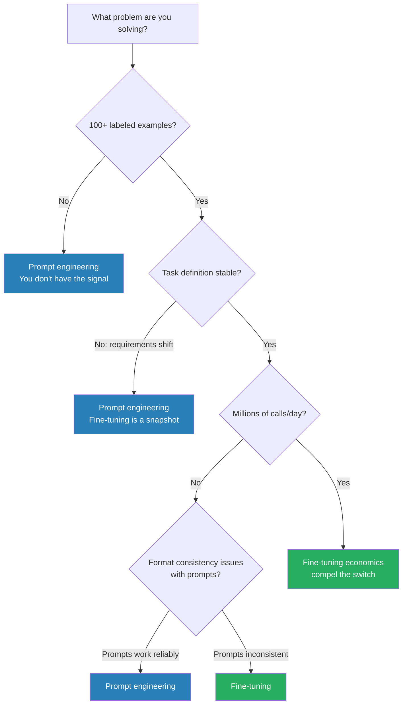

Fine-tuning a small model costs under $50 for most tasks in 2026. Every major provider — Anthropic, OpenAI, Google — has a fine-tuning API with turnaround measured in hours. Accessibility has genuinely changed. But accessibility hasn't changed the fundamental question: when does fine-tuning actually beat a well-crafted prompt on your specific task? The answer is more nuanced than either camp admits. Prompting wins more often than the fine-tuning hype implies, and fine-tuning wins more decisively than prompting advocates allow. Here is the honest framework.



## When fine-tuning actually wins

**Format and style consistency.** This is fine-tuning's strongest case. If your output must conform to a precise structure — a specific JSON schema with exact key names, a house style for customer communications, a structured report format — and you find yourself fighting prompts to get it right reliably, fine-tuning on 100-500 examples typically beats any prompt you can write. The model learns the format from demonstration rather than instruction. The failure mode of prompting — the model following instructions 95% of the time and producing subtly wrong output 5% of the time — is exactly what fine-tuning eliminates.

**Latency and cost at scale.** A fine-tuned 7B–14B parameter model can match a larger frontier model on a narrow, well-defined task at roughly one-tenth the cost. If you run 500,000+ calls per day on a task like customer intent classification, document categorization, or code comment generation, the economics are compelling. The fine-tuning cost amortizes quickly.

**Proprietary knowledge that isn't in public training data.** Domain-specific terminology for your industry vertical, the meaning of internal abbreviations, your company's product taxonomy — fine-tuning teaches the model things that aren't in its training corpus. The important caveat: this works for static knowledge. For anything that changes (current prices, live inventory, recent events), RAG beats fine-tuning every time, because fine-tuning is a snapshot and RAG retrieves current information at inference time.

**System prompt compression.** If your system prompt is 8,000+ tokens of behavioral instructions repeated on every call, fine-tuning can bake those instructions into the model weights. You pay the inference token cost once during fine-tuning training, not on every API call. At high volume, this is a real cost reduction.

## When prompting wins

- **The task requires reasoning over new information.** Fine-tuned models don't know things at inference time that weren't in their training data. If your task involves reasoning over a document, a database record, or any current context, that context must be in the prompt. Fine-tuning doesn't help with retrieval tasks.
- **Requirements change frequently.** Fine-tuning produces a model frozen at a point in time. Changing the task means re-fine-tuning. Prompts update instantly. If your product is still iterating — if the definition of "correct output" shifts every sprint — stay on prompts until the task stabilizes.
- **You don't have labeled training data.** Fine-tuning requires examples. If you can't produce 100+ high-quality input/output pairs representative of your production distribution, you don't have enough signal. A fine-tuning job trained on 40 mediocre examples produces a worse model than a careful prompt to the base model.
- **You're still validating what the task should be.** Don't fine-tune a target you haven't confirmed is the right one. Validate the task definition with prompts first. When the task is clear, consistent, and proven, then evaluate fine-tuning.

## The hybrid architecture

For knowledge-intensive applications, the strongest approach combines both: fine-tune for behavioral style and output format, use RAG for current knowledge. The fine-tuned model knows how to respond (tone, structure, terminology); RAG provides what to respond with (current product docs, customer records, retrieved context). Treating these as competing approaches misses the point — they solve different problems.

## Red flags: when fine-tuning is the wrong instinct

Fine-tuning because prompting "feels hacky" is not a valid reason. Prompts can be engineered with as much rigor as code — they deserve versioning, testing, and systematic iteration, not dismissal. Fine-tuning because you assume it will be more reliable is also a trap: a fine-tuning job trained on poor examples is more reliably wrong than a good prompt to a capable base model.

## Dataset quality is the real bottleneck

Fine-tuning is only as good as the training data. Common failure patterns: not enough examples (fewer than 100 rarely moves the needle), insufficient coverage of edge cases (the model learns the common case and fails on the tail), inconsistent labeling (conflicting examples confuse the model), format leakage (stray whitespace or inconsistent JSON structure in training examples propagates to outputs).

```python
import anthropic
import json

client = anthropic.Anthropic()

# Build training data: input/output pairs from your production logs
training_data = [
    {
        "messages": [
            {"role": "user", "content": "Classify this support email: 'My order hasn't arrived after 2 weeks'"},
            {"role": "assistant", "content": '{"category": "delivery_delay", "urgency": "high", "sentiment": "frustrated"}'}
        ]
    },
    # Minimum 100 examples; 300-500 is better; cover all categories and edge cases
]

# Create fine-tuning job — Anthropic fine-tuning API (available 2026)
job = client.fine_tuning.jobs.create(
    model="claude-haiku-4-5",
    training_data=training_data,
    hyperparameters={"n_epochs": 3},
)
print(f"Job ID: {job.id} | Status: {job.status}")

# Cost comparison: fine-tuned Haiku vs baseline Sonnet for this narrow task
CALLS_PER_DAY = 200_000
AVG_INPUT_TOKENS = 400

sonnet_cost_per_1m_input = 3.00   # claude-sonnet-4-5 approximate pricing
haiku_ft_cost_per_1m_input = 0.40  # fine-tuned Haiku with slight fine-tuning premium

sonnet_daily = CALLS_PER_DAY * AVG_INPUT_TOKENS / 1_000_000 * sonnet_cost_per_1m_input
haiku_ft_daily = CALLS_PER_DAY * AVG_INPUT_TOKENS / 1_000_000 * haiku_ft_cost_per_1m_input

fine_tune_one_time_cost = 45.00  # approximate for this dataset size

days_to_break_even = fine_tune_one_time_cost / (sonnet_daily - haiku_ft_daily)

print(f"Sonnet baseline: ${sonnet_daily:.2f}/day")
print(f"Fine-tuned Haiku: ${haiku_ft_daily:.2f}/day")
print(f"Break-even: {days_to_break_even:.1f} days")
# At 200k calls/day: break-even in ~2 days, then $800/month savings
```

The break-even math is usually favorable at high call volumes. But "high" is the key qualifier. At 5,000 calls per day, the savings are modest and the operational overhead of managing a fine-tuned model (versioning, re-training when task drifts, monitoring for degradation) may not be worth it. Do the calculation before committing.

Fine-tuning is not inherently better or more serious than prompting. It is a specialized tool with specific winning conditions. Meet those conditions and it is unambiguously the right choice. Miss them and you've added cost and operational complexity for no benefit.
