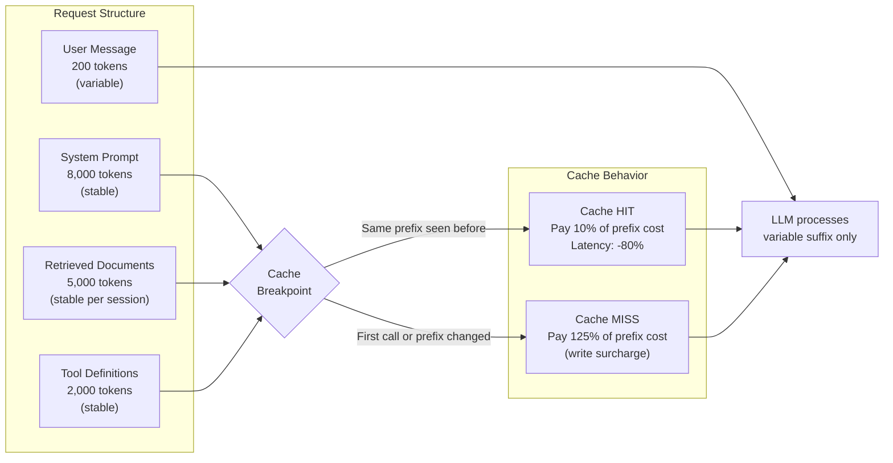

Every call to an LLM API recomputes attention over every token in the context window. If your system prompt is 8,000 tokens, repeated by 10,000 users per hour, you are paying to process 80 million tokens of unchanged content every single hour. Prompt caching eliminates that waste. For any application with a stable prefix — a system prompt, a set of documents, a tool definition list — the provider caches the computed key-value states from the transformer attention layers after the first call and reuses them on subsequent calls. You pay only for the variable suffix. The cost reduction is not marginal: 70-90% on the cached prefix, with latency dropping proportionally.



## How it works technically

LLM inference processes every token in the context window through transformer attention layers. This is the expensive computation. Prompt caching stores the attention key-value states for a designated prefix segment and reuses them without recomputation.

The prefix must be byte-identical to the cached version — any change invalidates the cache entry. This is the central engineering constraint. A dynamic timestamp in your system prompt, a session ID prepended to context, or any variable content inserted into the prefix destroys cache hits.

Anthropic's implementation uses explicit cache breakpoints marked with `cache_control`. When the same prefix up to a breakpoint is seen within the cache TTL (5 minutes for standard, longer for enterprise tiers), the cached KV states are loaded instead of recomputed. Cache read cost is approximately 10% of the normal input token cost. Cache write cost (first call per prefix) adds a ~25% surcharge. The math only works in your favour when the hit rate is high.

## Cost impact: a real calculation

```python
import anthropic

client = anthropic.Anthropic()

# System prompt + documents (stable prefix)
SYSTEM_PROMPT = """You are a senior technical support engineer for AcmeCorp..."""  # ~4,000 tokens
PRODUCT_DOCS = """[Full product documentation]"""  # ~6,000 tokens

# Pricing constants (approximate, verify in your provider console)
INPUT_TOKEN_COST_PER_1M = 3.00       # Standard input tokens
CACHE_READ_COST_PER_1M = 0.30        # 10% of input cost on cache hit
CACHE_WRITE_COST_PER_1M = 3.75       # 25% surcharge on cache write

STABLE_PREFIX_TOKENS = 10_000        # System prompt + docs
VARIABLE_SUFFIX_TOKENS = 300         # Average user message
CALLS_PER_HOUR = 5_000
CACHE_HIT_RATE = 0.95                # Target: >90% hit rate

def hourly_cost_no_cache():
    total_input = (STABLE_PREFIX_TOKENS + VARIABLE_SUFFIX_TOKENS) * CALLS_PER_HOUR
    return total_input / 1_000_000 * INPUT_TOKEN_COST_PER_1M

def hourly_cost_with_cache():
    hits = CALLS_PER_HOUR * CACHE_HIT_RATE
    misses = CALLS_PER_HOUR * (1 - CACHE_HIT_RATE)

    hit_cost = hits * STABLE_PREFIX_TOKENS / 1_000_000 * CACHE_READ_COST_PER_1M
    miss_cost = misses * STABLE_PREFIX_TOKENS / 1_000_000 * CACHE_WRITE_COST_PER_1M
    variable_cost = CALLS_PER_HOUR * VARIABLE_SUFFIX_TOKENS / 1_000_000 * INPUT_TOKEN_COST_PER_1M

    return hit_cost + miss_cost + variable_cost

no_cache = hourly_cost_no_cache()
with_cache = hourly_cost_with_cache()
savings_pct = (1 - with_cache / no_cache) * 100

print(f"Without caching: ${no_cache:.2f}/hour (${no_cache * 24 * 30:.0f}/month)")
print(f"With caching:    ${with_cache:.2f}/hour (${with_cache * 24 * 30:.0f}/month)")
print(f"Savings:         {savings_pct:.1f}%")
# At 95% hit rate on a 10,000-token prefix: ~87% cost reduction
```

At 5,000 calls per hour with a 10,000-token stable prefix and a 95% cache hit rate, the monthly saving is typically in the thousands of dollars range for mid-scale production systems.

## High-impact scenarios

**Large, stable system prompts.** Multi-page persona definitions, detailed instruction sets, or comprehensive behavioral guidelines used across all users — cache the entire system prompt. This is the simplest and highest-ROI caching configuration.

**RAG with a fixed document corpus.** If you are retrieving from a document set that doesn't change per user — a product knowledge base, a regulatory document library, a codebase — cache the retrieved documents. The user query varies; the documents don't. Mark the document block as a cache breakpoint.

**Coding assistants with a large codebase in context.** Sending 10,000 tokens of codebase context on every message to a coding assistant is expensive without caching. With caching, only the first message in a session pays full price; subsequent messages in the same session reuse the cached KV states.

**Tool-heavy agents.** Tool definitions (function schemas) are typically identical across all calls. Cache them. At 20+ tools, this alone reduces per-call input token costs by 10-20%.

## Low-impact scenarios

Short system prompts under 500 tokens: the absolute savings are small, and the architectural complexity of cache management isn't worth it. Highly personalized contexts that are unique per user: no common prefix to cache. One-off batch processing jobs where each request has a different prefix: no repeated context, no cache benefit.

## Implementation: structured for maximum cache hits

```python
def build_cached_message(user_query: str, retrieved_docs: list[str]) -> dict:
    """Structure the API call to maximize cache hits.
    
    Rule: stable content first, variable content last.
    Never break cache by inserting dynamic content into the stable prefix.
    """
    system_content = [
        {
            "type": "text",
            "text": SYSTEM_PROMPT,
            "cache_control": {"type": "ephemeral"},  # Cache breakpoint after system prompt
        },
        {
            "type": "text",
            "text": "\n\n".join(retrieved_docs),
            "cache_control": {"type": "ephemeral"},  # Cache breakpoint after docs
        }
    ]

    response = client.messages.create(
        model="claude-sonnet-4-5",
        max_tokens=1024,
        system=system_content,
        messages=[{"role": "user", "content": user_query}],  # Variable — not cached
    )

    # Check cache performance in usage metadata
    usage = response.usage
    cache_hit_tokens = getattr(usage, "cache_read_input_tokens", 0)
    cache_write_tokens = getattr(usage, "cache_creation_input_tokens", 0)
    normal_input_tokens = usage.input_tokens

    hit_rate = cache_hit_tokens / (cache_hit_tokens + normal_input_tokens + 1e-9)
    return response, hit_rate
```

## What kills your cache hit rate

Adding a timestamp, request ID, or any dynamic value to the stable prefix. This is the most common cache-destroying mistake. If you need to include per-request metadata, put it in the user message, not the system prompt.

Returning system prompt text from a database with inconsistent whitespace or encoding. Even a single byte difference invalidates the cache. Normalize and store the exact bytes you intend to send.

Session-based context prepended to the system prompt instead of the user turn. Anything that varies by user or session belongs in the variable suffix, not the cached prefix.

> Monitor your cache hit rate using the `cache_read_input_tokens` field in API usage responses. If hit rate is below 80% for a workload you expect to benefit from caching, something in your prefix is varying between calls.
{: .prompt-tip }

Prompt caching is the highest-leverage cost optimization available for most production LLM applications with stable context. At enterprise scale — thousands of calls per hour, large system prompts, RAG with shared document corpora — the 70-90% reduction in input token costs for the cached prefix translates to a measurable monthly saving with minimal implementation effort.
