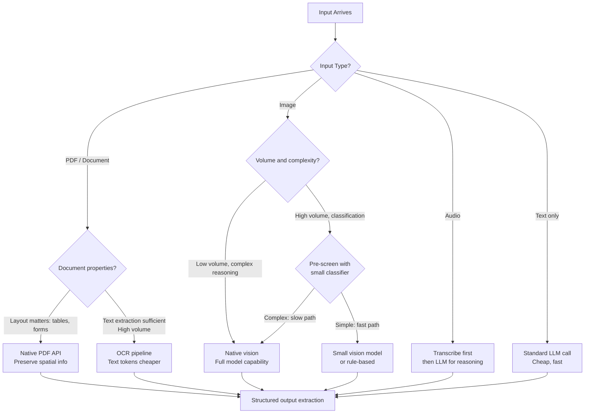

The pipeline-of-specialized-models approach — OCR the document, transcribe the audio, extract text, then pass everything to an LLM — still works. It's also becoming the slow path. Claude Sonnet 5, GPT-5, and Gemini Ultra all accept images, PDFs, and audio natively. Native multimodal processing eliminates preprocessing stages, preserves spatial layout information, and handles mixed-content inputs that would require complex routing logic in a pipeline approach. The tradeoff is cost: multimodal processing costs 5-10x text-only on a per-document basis. The engineering question is when native multimodal earns its cost and when the pipeline approach is still right.



## Document processing

Native PDF support is now standard across major providers. Send a PDF as a base64-encoded `document` content block and the model processes the full document — including page layout, tables, headers, and embedded images — without a preprocessing step.

**When native PDF wins:** forms where spatial layout carries meaning (a checkbox in column A vs column B means something different), tables with merged cells or complex formatting, documents with embedded images alongside text, and mixed-content inputs where a pipeline would require multiple specialized models.

**When the pipeline still wins:** very long documents that exceed the context window (split-and-merge is easier to implement than working around context limits), high-volume structured extraction from standardized forms (cost of vision tokens vs text tokens is substantial at scale), and low-quality scans that need preprocessing before any model can extract them reliably.

```python
import anthropic
import base64
from pathlib import Path
from pydantic import BaseModel

client = anthropic.Anthropic()

class InvoiceExtraction(BaseModel):
    vendor_name: str
    invoice_number: str
    invoice_date: str
    line_items: list[dict]
    subtotal: float
    tax: float
    total: float

def extract_invoice(pdf_path: str) -> InvoiceExtraction:
    pdf_bytes = Path(pdf_path).read_bytes()
    pdf_b64 = base64.standard_b64encode(pdf_bytes).decode("utf-8")

    response = client.messages.create(
        model="claude-sonnet-4-5",
        max_tokens=1024,
        messages=[{
            "role": "user",
            "content": [
                {
                    "type": "document",
                    "source": {
                        "type": "base64",
                        "media_type": "application/pdf",
                        "data": pdf_b64,
                    }
                },
                {
                    "type": "text",
                    "text": "Extract all invoice fields. Return JSON matching the schema: vendor_name, invoice_number, invoice_date, line_items (list of {description, quantity, unit_price, total}), subtotal, tax, total."
                }
            ]
        }]
    )

    import json
    return InvoiceExtraction(**json.loads(response.content[0].text))
```

## Image processing

Images are expensive in token terms. A 1,024×1,024 image typically costs 1,000-1,600 input tokens depending on the model and tile size. At high volume, that adds up fast. The mitigation strategy is pre-screening: run a cheap classifier first to decide whether an image needs full multimodal processing.

For classification tasks (is this image a receipt, a chart, or a product photo?), a small vision model or even a traditional computer vision classifier may be sufficient at a fraction of the cost. Reserve large frontier models for images that require complex reasoning.

Production patterns that matter:

- **Downscale aggressively.** If you need to classify document type from an image, 512px is usually sufficient. You don't need full resolution for most classification tasks. Smaller image = fewer tokens = lower cost.
- **Cache static images.** If the same image appears in multiple requests (a product image referenced across many customer queries), use prompt caching on the base64-encoded image. Pay the encoding cost once per cache TTL, not per call.
- **Batch for throughput, stream for interactive.** High-volume image processing benefits from async batch APIs. Interactive applications (user uploads a photo and waits) need streaming to feel responsive.

## Audio processing

Native audio reasoning in large frontier models is emerging but remains expensive and limited compared to the text-based reasoning path. The practical production pattern remains: transcribe with a Whisper-class model (fast, cheap, highly accurate), then pass the transcript to an LLM for reasoning, summarization, sentiment analysis, or structured extraction.

```python
import anthropic

client = anthropic.Anthropic()

def process_support_call_transcript(transcript: str) -> dict:
    """Structured extraction from a support call transcript."""
    response = client.messages.create(
        model="claude-haiku-4-5",  # Haiku is sufficient for structured extraction
        max_tokens=512,
        messages=[{
            "role": "user",
            "content": f"""Analyze this support call transcript and extract:
- issue_category (billing/technical/account/other)
- resolution_status (resolved/escalated/unresolved)
- sentiment (positive/neutral/negative)
- action_items (list of follow-up actions committed to)
- call_duration_minutes (if mentioned)

Transcript:
{transcript}

Return as JSON."""
        }]
    )
    import json
    return json.loads(response.content[0].text)
```

For long audio (>30 minutes), chunk on silence boundaries (most audio processing libraries support VAD-based chunking), process chunks in parallel, then merge results. Don't send a 3-hour meeting recording as a single transcript — context management becomes harder and errors compound.

## Multimodal RAG

The most powerful production pattern combines multimodal inputs with retrieval. A user asks a question; the system retrieves both relevant text passages and relevant images (charts, diagrams, screenshots) and passes all of them to the model for a grounded answer.

```yaml
# Multimodal RAG pipeline architecture
pipeline:
  ingestion:
    - source: "SharePoint, S3, databases"
    - processors:
        - type: "pdf_extractor"
          output: ["text_chunks", "embedded_images"]
        - type: "image_embedder"
          model: "clip-vit-large-patch14"
          output: "image_vectors"
        - type: "text_embedder"
          model: "voyage-3"
          output: "text_vectors"
    - storage:
        vectors: "qdrant"
        raw_content: "s3"
        metadata: "postgres"

  retrieval:
    query_embedding: "voyage-3"
    search_strategy: "hybrid"
    top_k_text: 5
    top_k_images: 3
    reranker: "cohere-rerank-3"

  generation:
    model: "claude-sonnet-4-5"
    context_assembly:
      - "top_k text chunks as document blocks"
      - "top_k images as image blocks"
      - "user query"
```

## Cost management at scale

Multimodal processing costs 5-10x text-only. Budget accordingly.

A practical tiered approach: use metadata and cheap text classifiers to route requests. Most incoming documents can be handled with text-only processing after a simple text extraction step. Send only the inputs that genuinely require spatial understanding or image reasoning to native multimodal models.

Monitor cost per document type. In a mixed-input production system, PDFs with embedded charts will cost 3-4x what plain-text PDFs cost. If a document category consistently over-consumes tokens relative to its value, evaluate whether the pipeline approach (OCR + text extraction) is a better fit for that category.

> A common mistake: using full-resolution images when the task doesn't need them. For receipt classification or document type detection, downscale to 512px before encoding. For detailed invoice extraction where small text must be legible, use the full resolution. Match resolution to task requirements.
{: .prompt-tip }

Multimodal AI has crossed the threshold from capability demonstration to production viability. The engineering challenge in 2026 is cost management and routing logic — knowing which inputs justify the multimodal path and which are better served by cheaper alternatives.
