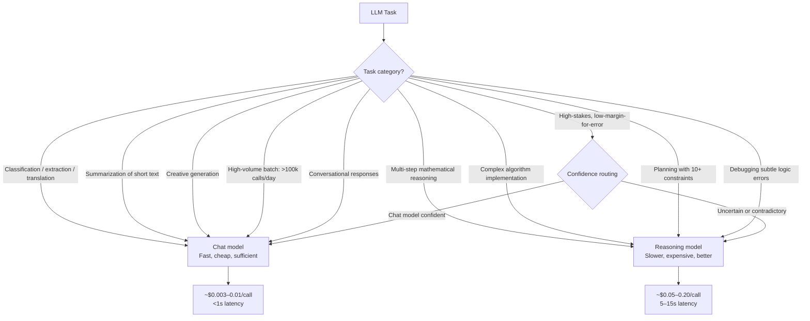

Reasoning models — Claude with extended thinking, GPT-5 reasoning modes, Gemini Ultra deep reasoning — produce better results on hard problems by spending tokens on internal chain-of-thought before generating a response. The quality gains on genuinely difficult tasks are substantial and real. On Claude with extended thinking, benchmark gains of 10-40 percentage points on hard reasoning tasks over standard mode are consistent. The tradeoff is also real: reasoning tokens add 3-10 seconds of latency and cost 5-20x more than a standard call for the same output. Using reasoning models for tasks that don't need them is expensive waste. Not using them when they're needed is an accuracy problem. The routing decision is worth getting right.



## What reasoning models actually do

Reasoning models don't have access to different information than chat models. They don't know more. What they do is think through the problem systematically before committing to a response. The internal chain-of-thought works through sub-problems, checks intermediate results, and backtracks when it hits a contradiction — similar to how a careful human works through a complex problem on paper before writing the answer.

This works well when the problem has structure that rewards systematic decomposition. It doesn't help when the problem is fundamentally about retrieval ("what is the capital of France"), creative judgment ("write a good opening paragraph"), or fast pattern matching ("classify this email as spam or not spam"). For those tasks, you're paying reasoning token costs for no quality improvement.

## When reasoning models win

**Multi-step mathematical and logical problems.** Anything requiring a sequence of correct logical steps where an early error cascades into a wrong final answer. Optimization problems, constraint satisfaction, formal verification reasoning, proof checking. Chat models are unreliable here in ways that aren't obvious from their confident-sounding output — they produce plausible-looking wrong answers. Reasoning models work through the logic systematically.

**Complex code generation.** Implementing a non-trivial algorithm — a custom graph traversal, a synchronization protocol, a parser for a context-free grammar — where the implementation must satisfy multiple interacting correctness constraints simultaneously. Chat models frequently produce code that looks right and fails on edge cases; reasoning models are substantially better at catching their own edge-case mistakes during generation.

**Planning with many constraints.** "Create a sprint plan for these 12 user stories given that engineers A and B are on leave next week, C is dedicated to on-call, and we have a hard deployment freeze on Friday." Chat models produce plans that violate constraints at a rate that's embarrassing in production. Reasoning models work through the constraints systematically.

**Adversarial evaluation and red teaming.** Finding non-obvious failure modes in a system prompt, a data pipeline, or an access control design. The systematic thinking that makes reasoning models better at hard problems also makes them better at finding attack vectors that a chat model would miss.

**High-stakes, low-volume decisions.** When being wrong has serious consequences and the task is hard enough that a chat model might miss something — and you're running tens of calls, not millions — the cost premium is justifiable.

## When chat models win

Most production tasks. Classification, extraction, summarization, translation, conversation, code explanation, documentation generation, structured output from well-understood schemas — chat models are reliable and reasoning adds no value. Using a reasoning model for customer support intent classification is like using a forklift to move a box across the room.

High-volume batch processing makes reasoning model costs impractical. At 500,000 calls per day, a 10x cost multiplier is not a rounding error — it's a budget conversation.

Users don't wait 10 seconds for conversational responses. Any real-time interactive use case has latency constraints that reasoning models can't meet at current speeds.

## Cost comparison: the numbers

```python
# Cost routing decision: when does reasoning model quality justify its cost?
import anthropic

# Approximate pricing per 1M tokens (input + output), 2026
CHAT_MODEL_COST_PER_1M = 3.00         # claude-sonnet-4-5 baseline
REASONING_MODEL_COST_PER_1M = 45.00   # claude-sonnet-4-5 extended thinking

# Typical call size
INPUT_TOKENS = 500
OUTPUT_TOKENS = 200
THINKING_TOKENS = 3000  # reasoning models produce thinking tokens on top of output

chat_cost = (INPUT_TOKENS + OUTPUT_TOKENS) / 1_000_000 * CHAT_MODEL_COST_PER_1M
reasoning_cost = (INPUT_TOKENS + OUTPUT_TOKENS + THINKING_TOKENS) / 1_000_000 * REASONING_MODEL_COST_PER_1M

print(f"Chat model:      ${chat_cost:.4f}/call")
print(f"Reasoning model: ${reasoning_cost:.4f}/call")
print(f"Multiplier:      {reasoning_cost / chat_cost:.1f}x")

# At 10,000 calls/day:
daily_chat = 10_000 * chat_cost
daily_reasoning = 10_000 * reasoning_cost
print(f"\nAt 10k calls/day:")
print(f"Chat model:      ${daily_chat:.2f}/day")
print(f"Reasoning model: ${daily_reasoning:.2f}/day")
```

## Hybrid routing

The practical production architecture uses chat models by default and escalates to reasoning models selectively based on task complexity signals.

```python
import anthropic
from enum import Enum

client = anthropic.Anthropic()

class TaskComplexity(Enum):
    STANDARD = "standard"
    REASONING = "reasoning"

def classify_task_complexity(task: str) -> TaskComplexity:
    """Use a cheap model to route to an expensive one only when needed."""
    routing_response = client.messages.create(
        model="claude-haiku-4-5",
        max_tokens=50,
        messages=[{
            "role": "user",
            "content": f"""Does this task require multi-step logical reasoning, 
mathematical computation, or planning with multiple constraints?
Answer YES or NO only.

Task: {task}"""
        }]
    )

    answer = routing_response.content[0].text.strip().upper()
    return TaskComplexity.REASONING if answer == "YES" else TaskComplexity.STANDARD

def execute_task(task: str, context: str = "") -> str:
    complexity = classify_task_complexity(task)

    if complexity == TaskComplexity.REASONING:
        # Extended thinking enabled
        response = client.messages.create(
            model="claude-sonnet-4-5",
            max_tokens=8000,
            thinking={"type": "enabled", "budget_tokens": 5000},
            messages=[{
                "role": "user",
                "content": f"{context}\n\n{task}" if context else task
            }]
        )
    else:
        response = client.messages.create(
            model="claude-haiku-4-5",
            max_tokens=1024,
            messages=[{
                "role": "user",
                "content": f"{context}\n\n{task}" if context else task
            }]
        )

    # Extract text from response (skip thinking blocks)
    return next(
        block.text for block in response.content
        if block.type == "text"
    )
```

The routing classifier itself uses a cheap, fast model — you're not paying reasoning prices to decide whether to pay reasoning prices. The classification call adds ~100ms and costs a fraction of a cent. For tasks that genuinely need reasoning, the quality improvement is worth the 10-20x cost multiplier. For the majority that don't, you're on the efficient path automatically.

> Track your reasoning model usage as a percentage of total calls. If it's above 20-30%, either your routing logic is too permissive or you have a genuinely reasoning-heavy workload. If it's below 1-2%, check whether your routing is actually routing complex tasks correctly — not just avoiding costs at the price of wrong answers.
{: .prompt-tip }

The routing decision is an engineering call, not a cost-cutting measure. The goal is matching task requirements to model capability — not defaulting to the most capable model for everything, and not defaulting to the cheapest model and hoping it's good enough.
