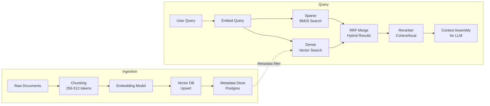

Embedding models convert text into dense numerical vectors that capture semantic meaning. Vector search finds the most semantically similar vectors to a query. Together they power retrieval-augmented generation: instead of stuffing an entire document corpus into every LLM context window, you retrieve only the relevant sections. The quality of your retrieval is the ceiling on the quality of your RAG system — a powerful generation model cannot compensate for poor retrieval. Getting embedding model selection, chunking strategy, and vector index configuration right is where RAG performance is won or lost in practice.



## Choosing an embedding model

Benchmark results on MTEB (the standard embedding benchmark) don't always translate to your domain. A model that leads on the MTEB average can underperform on technical documentation or code. Always evaluate on your own data with your own queries before committing.

**Proprietary options:**
- **Voyage AI voyage-3:** strong across-the-board, especially for code and technical content. The current default for most engineering-facing RAG systems.
- **OpenAI text-embedding-3-large:** 3072 dimensions, excellent general quality, matix of dimension truncation available (you can reduce to 256 dimensions for cost/speed tradeoffs with modest quality loss).
- **Cohere Embed v3:** multilingual strength, good for enterprise deployments spanning multiple languages.

**Open source options:**
- **BGE-M3:** multilingual, strong MTEB scores, can run locally. Good for air-gapped deployments or when data cannot leave your infrastructure.
- **Nomic Embed:** 768 dimensions, runs efficiently locally, competitive quality at small size. Good for teams that want to avoid per-token embedding costs at scale.
- **E5-Mistral:** instruction-tuned, handles asymmetric retrieval well (short query, long document). Requires explicit instruction prefix in queries.

The practical default for a new English-language RAG system in 2026: start with Voyage voyage-3, evaluate against your actual query logs and document set, move to an alternative only if benchmarking shows meaningful improvement.

## Vector database selection

| Database | Best for | Strengths | Limitations |
|----------|----------|-----------|-------------|
| pgvector | Existing Postgres users, <5M vectors | Zero new infrastructure, familiar ops, ACID, SQL joins with metadata | Slower at >5M vectors; no built-in hybrid search |
| Qdrant | Medium-large scale, complex filtering | Fast approximate search, rich payload filtering, good horizontal scaling | Self-hosted ops burden; managed tier adds cost |
| Weaviate | Multimodal, schema-first teams | Built-in BM25 hybrid search, multi-tenant, strong multimodal support | More complex schema design upfront |
| Pinecone | Teams prioritizing managed simplicity | Fully managed, simple API, easy to start | Expensive at scale; vendor lock-in |

The practical decision: pgvector if you're already on Postgres and under 5M vectors. Qdrant for larger scale or if you need complex metadata filtering as part of search. Weaviate if multimodal retrieval (images + text in the same index) is a core requirement.

## Chunking strategy

Chunking is where most teams underinvest. The right chunk size and method has a larger impact on retrieval quality than the choice of embedding model.

**Chunk size tradeoff:** smaller chunks (128-256 tokens) retrieve more precisely — the retrieved chunk is likely to contain the answer. Larger chunks (512-1024 tokens) give the LLM more surrounding context. The resolution: use small chunks for retrieval, retrieve the parent chunk for LLM context.

**Parent-child chunking** is the most effective general pattern:
1. Split documents into parent chunks (512-1024 tokens) at natural boundaries (sections, paragraphs).
2. Split parent chunks into child chunks (128-256 tokens) for embedding.
3. Index and search child chunks.
4. On retrieval, fetch the parent chunk (not the child) as the LLM context.

This gives you precise retrieval (from small chunks) and rich context (from large chunks).

**Chunking method matters.** Fixed-size chunking (split every N characters) is simple but cuts sentences and paragraphs mid-thought. Sentence-boundary chunking with 10-20% overlap is the right default for most text. Semantic chunking (split when the topic changes, detected by embedding similarity) is better but expensive — reserve for high-value corpora where retrieval quality is critical.

```python
from qdrant_client import QdrantClient, models
from anthropic import Anthropic
import voyageai

voyage = voyageai.Client()
qdrant = QdrantClient(url="http://localhost:6333")
anthropic_client = Anthropic()

COLLECTION_NAME = "enterprise_docs"
EMBEDDING_DIM = 1024  # voyage-3 output dimension

def create_collection():
    qdrant.create_collection(
        collection_name=COLLECTION_NAME,
        vectors_config=models.VectorParams(
            size=EMBEDDING_DIM,
            distance=models.Distance.COSINE,
        )
    )

def chunk_text(text: str, chunk_size: int = 300, overlap: int = 50) -> list[str]:
    """Sentence-boundary chunking with overlap."""
    import re
    sentences = re.split(r'(?<=[.!?])\s+', text)
    chunks, current, current_len = [], [], 0

    for sentence in sentences:
        words = sentence.split()
        if current_len + len(words) > chunk_size and current:
            chunks.append(" ".join(current))
            # Keep last `overlap` words for context continuity
            current = current[-overlap:]
            current_len = len(current)
        current.extend(words)
        current_len += len(words)

    if current:
        chunks.append(" ".join(current))
    return chunks

def ingest_document(doc_id: str, text: str, metadata: dict):
    chunks = chunk_text(text)
    embeddings = voyage.embed(chunks, model="voyage-3", input_type="document").embeddings

    points = [
        models.PointStruct(
            id=hash(f"{doc_id}:{i}") % (2**63),
            vector=emb,
            payload={"text": chunk, "doc_id": doc_id, **metadata}
        )
        for i, (chunk, emb) in enumerate(zip(chunks, embeddings))
    ]
    qdrant.upsert(collection_name=COLLECTION_NAME, points=points)

def hybrid_search(query: str, filter_dept: str = None, top_k: int = 5) -> list[dict]:
    """Dense vector search with optional metadata filter."""
    query_embedding = voyage.embed([query], model="voyage-3", input_type="query").embeddings[0]

    filter_condition = None
    if filter_dept:
        filter_condition = models.Filter(
            must=[models.FieldCondition(
                key="department",
                match=models.MatchValue(value=filter_dept)
            )]
        )

    results = qdrant.search(
        collection_name=COLLECTION_NAME,
        query_vector=query_embedding,
        query_filter=filter_condition,
        limit=top_k,
        with_payload=True,
    )
    return [{"text": r.payload["text"], "score": r.score, "doc_id": r.payload["doc_id"]}
            for r in results]
```

## Query-time optimization

**Hybrid search** — combining dense vector similarity with sparse BM25 keyword matching — consistently outperforms pure vector search on enterprise datasets. Vector search excels at semantic similarity; BM25 excels at exact keyword matching (product codes, technical terms, proper nouns). Merge results with Reciprocal Rank Fusion (RRF) before reranking.

**Query expansion** improves retrieval by generating alternative phrasings of the user query before embedding:

```python
def expand_query(query: str) -> list[str]:
    """Generate query variations to improve retrieval recall."""
    response = anthropic_client.messages.create(
        model="claude-haiku-4-5",
        max_tokens=200,
        messages=[{
            "role": "user",
            "content": f"""Generate 3 alternative phrasings of this search query that 
capture the same intent with different vocabulary.
Return as JSON list of strings only.

Query: {query}"""
        }]
    )
    import json
    variations = json.loads(response.content[0].text)
    return [query] + variations  # Original + expansions
```

**Reranking** is the highest-leverage retrieval improvement after initial implementation. A reranker (Cohere Rerank, or a cross-encoder running locally) re-scores the top-20 retrieved chunks using the full query-chunk pair for more accurate relevance scoring. This is more expensive than vector search but much cheaper than passing 20 chunks to the LLM and having it sort them out.

> Track retrieval recall separately from generation quality. If your evaluation shows the answer was in the top-20 retrieved chunks but the LLM still got it wrong, the problem is generation. If the answer wasn't in the top-20, the problem is retrieval — no amount of generation improvement will fix it.
{: .prompt-warning }

Embedding models and vector search are genuinely complex in production. The architecture decisions — model selection, chunk size, hybrid search, reranking — each contribute independently to retrieval quality. The right approach is to instrument retrieval quality separately from generation quality, so you can diagnose and improve each layer independently.
