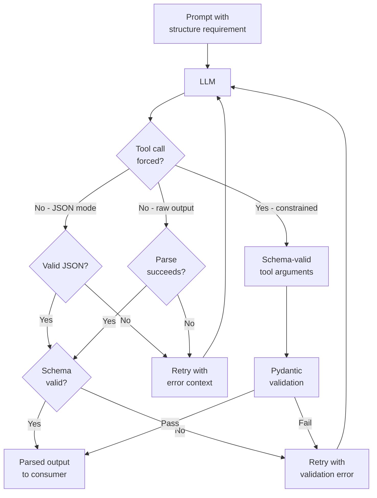

LLMs are text generators. They produce tokens that sound right given the context — and JSON is context like any other. Most of the time, a model asked to return JSON does return something JSON-shaped. But "most of the time" is not a reliability SLA. In production, the cases that break are exactly the ones that matter: deeply nested objects where a field goes missing, enum values where the model produces "Critical" instead of "P0", optional fields where you get an empty string instead of null. Without a structured output strategy, you are running a parse-and-hope architecture. This post covers three approaches to getting reliable structured output, their honest tradeoffs, and the edge cases that bite every team at scale.



## The three approaches

**JSON mode** is the simplest. You tell the API you want JSON output and the model is constrained to produce syntactically valid JSON. What you do not get is schema conformance. The model decides what keys to include, what types to use, and whether optional fields appear. For simple schemas with three or four well-named fields, this is often fine. For anything with required fields, enums, or nested structure, you are one awkward generation away from a KeyError at runtime.

**Schema-constrained decoding via tool use** is the reliable approach for Anthropic models. You define a tool whose input schema matches your desired output structure, force the model to call that tool, and extract the tool arguments. The model cannot produce output that violates the schema — constrained decoding at the token level ensures this. The tradeoff: tool definitions count toward input tokens, empty strings appear where the model wants to omit an optional field, and deeply nested schemas occasionally produce unexpected structure at nesting boundaries. These are manageable edge cases; they are not show-stoppers.

**Prompt-and-parse with validation and retry** is the fallback when you cannot use tool use — legacy integrations, provider-agnostic code, or models that don't support function calling. Instruct the model to produce JSON, parse the output, validate against your schema, and retry with the validation error if it fails. This works, but adds latency on failures and your retry rate directly reflects your prompt quality. At high volume, a 2% retry rate is thousands of wasted API calls per day.

## Tool use for structured output — the implementation

```python
import anthropic
from pydantic import BaseModel

class IncidentReport(BaseModel):
    severity: str  # P0 | P1 | P2 | P3
    affected_systems: list[str]
    root_cause: str
    action_items: list[str]
    estimated_resolution_minutes: int

client = anthropic.Anthropic()

def parse_incident(incident_text: str) -> IncidentReport:
    response = client.messages.create(
        model="claude-opus-4-5",
        max_tokens=1024,
        tools=[{
            "name": "submit_incident_report",
            "description": "Submit a structured incident report",
            "input_schema": IncidentReport.model_json_schema()
        }],
        tool_choice={"type": "tool", "name": "submit_incident_report"},
        messages=[{
            "role": "user",
            "content": f"Analyze this incident and file a report: {incident_text}"
        }]
    )

    # The model is FORCED to call submit_incident_report with valid IncidentReport fields
    tool_input = response.content[0].input
    return IncidentReport(**tool_input)  # Pydantic validates; raises on schema mismatch
```

`tool_choice={"type": "tool", "name": "submit_incident_report"}` is the critical line. Without it, the model may call the tool or may just respond in prose. Forcing the call removes the ambiguity. Pydantic validation after extraction catches the cases where constrained decoding produced a value the token-level schema allows but your application logic does not — an `estimated_resolution_minutes` of -5, for example.

## Validation and retry

For prompt-and-parse workflows, or as a safety net on top of tool use, a retry wrapper that feeds validation errors back to the model catches most failures without human intervention:

```python
from tenacity import retry, stop_after_attempt, wait_exponential
from pydantic import BaseModel, ValidationError
import json

@retry(
    stop=stop_after_attempt(3),
    wait=wait_exponential(multiplier=1, min=1, max=4)
)
def get_structured_output(prompt: str, schema: type[BaseModel]) -> BaseModel:
    response = client.messages.create(
        model="claude-opus-4-5",
        max_tokens=1024,
        tools=[{
            "name": "output",
            "description": "Return structured output matching the schema",
            "input_schema": schema.model_json_schema()
        }],
        tool_choice={"type": "tool", "name": "output"},
        messages=[{"role": "user", "content": prompt}]
    )

    try:
        return schema(**response.content[0].input)
    except ValidationError as e:
        # Re-raise with context — tenacity will retry
        raise ValueError(f"Schema validation failed: {e}") from e
```

`tenacity` handles retry backoff cleanly. Three attempts is usually sufficient — if the model fails three times on the same input, the problem is usually the schema definition or the prompt, not random sampling variance. Log failures before reraising for visibility into which tasks are consistently difficult.

## Edge cases that will bite you

**Optional fields produce empty strings.** When a model wants to omit an optional field, constrained decoding often produces `""` rather than omitting the key or producing `null`. If your application treats empty strings and absent fields differently, define this explicitly: change `Optional[str]` to `str | None` and add `Field(default=None)` with a description that says "omit if unknown; do not use empty string".

**Enums get violated.** `severity: str` with a comment saying "P0 | P1 | P2 | P3" is not a schema constraint — it's documentation. The model can and occasionally will produce "Critical" or "Sev1" or "HIGH". Use `Literal["P0", "P1", "P2", "P3"]` in Pydantic and include the valid values in the field description. The description is part of the tool schema that the model sees; explicit values in the description reduce violations substantially.

```python
from typing import Literal
from pydantic import BaseModel, Field

class IncidentReport(BaseModel):
    severity: Literal["P0", "P1", "P2", "P3"] = Field(
        description="Incident severity: P0=critical/production down, P1=major degradation, P2=partial impact, P3=minor"
    )
    affected_systems: list[str] = Field(
        description="List of affected system names. Maximum 10 items."
    )
    root_cause: str
    action_items: list[str] = Field(
        description="Concrete remediation steps. Maximum 5 items."
    )
    estimated_resolution_minutes: int = Field(
        ge=0,
        description="Estimated minutes to full resolution. Use 0 if already resolved."
    )
```

**Deeply nested schemas fail at higher rates.** A schema with three levels of nesting has significantly higher failure rates than a flat one. Before accepting a complex nested schema, ask whether the task can be decomposed: one call to produce the top-level structure, a second call to populate nested details. Sequential calls on flat schemas are more reliable than single calls on deeply nested ones, and the cost difference is small.

**Long lists get truncated.** A `list[str]` field with no maximum specified may be silently truncated mid-generation. Add `description="Maximum 5 items"` and validate list length explicitly in your Pydantic model with `Field(max_length=5)`.

## Structured output between agents

In agentic pipelines, structured output is mandatory for inter-agent communication. When Agent A produces prose that Agent B must parse, you've added a fragile natural-language-to-code boundary that accumulates error probability across every hop. Instead, define a shared schema and force every agent output through it:

```python
class ResearchHandoff(BaseModel):
    """Structured output from Research Agent to Analysis Agent."""
    query: str
    findings: list[str]
    confidence: Literal["high", "medium", "low"]
    sources: list[str]
    requires_followup: bool

# Research Agent produces this
handoff = get_structured_output(research_prompt, ResearchHandoff)

# Analysis Agent receives clean structured data, not text to parse
analysis_prompt = f"""
Analyze these research findings:
Query: {handoff.query}
Confidence: {handoff.confidence}
Findings:
{chr(10).join(f"- {f}" for f in handoff.findings)}
"""
```

The structured handoff makes the pipeline testable at each stage: you can inspect `handoff` independently, validate it against expected schema, and inject test fixtures without running the full pipeline.

## Cost vs reliability

Schema-constrained tool use adds input tokens — a `IncidentReport` schema definition is roughly 200-400 tokens depending on complexity. At $15/million input tokens (Opus-class), that's $0.003-0.006 per call in schema overhead. At 100,000 calls per day, that's $300-600 per month extra.

Compare that to a 2% retry rate on prompt-and-parse at the same volume: 2,000 retry calls per day, each costing a full call price. At even $3/million tokens with 500 tokens per call, that's $0.0015 per call × 2,000 retries = $3 per day, $90 per month — plus the user-facing latency on those retried calls.

For reliability requirements under 1% failure rate, tool use is cheaper when you account for retry costs and operational overhead. For simple schemas where prompt-and-parse has a 0.1% failure rate, the simpler approach may be justified. Measure your actual failure rate before optimizing.

> The reliability requirement drives the architecture choice. If a parsing failure is a recoverable UX annoyance, prompt-and-parse is fine. If a parsing failure means a missed incident, a corrupted record, or an agent pipeline stalling — tool use is the only reasonable choice.
{: .prompt-info }
