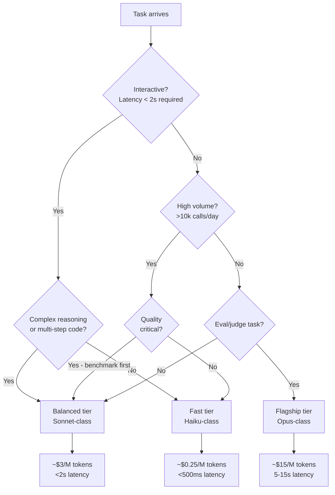

Every team defaults to the most capable model available when they start. It's the conservative choice — if you're not sure what the task needs, use the best model and you probably won't be wrong about quality. The problem is that "probably won't be wrong about quality" describes nearly every task, including the ones that a model costing 60x less handles perfectly well. When you're running thousands or millions of calls per day, the difference between a Haiku-class model at $0.25/million tokens and an Opus-class model at $15/million tokens is not a rounding error — it's a budget line item that requires a business case. This post covers how to make model selection a deliberate engineering decision rather than a habit.



## The five selection axes

**Quality** is what everyone thinks about first, but it's rarely binary. Most tasks have a quality floor, not a quality ceiling — you need responses accurate enough to be useful, not the most accurate response theoretically possible. The question is not "which model is best?" but "which model clears my quality bar?"

**Latency** is often the constraint that drives everything else. Interactive applications with human users need responses that feel fast — time to first token under one second, full response under three seconds for most use cases. Batch processing pipelines may tolerate 30 seconds per call. These are fundamentally different operating regimes that point toward different model tiers regardless of quality requirements.

**Cost** is straightforward to calculate and consistently underestimated at the point of model selection. A task that runs 50,000 times per day is a different cost conversation than one that runs 50 times per day, even if the individual call cost looks trivial. The cost modeling section below makes this concrete.

**Context window** is occasionally the binding constraint — a task that needs to process a 200,000-token document cannot run on a model with a 32,000-token window regardless of other tradeoffs. Check this first and eliminate models that physically cannot handle the input before optimizing on the other axes.

**Reliability** covers consistency of output format, instruction-following fidelity, and refusal rates. Smaller models are generally less reliable at following complex instructions precisely — they drift from format requirements, omit required fields, and occasionally refuse tasks they should handle. If your pipeline depends on exact output structure, test reliability on your specific tasks, not just general benchmarks.

## The model tiers

Using Anthropic's 2026 lineup as a concrete example (the tier structure applies to any provider's offerings):

**Fast tier — Haiku-class ($0.25/M input tokens):** High-volume, latency-sensitive, structurally simple tasks. Classification, routing, entity extraction from short text, brief summarization, intent detection. The quality bar for these tasks is lower than people assume — "classify this support ticket as billing/technical/account" does not require a flagship model. At this price point, running 10 million classifications costs $2.50. The practical question is whether quality is genuinely insufficient, not whether a bigger model would be marginally better.

**Balanced tier — Sonnet-class ($3/M input tokens):** The right default for most production tasks. Complex summarization, code generation and explanation, RAG-grounded answers, multi-turn conversation, structured output from complex schemas, document analysis. Quality is strong across a wide range of tasks. Latency is fast enough for most interactive use cases. Cost is 12x Haiku-class but 5x cheaper than Opus-class — the middle tier earns its position.

**Flagship tier — Opus-class ($15/M input tokens):** Reserve this for tasks where quality directly affects outcomes and the cheaper alternatives genuinely fail. Complex multi-step reasoning, algorithm implementation for critical systems, evaluation and judging tasks, adversarial red teaming. This is not a quality-first-ask-questions-later tier — it's a tier with a specific use case profile.

## A routing implementation

The cheapest model that meets your quality bar for a given task is the right model. One way to operationalize this: use a fast-tier classifier to route requests to the appropriate model before executing the main task.

```python
from anthropic import Anthropic

client = Anthropic()

TASK_MODEL_MAP = {
    "classification": "claude-haiku-4-5-20251001",
    "extraction": "claude-haiku-4-5-20251001",
    "summarization": "claude-sonnet-4-6",
    "code_generation": "claude-sonnet-4-6",
    "complex_reasoning": "claude-opus-4-5",
    "evaluation": "claude-opus-4-5",
}

def classify_task(user_request: str) -> str:
    response = client.messages.create(
        model="claude-haiku-4-5-20251001",  # Cheap model to classify
        max_tokens=20,
        system=(
            "Classify the request into exactly one of: "
            "classification, extraction, summarization, code_generation, "
            "complex_reasoning, evaluation. Return only the category name."
        ),
        messages=[{"role": "user", "content": user_request}]
    )
    return response.content[0].text.strip()

def route_to_model(user_request: str) -> str:
    task_type = classify_task(user_request)
    model = TASK_MODEL_MAP.get(task_type, "claude-sonnet-4-6")  # Default to balanced

    response = client.messages.create(
        model=model,
        max_tokens=2048,
        messages=[{"role": "user", "content": user_request}]
    )
    return response.content[0].text
```

The classifier call costs a fraction of a cent. If routing accuracy is 95% and the savings from using Haiku for simple tasks vs Sonnet is 12x, the routing overhead pays for itself at low volume. The tradeoff is operational complexity — you now have a classifier failure mode to monitor. Keep the routing logic simple and log task type distributions to catch drift.

## Benchmark before you commit

Don't guess whether a cheaper model is good enough for your specific task — measure it. The procedure is simple but teams consistently skip it:

1. Collect 50-100 representative examples of your actual task with expected outputs. Use your real production inputs, not synthetic ones.
2. Run both the current model and the candidate cheaper model on the same inputs.
3. Score quality using either human review or an LLM judge (use your best model for judging — see below).
4. Compare failure rates, quality distributions, and edge case handling.

General benchmarks like MMLU or HumanEval tell you something about a model's general capability profile. They tell you nothing about whether a 7% accuracy gap on the benchmark translates to a 7% quality gap on your specific task. In many cases, the cheaper model is within 1-2% on your actual use case even if it trails significantly on general benchmarks.

## The eval/judge exception

When you use an LLM to evaluate the outputs of other LLMs — scoring response quality, checking for correctness, ranking candidates — spend on model quality. This is the one place where the cost of the flagship tier is clearly justified by business logic.

A weak judge model produces unreliable scores. Unreliable scores mean your evaluation pipeline gives you false confidence in system quality. If you're using eval scores to make decisions about model upgrades, prompt changes, or system releases, those decisions are only as good as your judge's accuracy. A fast-tier model as a judge is a false economy: you save cents per evaluation call and gain noise in your most important quality signal.

Use Opus-class for evaluation tasks. Use it also for red teaming and adversarial review — the systematic thinking that makes reasoning models better at hard problems also makes them better at finding non-obvious failure modes.

## Latency optimization beyond model selection

If latency is the binding constraint, model selection is one lever among several:

**Prompt caching** (Anthropic, OpenAI) stores the KV cache for repeated prompt prefixes, reducing time to first token significantly for long system prompts. If your system prompt is 5,000 tokens and gets sent with every call, caching it can cut TTFT by 60-80%. This works best when the system prompt is stable and high-volume.

**Streaming** improves perceived latency — users see the first tokens within 200-300ms rather than waiting for the full response. For interactive applications, streaming is a higher-leverage improvement than switching model tiers.

**Output length control** is underused. Setting `max_tokens` to your actual expected output length, not a conservative ceiling, reduces generation time proportionally. If 95% of your responses are under 500 tokens, setting `max_tokens=2048` means you're occasionally paying for generation capacity you never use; more importantly, you're not bounding your latency tail.

## Cost modeling — the actual numbers

```python
def monthly_cost_estimate(
    calls_per_day: int,
    avg_input_tokens: int,
    avg_output_tokens: int,
    input_price_per_million: float,
    output_price_per_million: float,
) -> dict:
    daily_input_cost = (calls_per_day * avg_input_tokens / 1_000_000) * input_price_per_million
    daily_output_cost = (calls_per_day * avg_output_tokens / 1_000_000) * output_price_per_million
    daily_cost = daily_input_cost + daily_output_cost

    return {
        "daily_cost_usd": round(daily_cost, 2),
        "monthly_cost_usd": round(daily_cost * 30, 2),
        "annual_cost_usd": round(daily_cost * 365, 2),
    }

# Example: document classification pipeline, 50k calls/day
haiku_cost = monthly_cost_estimate(
    calls_per_day=50_000,
    avg_input_tokens=800,
    avg_output_tokens=50,
    input_price_per_million=0.80,    # claude-haiku-4-5
    output_price_per_million=4.00,
)
# Result: ~$39/month

sonnet_cost = monthly_cost_estimate(
    calls_per_day=50_000,
    avg_input_tokens=800,
    avg_output_tokens=50,
    input_price_per_million=3.00,    # claude-sonnet-4-6
    output_price_per_million=15.00,
)
# Result: ~$157/month

opus_cost = monthly_cost_estimate(
    calls_per_day=50_000,
    avg_input_tokens=800,
    avg_output_tokens=50,
    input_price_per_million=15.00,   # claude-opus-4-5
    output_price_per_million=75.00,
)
# Result: ~$781/month
```

For this pipeline, the question is whether Haiku's classification quality meets the bar. If it does, using Sonnet costs $1,400 more per year. If it doesn't — if a 5% misclassification rate creates downstream work that costs $500 in engineering time per month — Sonnet pays for itself. Run the numbers with your actual costs, not intuitions.

## Multi-model pipelines

The practical sweet spot for complex agentic systems is a tiered pipeline that uses the cheapest model at each step that meets quality requirements:

```python
class MultiModelPipeline:
    def __init__(self):
        self.client = Anthropic()
        self.fast_model = "claude-haiku-4-5-20251001"
        self.balanced_model = "claude-sonnet-4-6"
        self.flagship_model = "claude-opus-4-5"

    def classify_and_route(self, task: str) -> str:
        """Fast tier: route the task."""
        return self._call(self.fast_model, max_tokens=30, prompt=task)

    def execute_task(self, task: str) -> str:
        """Balanced tier: do the main work."""
        return self._call(self.balanced_model, max_tokens=2048, prompt=task)

    def evaluate_output(self, task: str, output: str) -> dict:
        """Flagship tier: judge quality."""
        eval_prompt = f"Task: {task}\nOutput: {output}\nScore quality 1-10 with reasoning."
        result = self._call(self.flagship_model, max_tokens=512, prompt=eval_prompt)
        return {"score": result}

    def _call(self, model: str, max_tokens: int, prompt: str) -> str:
        response = self.client.messages.create(
            model=model,
            max_tokens=max_tokens,
            messages=[{"role": "user", "content": prompt}]
        )
        return response.content[0].text
```

This pattern uses Haiku for routing (cents per day), Sonnet for generation (the bulk of cost), and Opus only for evaluation (small volume, high value). You get Opus-class quality assurance without Opus-class costs at scale.

## On provider diversity

Mixing providers gives you redundancy and access to model-specific capabilities that one provider's lineup may lack. It also means separate API integrations, different rate limits to manage, different pricing models to track, and different reliability characteristics in your monitoring. For most teams at most stages, start with one provider's model family. The operational simplicity is worth more than the theoretical flexibility. Add a second provider when you have a specific capability gap or a genuine redundancy requirement — not as a default hedge.

> The right model for a task is the cheapest one that consistently clears your quality bar on your actual inputs. If you don't know what your quality bar is, define it before selecting a model. If you haven't measured whether a cheaper model clears it, measure it before committing to anything more expensive.
{: .prompt-info }
