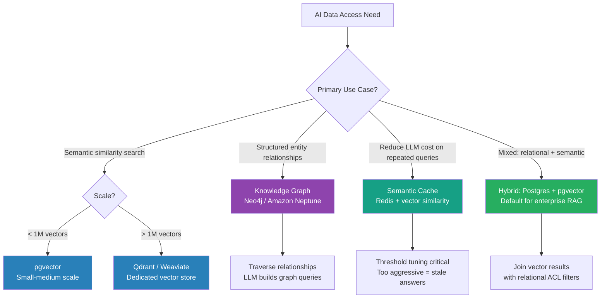

The data layer is the hardest part to get right in production AI systems. Getting it wrong means re-architecting under load — and unlike application logic, data migrations don't get cheaper when you have 10 million embeddings already stored. Most teams start by slapping a vector extension on their existing Postgres instance and calling it done. That works until it doesn't. The honest picture is four distinct patterns, each appropriate for a different problem shape, and knowing which one you actually need before you build is worth the time.



## Pattern 1: Vector databases for semantic similarity

The core use case is RAG retrieval: given a user query, find the most semantically relevant document chunks. The design decisions that actually matter in production:

**Chunk size**: smaller chunks (128–256 tokens) retrieve more precisely but lose surrounding context. Larger chunks (512–1024 tokens) preserve context but dilute the semantic signal. The right answer depends on your content — dense technical documentation favors smaller chunks; narrative content favors larger. Run an offline evaluation with your actual content before committing.

**Embedding model**: the model determines the semantic space. OpenAI `text-embedding-3-small` is the default for general text; specialized models (code, legal, medical) outperform on domain-specific retrieval but require re-embedding your entire corpus when you swap models. Choose the model before embedding anything at scale.

**Index type**: HNSW delivers fast approximate nearest-neighbor search with predictable latency. IVF is better for memory-constrained environments. For production RAG, HNSW is the default unless you have specific memory constraints.

**Metadata filtering**: every vector query should include metadata filters — don't retrieve vectors and then filter post-hoc. Filter during the vector search (Qdrant, Weaviate, and pgvector all support this). This is critical for access control.

For scale: pgvector handles up to roughly 1M vectors with reasonable latency. Beyond that, dedicated stores like Qdrant or Weaviate offer purpose-built indexing and horizontal scaling that pgvector can't match.

## Pattern 2: Semantic caching layer

For read-heavy applications where users ask semantically similar questions repeatedly, a semantic cache reduces LLM costs significantly. The mechanic: embed incoming queries, check if a semantically similar query (above a cosine similarity threshold) has a cached response, and return the cached response if so.

Redis with the RediSearch vector module is the standard implementation. GPTCache is the purpose-built library if you want a higher-level abstraction.

The critical tuning parameter is the similarity threshold. Too aggressive (high threshold, few cache hits) and you get no cost benefit. Too permissive (low threshold, many cache hits) and you return stale or wrong answers for queries that differ enough to matter. Test your threshold against your actual query distribution before deploying.

Semantic caching is not appropriate for queries where freshness matters (current events, real-time data) or where personalization is important (the right answer varies by user). Use it only for stable, query-domain knowledge retrieval.

## Pattern 3: Knowledge graphs for structured relationships

When your domain has explicit entity relationships that need to be traversed — org charts, product catalogues, regulatory dependency trees — a knowledge graph may be worth its complexity. The LLM builds natural-language graph queries (Cypher for Neo4j, SPARQL for others) from user questions; the graph engine traverses the relationships and returns structured results.

Best use case: question answering over structured relational knowledge that doesn't fit well in text chunks. "What compliance requirements apply to a fintech product selling in the EU that also handles healthcare data?" is a graph traversal problem, not a semantic similarity problem.

The honest limitation: knowledge graphs are expensive to build and maintain. Graph construction requires structured input or LLM-based entity extraction from unstructured text (which introduces errors). Don't reach for this unless RAG is demonstrably insufficient for your retrieval problem. Most teams that think they need a knowledge graph actually need better chunking and metadata.

## Pattern 4: Hybrid relational + vector (the right default for enterprise)

For most enterprise RAG systems, the answer is Postgres with the pgvector extension. Standard relational tables handle business data; pgvector handles embedding storage and similarity search. The critical capability: join vector search results with relational access control filters in a single query.

```python
import psycopg2
from psycopg2.extras import execute_values

def hybrid_retrieval(
    query_embedding: list[float],
    user_id: str,
    top_k: int = 5,
    conn=None
) -> list[dict]:
    """
    Retrieve semantically similar chunks filtered by user's document ACL.
    Combines pgvector similarity search with Postgres metadata filtering.
    """
    with conn.cursor() as cur:
        cur.execute(
            """
            SELECT
                c.chunk_id,
                c.document_id,
                c.chunk_text,
                c.embedding <=> %s::vector AS distance
            FROM document_chunks c
            INNER JOIN document_access da
                ON c.document_id = da.document_id
            WHERE da.user_id = %s
              AND da.access_level IN ('read', 'write', 'admin')
            ORDER BY c.embedding <=> %s::vector
            LIMIT %s
            """,
            (query_embedding, user_id, query_embedding, top_k)
        )
        rows = cur.fetchall()

    return [
        {
            "chunk_id": row[0],
            "document_id": row[1],
            "chunk_text": row[2],
            "distance": float(row[3]),
        }
        for row in rows
    ]
```

The `<=>` operator is pgvector's cosine distance. The `INNER JOIN` with the access control table ensures vector search never returns chunks from documents the user isn't authorized to see — at the database level, not the application level.

## The access control problem

This is the most commonly skipped design requirement in enterprise RAG systems. If user A cannot read document X, they must not be able to retrieve chunks from document X via the AI — even phrased as natural language. The vector database has no inherent concept of ACL. You must enforce access control in every vector query via metadata filtering.

The implementation pattern: store allowed document IDs or permission tags as metadata on each chunk at index time. Filter on those metadata fields in every query. Never retrieve vectors and check ACL post-hoc — a user who is told "no results found" but whose query retrieved restricted vectors has still exposed metadata through the query process.

## Data freshness and deletion

RAG retrieval is only as fresh as your index. Define these before building:

- **Ingestion latency**: how quickly must a new document appear in retrieval? If your answer is "within 1 hour," you need a near-real-time ingestion pipeline, not a nightly batch job.
- **Document updates**: when a document changes, you must delete the old chunks and insert new ones. Partial updates (updating some chunks) are a source of retrieval inconsistency.
- **Document deletion**: this is critical for compliance. If a user revokes a document or a document reaches its retention limit, every chunk from that document must be deleted from the vector store. Define the deletion pipeline before you need it, not after a compliance audit requires it.

The data layer in AI systems is where production complexity lives. Get the pattern right for your use case before you embed a single token at scale.
