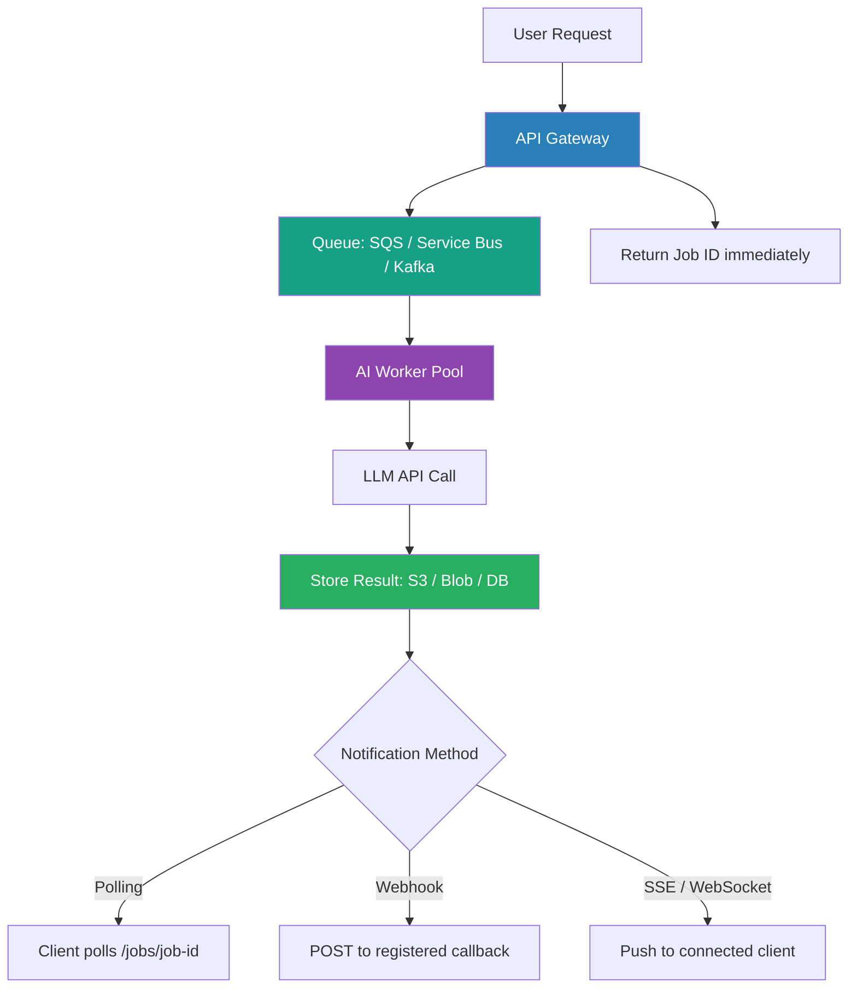

Synchronous request-response fails for AI workloads in predictable ways. An LLM call takes 1–30 seconds depending on the model and output length; reasoning models run longer. HTTP timeouts are set to 5–30 seconds in most mobile apps. Load spikes on the LLM provider cascade into upstream timeouts. Users get error screens. The pattern that breaks this coupling is event-driven architecture: accept the request, return a job ID immediately, process asynchronously when the worker is ready, deliver the result when it's done. This isn't new technology — but applying it specifically to AI workload shapes requires a few patterns that aren't obvious from the standard event-driven playbook.



## Why synchronous fails for AI

The math is straightforward. A P50 LLM response of 3 seconds and a P95 of 15 seconds means a typical mobile app timeout of 10 seconds will catch 10–20% of requests as errors at P95. That's before you factor in LLM provider rate limits — which don't return HTTP errors immediately, they add latency. A spike in usage creates a latency spike that cascades into timeouts across every synchronous caller.

Cost attribution is also harder synchronously. When an LLM call fails after 12 seconds, you've already paid for the tokens. Async processing lets you implement retry logic with cost awareness — don't retry indefinitely, track cost per job, alert when a job has consumed more than a threshold in retries.

## Pattern 1: Command queue

The foundational pattern. User submits a task; the API gateway validates and enqueues it; an AI worker picks it up when capacity is available; the result is stored and the user is notified.

Infrastructure choices by provider:
- **AWS**: SQS (queue) + Lambda or ECS (workers) + S3 (results) + SNS or SES (notification)
- **Azure**: Service Bus (queue) + Functions or Container Apps (workers) + Blob Storage (results)
- **GCP**: Pub/Sub (queue) + Cloud Run (workers) + Cloud Storage (results)

For most enterprise AI workloads, managed queues (SQS, Service Bus) are the right choice over self-managed Kafka. Kafka's operational complexity — partition management, consumer group coordination, offset management — is rarely justified for AI-specific async processing. Reach for Kafka when you have existing Kafka infrastructure, need multi-consumer fan-out, or have throughput requirements above what managed queues handle.

```python
import boto3
import json
import hashlib
import time
from typing import Any

sqs = boto3.client("sqs", region_name="us-east-1")
s3 = boto3.client("s3", region_name="us-east-1")

QUEUE_URL = "https://sqs.us-east-1.amazonaws.com/123456789/ai-tasks"
RESULTS_BUCKET = "ai-results"
IDEMPOTENCY_TABLE = "ai-task-idempotency"  # DynamoDB table

def process_ai_tasks():
    """
    SQS worker: processes AI tasks with idempotency check and result storage.
    Runs in a container or Lambda with appropriate timeout settings.
    """
    dynamodb = boto3.resource("dynamodb")
    idempotency_table = dynamodb.Table(IDEMPOTENCY_TABLE)

    while True:
        response = sqs.receive_message(
            QueueUrl=QUEUE_URL,
            MaxNumberOfMessages=1,
            WaitTimeSeconds=20,         # long polling
            VisibilityTimeout=120,      # max processing time before re-queue
        )

        messages = response.get("Messages", [])
        if not messages:
            continue

        for message in messages:
            body = json.loads(message["Body"])
            task_id = body["task_id"]
            content_hash = hashlib.sha256(
                json.dumps(body["input"], sort_keys=True).encode()
            ).hexdigest()

            # Idempotency check: have we processed this exact input before?
            existing = idempotency_table.get_item(
                Key={"content_hash": content_hash}
            ).get("Item")

            if existing:
                # Already processed — store a pointer to the existing result
                _store_result(task_id, {"result_ref": existing["result_key"]})
            else:
                # Process with LLM
                result = _call_llm(body["input"])

                result_key = f"results/{task_id}.json"
                s3.put_object(
                    Bucket=RESULTS_BUCKET,
                    Key=result_key,
                    Body=json.dumps(result),
                    ContentType="application/json",
                )

                idempotency_table.put_item(Item={
                    "content_hash": content_hash,
                    "result_key": result_key,
                    "processed_at": int(time.time()),
                })

            # Delete from queue only after successful processing
            sqs.delete_message(
                QueueUrl=QUEUE_URL,
                ReceiptHandle=message["ReceiptHandle"],
            )

def _call_llm(input_data: dict) -> Any:
    """Placeholder — replace with your actual LLM call."""
    raise NotImplementedError

def _store_result(task_id: str, result: Any) -> None:
    s3.put_object(
        Bucket=RESULTS_BUCKET,
        Key=f"results/{task_id}.json",
        Body=json.dumps(result),
        ContentType="application/json",
    )
```

## Pattern 2: Event sourcing for agent state

For multi-step agent workflows, event sourcing provides auditability and resilience. Record every significant event as an immutable fact: `UserMessageReceived`, `ToolCallStarted`, `ToolCallCompleted`, `AgentResponseGenerated`. The current agent state is reconstructed from the event log.

This gives you two capabilities that become critical in production:
- **Replay for debugging**: when an agent produces a wrong output, replay the event stream to see exactly what information it had at each step.
- **Resume interrupted agents**: if the agent crashes mid-task, reconstruct state from the event log and resume from the last checkpoint rather than starting over.

Event sourcing adds storage cost and reconstruction latency. It's worth it for agents that take consequential actions (executing code, modifying records, sending communications) and for any workflow requiring an audit trail.

## Pattern 3: Fan-out for parallel AI processing

A document arrives in your ingestion pipeline. You need: a summary, entity extraction, classification, sentiment analysis, and compliance flag detection. Running these sequentially takes 15–30 seconds. Running them in parallel takes 3–8 seconds.

Fan-out is the pattern: one incoming event triggers multiple parallel AI processing tasks. Each task is independent and writes its result to a shared result store. A collector task assembles the results when all tasks complete.

AWS Step Functions, Azure Durable Functions, and GCP Workflows all support fan-out natively with scatter-gather coordination built in. Don't implement coordination logic yourself.

## Pattern 4: Streaming + async hybrid

Users expect streaming responses — the partial-output effect reduces perceived latency significantly. But pure streaming is fragile: if the connection drops, the user loses their result and must restart from scratch.

The hybrid: initiate an async task (return a job ID), simultaneously stream partial results to the connected client via SSE or WebSocket. Store the full result to the result store as the stream completes. If the client disconnects and reconnects, serve the stored result. The user gets streaming UX with async reliability.

## Idempotency is not optional

Managed queues deliver messages at-least-once. Network partitions, Lambda cold starts, and container restarts all cause re-delivery. If your AI task is processed twice, the result should be identical — and you should not bill the user twice or produce duplicate records.

The implementation above shows the content hash approach: hash the task input, check DynamoDB before processing, store the hash after processing. This prevents duplicate LLM calls and produces consistent results for identical inputs. Design your entire AI task pipeline around idempotency from day one — retrofitting it after a production billing incident is significantly more painful.

## Dead letter queues

Configure a DLQ for every AI task queue. Tasks go to the DLQ after N failed processing attempts. Monitor DLQ depth — a growing DLQ means your workers are consistently failing on a class of inputs. Alert on DLQ depth, inspect DLQ messages manually, and either fix the worker or move the tasks to a human review queue. Never let the DLQ grow silently.

Event-driven architecture makes AI workloads more reliable, more scalable, and more cost-attributable. The main cost is operational complexity — you now have queues, workers, result stores, and notifications to operate. That complexity is worth it at any serious production scale.
