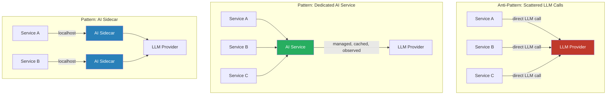

Microservices exist to give teams independent deployability, isolation of failure, and independently scalable components. LLM calls are high-latency (1–30 seconds), probabilistic, and expensive. Embedding LLM calls inline in synchronous microservice paths violates the latency contracts the system was designed to meet and introduces a new failure mode — LLM provider unavailability — into services that previously had no dependency on it. Getting AI integration right in a microservices architecture means treating AI as a cross-cutting concern, not an inline library call.



## Anti-patterns that most teams hit first

**Direct LLM calls in synchronous service paths.** Service A receives a user request, calls an LLM inline, waits 5–15 seconds, returns the response. This breaks several things simultaneously: P95 latency SLAs that were designed around millisecond database calls; cascading timeout chains when the LLM is slow (the timeout propagates upstream to every caller of Service A); cost attribution (which team's budget pays for the LLM call?); and caching (every service re-invents semantic caching or doesn't cache at all).

**AI logic scattered across services.** Every team that needs AI rolls their own LLM client, their own prompt management, their own error handling, their own retry logic. Result: inconsistent behavior across services, no shared observability (you can't see total LLM spend across the system), duplicate costs (five services call the same LLM with the same input because there's no shared cache), and five different interpretations of how to handle rate limits.

**Shared LLM client library without a gateway.** Better than scattered clients — at least error handling and retry logic are consistent — but each service still calls the LLM provider directly. No centralized cost control. No cross-service rate limiting. No unified logging. When the LLM provider changes their API, you update five services.

## Pattern 1: AI as a dedicated service

Extract AI capability into a separate service with a well-defined API. Every team that needs AI calls the AI service — synchronously for simple queries, asynchronously for heavy workloads. The AI service owns everything AI-related: LLM client lifecycle, prompt templates, semantic caching, observability, rate limiting, and fallback logic.

This creates a clear separation: the AI service team owns AI quality and costs; product services own their own logic and data. Cost attribution becomes trivial — the AI service tracks which calling service triggered each LLM call via request headers.

The tradeoff: the AI service becomes a critical shared dependency. It needs SLOs, proper on-call coverage, and circuit breakers in every caller. Design it with this operational reality in mind from day one.

## Pattern 2: AI sidecar

Deploy a small AI sidecar container alongside each service that needs AI capability. The sidecar runs in the same pod (Kubernetes) or same task (ECS). The main service calls the sidecar over localhost — no network hop, minimal latency overhead. The sidecar handles LLM communication, local caching, and observability.

This works well when different services need different AI capabilities with different models or prompts, and a shared AI service would become a configuration-management nightmare. Each team deploys their own sidecar configuration. The sidecar template is shared; the configuration is per-team.

```yaml
# kubernetes/ai-sidecar-deployment.yaml
apiVersion: apps/v1
kind: Deployment
metadata:
  name: document-service
  namespace: production
spec:
  replicas: 3
  selector:
    matchLabels:
      app: document-service
  template:
    metadata:
      labels:
        app: document-service
    spec:
      containers:
        - name: document-service
          image: company/document-service:v2.4.1
          ports:
            - containerPort: 8080
          env:
            - name: AI_SIDECAR_URL
              value: "http://localhost:8090"
          resources:
            requests:
              cpu: "500m"
              memory: "512Mi"
            limits:
              cpu: "1000m"
              memory: "1Gi"

        - name: ai-sidecar
          image: company/ai-sidecar:v1.2.0
          ports:
            - containerPort: 8090
          env:
            - name: LLM_PROVIDER
              value: "anthropic"
            - name: MODEL
              value: "claude-sonnet-4-6"
            - name: CACHE_TTL_SECONDS
              value: "300"
            - name: SERVICE_NAME
              value: "document-service"        # for cost attribution
            - name: ANTHROPIC_API_KEY
              valueFrom:
                secretKeyRef:
                  name: llm-secrets
                  key: anthropic-api-key
          resources:
            requests:
              cpu: "100m"
              memory: "256Mi"
            limits:
              cpu: "500m"
              memory: "512Mi"
          readinessProbe:
            httpGet:
              path: /health
              port: 8090
            initialDelaySeconds: 5
            periodSeconds: 10
```

The sidecar pattern integrates cleanly with service mesh (Istio, Linkerd) — the AI sidecar sits alongside the existing proxy sidecar. Observability flows through the mesh's telemetry pipeline.

## Pattern 3: Async AI enrichment

Many AI use cases don't need to block the primary service path. A document management service creates a document record; it doesn't need the AI-generated summary before returning a 200 to the caller. Async enrichment: the service emits a `DocumentCreated` event; the AI enrichment service consumes the event, processes asynchronously, and writes the AI-generated summary back to the document record.

The main service path is never blocked by LLM latency. AI unavailability doesn't cascade to the primary service. Enrichment can be retried independently if the LLM is temporarily unavailable.

The tradeoff: AI enrichments are eventually consistent. Callers who retrieve the document immediately after creation may not yet have the AI-generated fields. Design your API contracts to handle this — either return `null` for not-yet-enriched fields, or return an `enrichment_status` flag that clients can poll or subscribe to.

## Observability across the AI service boundary

The hardest observability problem in AI + microservices: correlating an AI quality issue back to the service that triggered it. When the AI service logs a slow LLM call, which upstream service caused it?

Use trace context propagation (W3C TraceContext headers) across every service boundary including the AI service boundary. The AI service must propagate the trace ID from the caller into its LLM call. If your LLM client doesn't support this natively, manually include the trace ID in your LLM request's system prompt or metadata — at minimum, log the trace ID alongside every LLM call in the AI service.

Cross-service cost attribution: the AI service should log which `X-Calling-Service` header triggered each LLM call. Aggregate by calling service to produce per-team AI cost reports. This changes the conversation from "AI is expensive" to "Document Service's summarization feature is expensive."

## Circuit breakers in every caller

Every service calling the AI service (or AI sidecar) must implement a circuit breaker. When the AI service is slow or returning errors, the circuit breaker prevents the failure from cascading. Design your AI integration with explicit degraded-mode behavior: what does the service return when the AI service is unavailable? Never answer "it fails" — it should return the non-AI result with a flag indicating AI enrichment is pending.
